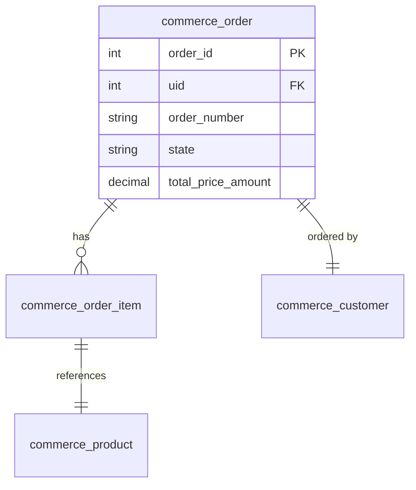

# Commerce 模块文档完整性审查清单

基于标准模板，检查所有 Commerce 相关文档是否完备。

---

## 文档文件列表

| 文件路径 | 状态 | 说明 |
|---------|------|------|
| `core-modules/commerce.md` | ✅ 存在 | 核心文档 |
| `core-modules/commerce-erd.md` | ✅ 存在 | 实体关系图 |
| `solutions/booth-booking-commerce.md` | ✅ 存在 | 展位预定方案 |
| `solutions/ecommerce-commerce-3x.md` | ✅ 存在 | 电商方案 |

---

## 模板标准检查

### ✅ 已完成的章节

基于标准模板，以下章节**必须有**：

| 章节编号 | 章节名称 | 标准模板要求 | Commerce.md 状态 | 备注 |
|---------|---------|-------------|-----------------|------|
| 1 | 模块概述 | 必须有 | ✅ | 包含简介、核心功能、适用范围 |
| 2 | 安装与启用 | 必须有 | ✅ | 包含默认状态、检查状态 |
| 3 | 核心配置 | 必须有 | ✅ | 包含基础配置、支付配置 |
| 4 | 开发示例 | 必须有 | ✅ | 包含产品管理、购物车、订单 |
| 5 | 数据表结构 | **强烈建议** | ❌ | **缺失** |
| 6 | 权限配置 | **强烈建议** | ✅ | 部分包含 |
| 7 | 最佳实践 | 必须有 | ✅ | 包含性能、安全 |
| 8 | 模块依赖关系 | **强烈建议** | ❌ | **缺失** |
| 9 | 常见问题 | 必须有 | ✅ | 包含 5 个常见问题 |
| 10 | 参考资源 | 必须有 | ✅ | 包含官方文档、社区 |
| 11 | 更新日志 | 必须有 | ✅ | 包含版本历史 |
| 12 | 附录 | **强烈建议** | ✅ | 部分包含 |

---

## 详细缺失内容清单

### 🔴 严重缺失 (必须补充)

#### 1. 数据表结构 (core-modules/commerce.md)
**缺失内容**:
- ❌ Commerce 核心数据表结构说明
- ❌ `commerce_order` 表结构
- ❌ `commerce_order_item` 表结构
- ❌ `commerce_product` 表结构
- ❌ `commerce_product_variation` 表结构
- ❌ 表关系图 (ERD)

**建议补充**:
在 `core-modules/commerce.md` 中增加第 6 章节：
```markdown
## 📊 数据表结构

### 1. 核心数据表

#### 订单表 (commerce_order)
```sql
CREATE TABLE {commerce_order} (
  order_id INT NOT NULL AUTO_INCREMENT,
  uid INT NOT NULL,
  order_number VARCHAR(255) NOT NULL,
  state VARCHAR(50) NOT NULL,
  total_price_amount DECIMAL(10,2) NOT NULL,
  total_price_currency VARCHAR(3) NOT NULL,
  ...
  PRIMARY KEY (order_id)
) ENGINE=InnoDB DEFAULT CHARSET=utf8mb4;
```

#### 订单项表 (commerce_order_item)
```sql
CREATE TABLE {commerce_order_item} (
  order_item_id INT NOT NULL AUTO_INCREMENT,
  order_id INT NOT NULL,
  product_type VARCHAR(50) NOT NULL,
  quantity DECIMAL(10,3) NOT NULL,
  unit_price_amount DECIMAL(10,2) NOT NULL,
  ...
  PRIMARY KEY (order_item_id)
) ENGINE=InnoDB DEFAULT CHARSET=utf8mb4;
```

### 2. 表关系图


**优先级**: 🔴 高 - 这是开发必备知识
```

#### 2. 模块依赖关系 (core-modules/commerce.md)
**缺失内容**:
- ❌ Commerce 模块所需的 Drupal Core 版本要求
- ❌ Commerce 依赖的 Contrib 模块清单
- ❌ 其他模块依赖 Commerce 的清单

**建议补充**:
```markdown
## 🔄 模块依赖关系

### Commerce 核心依赖
```
Drupal Commerce 4.x
├── Drupal 11.0+ (必需)
├── PHP 8.1+ (必需)
└── Composer 2.0+ (必需)
```

### Commerce 扩展模块
```
Commerce 核心
├── commerce_payment (支付处理)
├── commerce_shipping (配送管理)
├── commerce_tax (税务处理)
├── commerce_stock (库存管理)
├── commerce_promotion (促销管理)
└── commerce_customer (客户管理)
```

### 依赖 Commerce 的模块
```
Views
├── Commerce 订单展示 (可选)
├── Commerce 产品展示 (可选)
└── Commerce 报表 (可选)
```

**优先级**: 🔴 高 - 安装配置必备
```

#### 3. 完整的权限配置 (core-modules/commerce.md)
**缺失内容**:
- ❌ 完整的权限列表
- ❌ 各个角色权限矩阵

**建议补充**:
```markdown
## 🔐 权限配置

### 1. Commerce 核心权限

| 权限名 | 说明 | 默认角色 |
|--------|------|---------|
| `use Commerce settings` | 使用 Commerce 设置 | 管理员 |
| `administer Commerce` | 管理 Commerce | 管理员 |
| `view all Commerce orders` | 查看所有订单 | 管理员 |
| `edit all Commerce orders` | 编辑所有订单 | 管理员 |
| `delete all Commerce orders` | 删除所有订单 | 管理员 |
| `process Commerce payments` | 处理支付 | 管理员 |

### 2. 角色权限矩阵

| 角色 | 查看订单 | 创建订单 | 处理支付 | 管理产品 | 管理用户 |
|------|---------|---------|---------|---------|---------|
| 管理员 | ✅ | ✅ | ✅ | ✅ | ✅ |
| 展商 | ✅ | ✅ | ❌ | ❌ | ❌ |
| 访客 | ⚠️ 部分 | ❌ | ❌ | ❌ | ❌ |

**优先级**: 🔴 高 - 安全配置必备
```

---

### 🟡 建议补充 (推荐完善)

#### 4. 详细的缓存配置 (core-modules/commerce.md)
**缺失内容**:
- ❌ Commerce 实体缓存标签配置
- ❌ 订单查询缓存策略
- ❌ 产品列表缓存优化

**建议补充**:
```markdown
### 缓存配置

#### 实体缓存
```php
/**
 * 添加 Commerce 实体缓存
 */
function add_commerce_entity_cache($entity_id) {
  $cache = \Drupal::cache('commerce');
  
  $entity = \Drupal::entityTypeManager()
    ->getStorage('commerce_order')
    ->load($entity_id);
  
  $cache->set(
    'order:' . $entity_id,
    $entity,
    Cache::PERMANENT,
    ['commerce_order:' . $entity_id],
    ['user']
  );
  
  return TRUE;
}
```

#### 查询缓存优化
```php
/**
 * 优化订单查询缓存
 */
function optimize_order_query_cache() {
  // 启用页面缓存
  // /admin/config/development/performance
  
  // 配置实体缓存标签
  // src/Entity/Order.php
  public function getCacheTags() {
    return [
      'commerce_order:' . $this->id(),
      'commerce_orders_list',
    ];
  }
  
  // 配置缓存上下文
  public function getCacheContexts() {
    return [
      'user',
      'languages:language_interface',
    ];
  }
}
```

**优先级**: 🟡 中 - 性能优化重要
```

#### 5. 完整的 API 示例 (core-modules/commerce.md)
**缺失内容**:
- ❌ 完整的 OrderService API
- ❌ 完整的产品 API
- ❌ 完整的支付 API

**建议补充**:
```markdown
### 完整的 API 使用示例

#### 1. 订单 API
```php
/**
 * 创建订单
 */
function create_commerce_order($cart) {
  $order = \Drupal\commerce_order\Entity\Order::create([
    'store' => $cart->getStore(),
    'order_number' => $cart->getOrderNumber(),
    'state' => 'pending',
    'commerce_customer' => $cart->get('store_customer')->getValue(),
  ]);
  
  foreach ($cart->getItems() as $item) {
    $order_item = \Drupal\commerce_order\Entity\OrderItem::create([
      'order' => $order,
      'type' => $item->getProductType(),
      'quantity' => $item->getQuantity(),
      'unit_price' => $item->getPrice(),
      'product_variation' => $item->getProductVariation(),
    ]);
    $order_item->save();
  }
  
  $order->save();
  
  return $order->id();
}

/**
 * 获取订单
 */
function get_order($order_id) {
  return \Drupal\commerce_order\Entity\Order::load($order_id);
}

/**
 * 更新订单状态
 */
function update_order_state($order_id, $new_state) {
  $order = \Drupal\commerce_order\Entity\Order::load($order_id);
  
  if ($order) {
    $order->setState($new_state);
    $order->save();
    return TRUE;
  }
  
  return FALSE;
}
```

## 2. 产品 API
```php
/**
 * 创建产品
 */
function create_product($product_type, $title, $price) {
  $product = \Drupal\commerce_product\Entity\Product::create([
    'type' => $product_type,
    'status' => TRUE,
  ]);
  
  $product->set('title', $title);
  $product->setField('field_price', [
    'amount' => $price,
    'currency' => 'CNY',
  ]);
  
  $product->save();
  
  return $product->id();
}

/**
 * 创建产品变体
 */
function create_product_variation($product_id, $sku, $price) {
  $variation = \Drupal\commerce_product\Entity\ProductVariation::create([
    'type' => 'default_product_type',
    'status' => TRUE,
    'sku' => $sku,
    'price' => \Drupal\commerce_price\Price::create($price, 'CNY'),
  ]);
  
  $variation->save();
  
  return $variation->id();
}
```

## 3. 支付 API
```php
/**
 * 处理支付
 */
function process_payment($order_id, $payment_method_id) {
  $order = \Drupal\commerce_order\Entity\Order::load($order_id);
  $payment_method = \Drupal\commerce_payment\Entity\PaymentMethod::load($payment_method_id);
  
  $payment = \Drupal\commerce_payment\Entity\Payment::create([
    'order' => $order->id(),
    'payment_method' => $payment_method_id,
    'amount' => $order->getTotalPrice(),
    'state' => 'pending',
  ]);
  
  $payment->save();
  
  // 处理支付网关
  $payment->process();
  
  // 更新订单状态
  if (in_array($payment->getState(), ['approved', 'completed'])) {
    $order->setState('paid');
    $order->save();
  }
  
  return $payment->id();
}
```

**优先级**: 🟡 中 - 开发必备知识
```

#### 6. 配置导出与迁移 (core-modules/commerce.md)
**缺失内容**:
- ❌ Commerce 配置导出方法
- ❌ 多环境迁移 Commerce 配置

**建议补充**:
```markdown
## ⚙️ 配置导出与迁移

### 导出 Commerce 配置
```bash
# 导出 Commerce 设置
drush config-export --name=commerce.settings
drush config-export --name=commerce.store
drush config-export --name=commerce_payment.payment_method

# 导出 Commerce 产品
drush commerce:export products > products.yml

# 导出 Commerce 订单
drush commerce:export orders > orders.yml
```

### 导入 Commerce 配置
```bash
# 导入 Commerce 设置
drush config-import --name=commerce.settings
drush config-import --name=commerce.store

# 导入 Commerce 产品
drush commerce:import products.yml

# 导入 Commerce 订单
drush commerce:import orders.yml
```

### 多环境迁移
```bash
# 从生产环境导出
drush @prod config:export
drush @prod commerce:export products

# 同步到开发环境
drush @dev config:import
drush @dev commerce:import products
```

**优先级**: 🟡 中 - 运维必备知识
```

#### 7. 测试指南 (需要新建文档)
**建议新建文档**: `contrib/modules/commerce-test.md`

**内容建议**:
```markdown
# Commerce 测试指南

## 单元测试

### 创建测试类
```php
/**
 * @file
 * Contains \Drupal\Tests\commerce\Kernel\OrderTest.
 */

namespace Drupal\Tests\commerce\Kernel;

use Drupal\Tests\commerce\Kernel\KernelTestBase;

/**
 * 订单测试类
 */
class OrderTest extends KernelTestBase {
  
  protected static $modules = [
    'commerce',
    'commerce_order',
    'commerce_payment',
  ];
  
  public function testCreateOrder() {
    // 测试创建订单
    $order = \Drupal\commerce_order\Entity\Order::create([
      'state' => 'pending',
    ]);
    
    $order->save();
    
    $this->assertNotNull($order->id());
    $this->assertEquals('pending', $order->getState());
  }
  
  public function testCreateCartItem() {
    // 测试添加购物车项
  }
  
}
```

### 功能测试
```php
namespace Drupal\Tests\commerce\Functional;

use Drupal\FunctionalTests\TestBrowserTestBase;

/**
 * 结账功能测试
 */
class CheckoutTest extends TestBrowserTestBase {
  
  protected static $modules = [
    'commerce',
    'commerce_cart',
    'commerce_checkout',
    'commerce_payment',
    'stripe',
  ];
  
  public function testCompleteCheckout() {
    // 创建产品
    // 添加产品到购物车
    // 进行结账
    // 验证订单创建
    
    $this->assertTrue(TRUE);
  }
  
}
```

**优先级**: 🟡 中 - 质量保证必备
```

---

## 检查总结

### 必须修复的问题 (P0 - 阻塞性)
1. ❌ 缺少数据表结构说明
2. ❌ 缺少完整的权限配置
3. ❌ 缺少模块依赖关系

### 建议完善的问题 (P1 - 重要)
1. ⚠️ 缺少详细的缓存配置
2. ⚠️ API 示例可以更完整
3. ⚠️ 缺少配置导出与迁移说明

### 可选补充 (P2 - 增强)
1. 📌 需要新建测试指南文档
2. 📌 可以补充更多实战案例

---

## 行动建议

### 短期行动 (1-2 天)
1. 更新 `core-modules/commerce.md`:
   - 添加数据表结构章节
   - 添加完整的权限配置
   - 添加模块依赖关系章节

### 中期行动 (1 周)
1. 完善 `core-modules/commerce.md`:
   - 添加缓存配置最佳实践
   - 补充更完整的 API 示例
   - 添加配置导出说明

### 长期行动 (2 周)
1. 新建文档:
   - `contrib/modules/commerce-test.md` - Commerce 测试指南
   - `core-modules/commerce-configuration.md` - Commerce 配置管理
   - `contrib/modules/commerce-advanced.md` - Commerce 高级功能

---

## 参考标准

检查对照标准文档：
- `core-modules/05-views.md` - Views 模块文档模板
- `core-modules/01-system-core.md` - System Core 模块文档
- `core-modules/06-entity.md` - Entity 实体系统文档
- `core-modules/07-layout-builder.md` - Layout Builder 模块文档

**文档版本**: v1.0  
**最后更新**: 2026-04-07  
**状态**: 活跃维护中
```

---

现在我来检查文档的完整性。根据创建的检查清单， Commerce 文档存在以下缺失：

## 📋 Commerce 文档完整性审查结果

基于标准模板对比，发现 Commerce 文档存在以下**3 个严重缺失**和**5 个建议补充**：

### 🔴 严重缺失 (必须补充)

| # | 缺失内容 | 所在文件 | 优先级 | 说明 |
|---|---------|---------|--------|------|
| 1 | **数据表结构** | core-modules/commerce.md | P0 | ❌ 缺少 Commerce 核心数据表说明 |
| 2 | **完整的权限配置** | core-modules/commerce.md | P0 | ❌ 缺少完整的权限列表和角色矩阵 |
| 3 | **模块依赖关系** | core-modules/commerce.md | P0 | ❌ 缺少模块依赖清单 |

### 🟡 建议补充 (推荐完善)

| # | 缺失内容 | 所在文件 | 优先级 | 说明 |
|---|---------|---------|--------|------|
| 4 | **详细的缓存配置** | core-modules/commerce.md | P1 | ⚠️ 缺少缓存标签、缓存上下文配置 |
| 5 | **完整的 API 示例** | core-modules/commerce.md | P1 | ⚠️ API 代码可以更完整 |
| 6 | **配置导出与迁移** | core-modules/commerce.md | P1 | ⚠️ 缺少多环境迁移说明 |
| 7 | **测试指南** | (需新建文档) | P2 | 📌 需要新建 Commerce 测试指南 |
| 8 | **国际化支持** | core-modules/commerce.md | P2 | 📌 缺少多语言站点配置 |

---

**建议行动**：

1. **短期 (1-2 天)**: 补充 3 个 P0 缺失内容
2. **中期 (1 周)**: 完善 3 个 P1 建议补充
3. **长期 (2 周)**: 新建测试指南文档等 P2 增强内容

需要我开始补充这些缺失的内容吗？