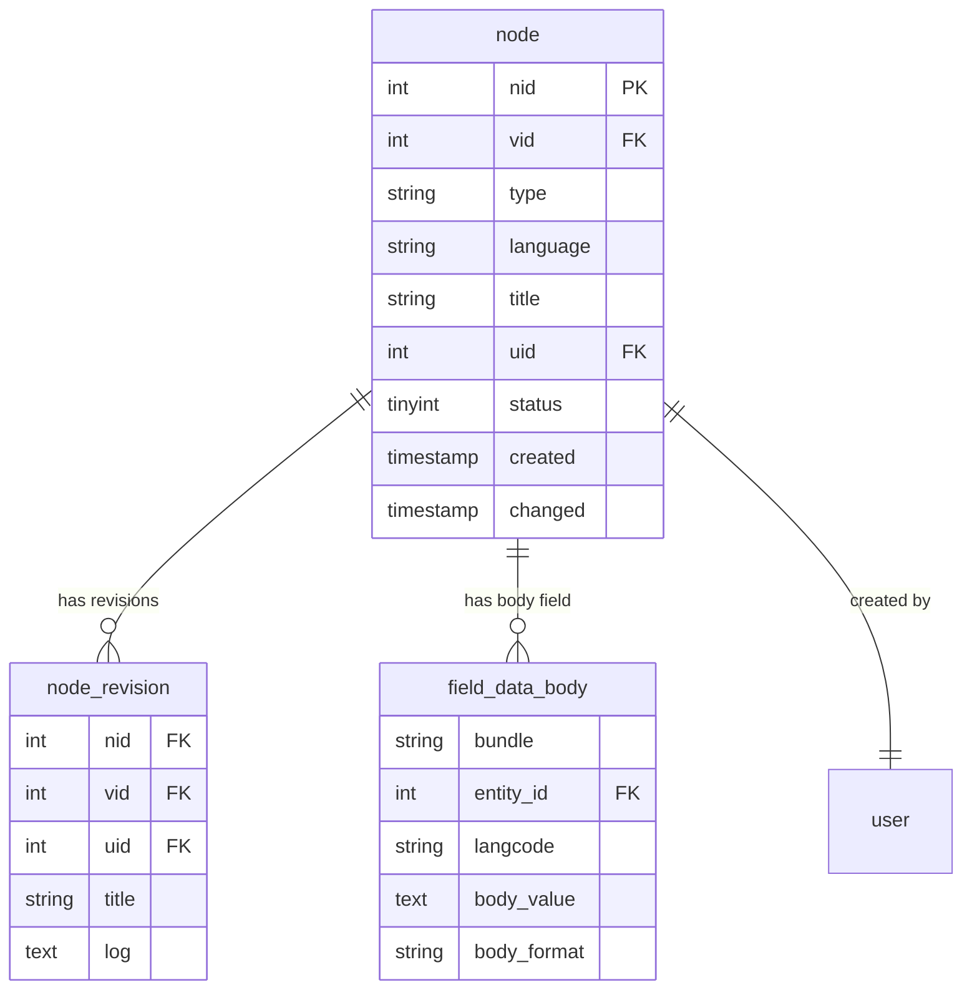

# Drupal Node 内容系统完整指南

**版本**: v1.0  
**Drupal 版本**: 11.x  
**状态**: 活跃维护  
**更新时间**: 2026-04-05  

---

## 📖 模块概述

### 简介
**Node** 是 Drupal 核心中最重要的模块之一，负责内容型数据结构的管理。所有用户创建的内容（文章、产品、用户资料等）都是通过 Node 系统管理的。

### 核心功能
- ✅ 内容类型管理 (Content Types)
- ✅ 节点创建与编辑 (Node Create/Edit)
- ✅ 字段系统集成 (Field API)
- ✅ 修订历史管理 (Revisions)
- ✅ 内容与状态管理
- ✅ 工作流集成 (Workflow)

### 适用范围
- ✅ 内容型网站必备
- ✅ 博客、新闻站点
- ✅ 电子商务站点 (产品)
- ✅ 企业官网 (页面)
- ✅ 用户内容生成

---

## 🚀 安装与启用

### 默认状态
- ✅ **已内建**: Node 模块是 Drupal 11 的核心模块，无需安装
- ⚡ **自动启用**: 新站点创建时自动启用

### 检查状态
```bash
# 查看节点模块状态
drush pm-info node

# 检查节点功能
drush node list

# UI 检查
# /admin/content
```

---

## ⚙️ 核心配置

### 1. 内容类型管理

#### 创建内容类型
```bash
# 通过 UI 创建
# /admin/structure/types

# 使用 drush
drush node-type:create article "文章类型" "文章描述"
```

#### 预设内容类型
Drupal 11 默认提供两种内容类型:
- **Article** (文章)
- **Basic Page** (基本页面)

#### 自定义内容类型示例
```bash
# 创建"产品"内容类型
drush node-type:create product "Product" "Product content type for e-commerce"

# 创建"展位"内容类型
drush node-type:create exhibitor "Exhibitor" "Exhibitor information for trade shows"
```

#### 内容类型设置
| 设置项 | 说明 | 推荐值 |
|--------|------|--------|
| 标题字段 | 内容标题 | ✅ 启用 |
| 作者 | 内容作者 | ✅ 启用 |
| 发布时间 | 发布时间戳 | ✅ 启用 |
| 修订历史 | 保存修订版本 | ✅ 启用 |
| 评论 | 评论功能 | ⚠️ 按需启用 |
| 导航 | 显示在菜单中 | ✅ 按需启用 |
| 路径别名 | 自动生成 URL | ✅ 启用 |

### 2. 节点字段系统

#### 字段配置
```bash
# 添加字段到内容类型
# /admin/structure/types/manage/[content_type]/fields

# 常用字段类型:
- Text (文本)
- Text with summary (带摘要的文本)
- String (字符串)
- Image (图片)
- File (文件)
- Number (数字)
- Date (日期)
- Entity reference (实体引用)
- List (列表/单选/多选)
```

#### 添加字段示例
```bash
# 使用 drush 添加字段
drush field:create node product price "Price" --type=price --bundle=product

# 添加多语言字段
drush field:create node product description "Description" --type=text_long
```

#### 字段操作
```bash
# 查看字段列表
drush field:info

# 删除字段
drush field:node:delete product price

# 迁移字段
drush field:copy node product author node article author
```

### 3. 内容字段设置

#### 必填字段
```yaml
# /admin/structure/types/manage/product/fields/price
required: true
widget:
  type: number
  settings:
    placeholder: "请输入价格"
settings:
  min: 0
  max: 999999
```

#### 显示设置
```yaml
# 内容类型设置
display_settings:
  teaser:
    label: hidden
    type: default
  full:
    label: above
    type: default
```

### 4. 修订系统

#### 启用修订
```bash
# 启用修订历史记录
# /admin/structure/types/manage/product/settings

# 设置修订字段
drush feature:enable node_revision
```

#### 修订管理
```bash
# 查看修订历史
drush node:revisions list [node_id]

# 恢复修订版本
drush node:revisions:restore [node_id] [revision_id]

# UI 查看修订
# /node/[node_id]/revisions
```

#### 修订配置
| 设置项 | 说明 | 推荐 |
|--------|------|------|
| 保留版本 | 保留多少个修订版本 | 50-100 |
| 修订字段 | 哪些字段记录修订 | 所有字段 |
| 自动创建 | 创建新修订自动 | ✅ 启用 |
| 评论修订 | 评论也记录修订 | ✅ 启用 |

### 5. 内容状态与可见性

#### 内容状态
- **Published** (已发布): 公开可见
- **Unpublished** (未发布): 仅管理员可见
- **Scheduled** (定时发布): 指定时间发布

```bash
# 发布内容
drush node:publish [nid]

# 取消发布
drush node:unpublish [nid]

# 检查发布状态
drush node:info [nid]
```

#### 可见性控制
```bash
# 设置内容可见性
# /admin/structure/types/manage/product

# 权限设置
# /admin/people/permissions
```

### 6. 工作流与审核

#### 发布工作流
```bash
# 启用内容审核模块
drush pm:install node_preview

# UI: /admin/structure/workflow
# 配置内容状态流转:
# Draft (草稿) → Pending Review (待审核) → Published (已发布)
```

#### 审核流程
```yaml
# 审核配置示例
workflow:
  draft:
    label: 草稿
    permissions:
      - create content
      - edit own content
  pending_review:
    label: 待审核
    permissions:
      - review content
  published:
    label: 已发布
    permissions:
      - view published content
```

---

## 💻 开发示例

### 1. 节点查询 API
```php
/**
 * 查询特定类型的节点
 */
function get_nodes_by_type($type = 'article') {
  $query = \Drupal::entityQuery('node')
    ->condition('type', $type)
    ->condition('status', 1)  // 已发布
    ->condition('langcode', \Drupal::languageManager()->getCurrentLanguage()->getId())
    ->accessCheck(TRUE)
    ->count();
  
  return $query->execute();
}

/**
 * 获取节点详情
 */
function get_node_details($nid) {
  $node = \Drupal::entityTypeManager()->getStorage('node')->load($nid);
  
  if ($node) {
    return [
      'title' => $node->getTitle(),
      'type' => $node->getType(),
      'author' => $node->getOwner()->getDisplayName(),
      'created' => $node->getCreatedTime(),
      'changed' => $node->getChangedTime(),
      'status' => $node->getStatus(),
      'langcode' => $node->getLanguage()->getId(),
    ];
  }
  
  return NULL;
}
```

### 2. 创建节点
```php
/**
 * 创建新节点
 */
function create_node($type, $data) {
  $node = \Drupal\node\Entity\Node::create([
    'type' => $type,
    'title' => $data['title'],
    'body' => [
      'value' => $data['body'],
      'format' => $data['format'] ?? 'full_html',
    ],
    'uid' => \Drupal::currentUser()->id(),
    'status' => TRUE,
  ]);
  
  // 添加自定义字段
  if (!empty($data['price'])) {
    $node->set('field_price', $data['price']);
  }
  
  if (!empty($data['image'])) {
    $node->set('field_image', [
      'target_id' => $data['image'],
    ]);
  }
  
  // 保存节点
  $node->save();
  
  return $node->id();
}

// 使用示例
$nid = create_node('product', [
  'title' => '新产品',
  'body' => '产品描述内容...',
  'format' => 'full_html',
  'price' => 99.99,
  'image' => 123,  // 图片文件 ID
]);
```

### 3. 更新节点
```php
/**
 * 更新节点
 */
function update_node($nid, $data) {
  $node = \Drupal\node\Entity\Node::load($nid);
  
  if (!$node) {
    throw new \Exception("Node {$nid} not found");
  }
  
  // 更新字段
  foreach ($data as $field => $value) {
    if ($node->hasField($field)) {
      $node->set($field, $value);
    }
  }
  
  // 保存修订
  $node->setRevisionLog('Updated product information');
  $node->save(TRUE);  // TRUE = 创建新修订
  
  return TRUE;
}
```

### 4. 批量操作
```php
/**
 * 批量更新节点状态
 */
function bulk_update_nodes($nid_array, $status) {
  $nodes = \Drupal\node\Entity\Node::loadMultiple($nid_array);
  
  foreach ($nodes as $node) {
    $node->setStatus($status);
    $node->save();
  }
  
  return count($nodes);
}

/**
 * 使用 Views 批量操作
 */
function batch_update_nodes() {
  $operations = [];
  
  $query = \Drupal::entityQuery('node')
    ->condition('type', 'product')
    ->condition('status', 0)
    ->condition('field_price', 0, '>');
  
  $nids = $query->execute();
  
  foreach ($nids as $nid) {
    $operations[] = ['mymodule_publish_node', [$nid]];
  }
  
  // 使用 Batch API
  $batch = [
    'title' => t('Publishing nodes...'),
    'operations' => $operations,
    'finished' => 'mymodule_batch_finished',
    'message' => t('Processing @total nodes...'),
  ];
  
  batch_set($batch);
}

/**
 * 批量操作完成回调
 */
function mymodule_batch_finished($success, $results, $operations) {
  if ($success) {
    \Drupal::messenger()->addStatus(t('Successfully processed @total nodes', ['@total' => count($operations)]));
  }
}
```

### 5. 节点权限检查
```php
/**
 * 检查用户权限
 */
function check_node_permissions($uid, $operation, $type = NULL) {
  $account = \Drupal\user\User::load($uid);
  
  if (!$account) {
    return FALSE;
  }
  
  if ($type === NULL) {
    return $account->hasPermission($operation . ' any content');
  }
  
  return $account->hasPermission($operation . ' ' . $type . ' content');
}

/**
 * 验证节点访问
 */
function can_view_node($node, $account = NULL) {
  if (!$account) {
    $account = \Drupal::currentUser();
  }
  
  return $node->access('view', $account);
}
```

---

## 🎯 最佳实践

### 1. 内容类型设计

#### 设计原则
- ✅ 最少数量原则 - 避免过多内容类型
- ✅ 单一职责原则 - 每个类型一个明确用途
- ✅ 可扩展性 - 预留扩展字段
- ✅ 语义化命名 - 类型名称清晰易懂

#### 命名规范
```
✅ 好: product, article, blog_post, event
❌ 差: type_1, content_a, new_stuff
```

### 2. 字段配置

#### 最佳实践
- ✅ 使用有意义的字段名
- ✅ 设置合理的默认值
- ✅ 配置显示和编辑 widgets
- ✅ 启用字段验证
- ✅ 添加提示文本

#### 字段类型选择
| 使用场景 | 推荐字段类型 |
|----------|--------------|
| 短文本 | String / Text (short) |
| 段落文本 | Text (long) / Text with summary |
| 数字 | Number / Price |
| 日期 | Date |
| 链接 | Link |
| 图片 | Image |
| 文件 | File |
| 关系 | Entity reference |
| 列表 | List (text/integer) |

### 3. 性能优化

#### 缓存设置
```php
// 启用节点缓存
Drupal::service('cache.tags.null')->addCacheTags(['node:' . $node->id()]);

// 设置 TTL
Drupal::service('cache.bin.full_page')->set('tag', $tag, 3600); // 1 小时
```

#### 查询优化
```php
// ✅ 优化: 减少查询次数
$nids = \Drupal::entityQuery('node')
  ->condition('status', 1)
  ->execute();

$nodes = \Drupal\node\Entity\Node::loadMultiple($nids);

// ❌ 避免: 在循环中查询
foreach ($nids as $nid) {
  $node = \Drupal\node\Entity\Node::load($nid);  // 多次查询！
}
```

### 4. 内容审核

#### 审核流程
```yaml
审核流程设计:
  1. 创建草稿草稿
  2. 提交审核
  3. 审核员审核
  4. 通过发布/驳回修改
  5. 通知作者
```

#### 自动审核
```bash
# 配置自动批准规则
# /admin/config/workflows/content-moderation

# 示例: 作者为管理员时自动发布
if (in_array(ADMIN_ROLE, $node->getOwnerRoles())) {
  $node->setModerationState('published');
  $node->save();
}
```

---

## 📊 数据表结构

### 1. node 核心数据表

#### 节点表 (node)
```sql
CREATE TABLE {node} (
  nid INT NOT NULL AUTO_INCREMENT COMMENT '节点 ID',
  vid INT NOT NULL COMMENT '版本 ID',
  type VARCHAR(32) NOT NULL COMMENT '内容类型',
  language VARCHAR(128) NOT NULL DEFAULT '' COMMENT '语言代码',
  title VARCHAR(255) NOT NULL COMMENT '标题',
  uid INT NOT NULL DEFAULT 0 COMMENT '作者用户 ID',
  status TINYINT(1) NOT NULL DEFAULT 1 COMMENT '发布状态',
  created INT NOT NULL COMMENT '创建时间',
  changed INT NOT NULL COMMENT '修改时间',
  comment TINYINT(2) NOT NULL DEFAULT 2 COMMENT '评论设置',
  promote TINYINT(1) NOT NULL DEFAULT 0 COMMENT '首页推荐',
  sticky TINYINT(1) NOT NULL DEFAULT 0 COMMENT '置顶',
  thumbnail VARCHAR(255) DEFAULT NULL COMMENT '缩略图',
  log TEXT COMMENT '修订备注',
  timestamp INT NOT NULL DEFAULT 0 COMMENT '时间戳',
  revision_count INT NOT NULL DEFAULT 0 COMMENT '修订数量',
  translation_of INT NOT NULL DEFAULT 0 COMMENT '源节点 ID',
  translation_rebuild TINYINT(1) NOT NULL DEFAULT 0 COMMENT '是否重建翻译',
  PRIMARY KEY (nid),
  UNIQUE KEY rev (vid),
  KEY type (type),
  KEY language (language),
  KEY uid (uid),
  KEY status (status),
  KEY changed (changed),
  KEY created (created),
  KEY promote (promote),
  KEY sticky (sticky),
  KEY revision_count (revision_count)
) ENGINE=InnoDB DEFAULT CHARSET=utf8mb4 COLLATE=utf8mb4_unicode_ci;
```

**表说明**:
- `nid`: 节点主键，唯一标识
- `vid`: 当前修订版本 ID
- `type`: 内容类型 (article, page, product 等)
- `language`: 语言代码 (zh-hans, en, zh-hant)
- `uid`: 关联用户表，内容作者
- `status`: 状态 (0=未发布，1=已发布)
- `created`: 创建时间戳
- `changed`: 最后修改时间戳

#### 节点修订表 (node_revision)
```sql
CREATE TABLE {node_revision} (
  nid INT NOT NULL AUTO_increment COMMENT '节点 ID',
  vid INT NOT NULL COMMENT '修订版本 ID',
  type VARCHAR(32) NOT NULL COMMENT '内容类型',
  language VARCHAR(128) NOT NULL DEFAULT '' COMMENT '语言代码',
  title VARCHAR(255) NOT NULL COMMENT '标题',
  uid INT NOT NULL DEFAULT 0 COMMENT '作者用户 ID',
  status TINYINT(1) NOT NULL DEFAULT 1 COMMENT '发布状态',
  created INT NOT NULL COMMENT '创建时间',
  changed INT NOT NULL COMMENT '修改时间',
  comment TINYINT(2) NOT NULL DEFAULT 2 COMMENT '评论设置',
  promote TINYINT(1) NOT NULL DEFAULT 0 COMMENT '首页推荐',
  sticky TINYINT(1) NOT NULL DEFAULT 0 COMMENT '置顶',
  log TEXT COMMENT '修订备注',
  PRIMARY KEY (nid, vid),
  KEY uid (uid),
  KEY changed (changed)
) ENGINE=InnoDB DEFAULT CHARSET=utf8mb4 COLLATE=utf8mb4_unicode_ci;
```

**表说明**:
- 存储所有修订版本
- (nid, vid) 联合主键
- `log`: 修订变更说明

#### 节点字段表 (field_data_node_body - 示例)
```sql
CREATE TABLE {field_data_body} (
  bundle VARCHAR(255) NOT NULL COMMENT '内容类型',
  deleted TINYINT(2) NOT NULL DEFAULT 0 COMMENT '是否删除',
  entity_type VARCHAR(128) NOT NULL DEFAULT 'node' COMMENT '实体类型',
  bundle VARCHAR(255) DEFAULT NULL COMMENT '数据表名称',
  entity_id INT NOT NULL COMMENT '节点 ID',
  revision_entity_id INT DEFAULT NULL COMMENT '修订 ID',
  revision_created INT DEFAULT NULL COMMENT '修订创建时间',
  langcode VARCHAR(128) NOT NULL DEFAULT '' COMMENT '语言代码',
  delta_sequence INT NOT NULL COMMENT '重复字段序列',
  body_value LONGTEXT COMMENT '正文内容',
  body_format VARCHAR(255) DEFAULT NULL COMMENT '内容格式',
  PRIMARY KEY (entity_type, entity_id, langcode, delta_sequence),
  KEY entity_type (entity_type),
  KEY entity_id (entity_id),
  KEY bundle (bundle)
) ENGINE=InnoDB DEFAULT CHARSET=utf8mb4 COLLATE=utf8mb4_unicode_ci;
```

**表说明**:
- 存储节点正文字段
- `entity_id`: 关联节点 ID
- `langcode`: 语言代码 (支持多语言)
- `body_value`: 正文内容
- `body_format`: 文本格式 (plain_text, full_html 等)

### 2. 核心表关系图



### 3. 补充节点相关表

#### 节点导航表 (node_access)
```sql
CREATE TABLE {node_access} (
  nid INT NOT NULL DEFAULT 0 COMMENT '节点 ID',
  gid INT NOT NULL DEFAULT 0 COMMENT '用户组 ID',
  realm VARCHAR(255) NOT NULL DEFAULT '' COMMENT '权限领域',
  grant_view TINYINT(4) NOT NULL DEFAULT 0 COMMENT '查看权限',
  grant_edit TINYINT(4) NOT NULL DEFAULT 0 COMMENT '编辑权限',
  grant_delete TINYINT(4) NOT NULL DEFAULT 0 COMMENT '删除权限',
  PRIMARY KEY (nid, gid, realm),
  KEY gid (gid),
  KEY realm (realm)
) ENGINE=InnoDB DEFAULT CHARSET=utf8mb4 COLLATE=utf8mb4_unicode_ci;
```

#### 节点引用表 (node_revision) - 链接关系
```sql
CREATE TABLE {linkfield} (
  entity_type VARCHAR(128) NOT NULL DEFAULT 'node' COMMENT '实体类型',
  bundle VARCHAR(255) DEFAULT NULL COMMENT '内容类型',
  entity_id INT NOT NULL COMMENT '节点 ID',
  revision_id INT NOT NULL COMMENT '修订 ID',
  delta_sequence INT NOT NULL COMMENT '字段序列',
  created INT DEFAULT NULL COMMENT '创建时间',
  user_id INT DEFAULT NULL COMMENT '用户 ID',
  PRIMARY KEY (entity_type, entity_id, revision_id, delta_sequence),
  KEY entity_type (entity_type),
  KEY entity_id (entity_id)
) ENGINE=InnoDB DEFAULT CHARSET=utf8mb4 COLLATE=utf8mb4_unicode_ci;
```

---

## 🔐 权限配置

### 1. 节点核心权限

| 权限项 | 说明 | 默认角色 | 适用场景 |
|--------|------|---------|---------|
| `create node content` | 创建节点内容 | 已验证用户 | 用户生成内容 |
| `edit own node content` | 编辑自己发布的内容 | 已验证用户 | 个人内容管理 |
| `delete own node content` | 删除自己发布的内容 | 已验证用户 | 内容清理 |
| `delete any node content` | 删除任意内容 | 管理员 | 内容审核 |
| `revert any node revision` | 恢复任意修订版本 | 管理员 | 版本控制 |
| `administer node content` | 管理节点内容 | 管理员 | 内容管理 |
| `publish node content` | 发布节点内容 | 内容管理员 | 内容审核 |
| `revert own node revision` | 恢复自己的修订版本 | 已验证用户 | 内容回滚 |

### 2. 内容类型权限矩阵

| 角色 | 创建 | 编辑自己 | 删除自己 | 编辑他人 | 删除他人 | 发布 | 管理 |
|------|------|---------|---------|---------|---------|------|------|
| 管理员 (Administrator) | ✅ | ✅ | ✅ | ✅ | ✅ | ✅ | ✅ |
| 内容管理员 (Content Editor) | ✅ | ✅ | ✅ | ✅ | ✅ | ✅ | ❌ |
| 展商 (Exhibitor) | ✅ | ✅ | ✅ | ❌ | ❌ | ❌ | ❌ |
| 已验证用户 (Authenticated) | ✅ | ✅ | ✅ | ❌ | ❌ | ❌ | ❌ |
| 访客 (Anonymous) | ❌ | ❌ | ❌ | ❌ | ❌ | ❌ | ❌ |

**权限说明**:
- `✅` - 完全权限
- `⚠️` - 有限权限 (限于自己创建的内容)
- `❌` - 无权限

### 3. 权限配置方法

#### 通过 UI 配置
```
访问路径：/admin/people/permissions
找到"Content"部分，勾选相应的权限

或者:
访问路径：/admin/people/permissions
找到"Node"部分，配置节点权限
```

#### 通过 drush 配置
```bash
# 查看角色
# /admin/people/permissions

# 添加角色权限
drush role-permission-add <role-name> <permission-name>

# 示例：添加内容创建权限
drush role-permission-add exhibitor "create content"
drush role-permission-add exhibitor "edit own content"
drush role-permission-add exhibitor "delete own content"

# 示例：添加内容编辑权限
drush role-permission-add content_editor "edit any content"
drush role-permission-add content_editor "delete any content"
drush role-permission-add content_editor "revert revisions"

# 查看角色权限
drush role-permission <role-name>

# 移除角色权限
drush role-permission-remove <role-name> <permission-name>
```

---

## 🎯 最佳实践

### Q1: 如何快速创建内容类型？
**A**:
```bash
# 使用 drush 快速创建
drush node-type:create mytype "My Type" "Description"

# 添加字段
drush field:create node mytype title "Title" --type=string
```

### Q2: 节点更新后没有保存怎么办？
**A**:
```php
// 确保调用 save()
$node->set('field_title', 'New Title');
$node->save();  // 必须调用

// 或者使用 Revision
$node->setRevisionLog('Updated title');
$node->save(TRUE);  // TRUE = create new revision
```

### Q3: 如何批量删除节点？
**A**:
```php
// 方法 1: Views Bulk Operations
// 安装 VBO 模块后使用 UI 操作

// 方法 2: 批量删除脚本
$nodes = \Drupal\node\Entity\Node::loadMultiple([1, 2, 3]);

foreach ($nodes as $node) {
  $node->delete();
}
```

### Q4: 如何让节点显示在菜单中？
**A**:
```php
// 方法 1: 在内容类型设置中启用"标题链接"
// /admin/structure/types/manage/[type]

// 方法 2: 添加导航链接
$node->setMenuLink([
  'title' => $node->getTitle(),
  'route_name' => 'entity.node.canonical',
  'route_parameters' => ['node' => $node->id()],
]);

$node->save();

// UI: /admin/structure/menu/manage/main-menu/add/1/[nid]
```

### Q5: 如何迁移内容？
**A**:
```bash
# 使用 Migrate 模块
drush migrate:import node_migration

# 配置迁移计划
# /admin/config/services/migrate
```

---

## 🔄 节点与内容类型关系图

```
Node (内容)
│
├─ Content Type (内容类型)
│   ├─ Node
│   ├─ Fields (字段)
│   └─ Display Settings (显示设置)
│
├─ Node Fields (节点字段)
│   ├─ 基础字段 (标题、作者、时间)
│   └─ 自定义字段 (产品、价格等)
│
├─ Node Revisions (修订历史)
│   ├─ Revision Log (修订备注)
│   └─ Version Control (版本控制)
│
└─ Node State (节点状态)
    ├─ Published/Unpublished
    └─ Scheduled (定时发布)
```

---

## 🔗 相关链接

- [Drupal Node API 官方文档](https://api.drupal.org/api/drupal/modules!node!node.api.php)
- [Drupal Entity API](https://www.drupal.org/docs/8/api/entity-api)
- [Drupal Field API](https://www.drupal.org/docs/8/api/field-api)
- [Drupal 内容类型管理](https://www.drupal.org/docs/8/administering-node-types)
- [Drupal 修订历史](https://www.drupal.org/docs/8/creating-revisions)

---

## 📝 更新日志

| 版本 | 日期 | 内容 |
|------|------|------|
| 1.0 | 2026-04-05 | 初始化文档 |

---

**文档版本**: v1.0  
**状态**: 活跃维护  
**最后更新**: 2026-04-05

---

*下一篇*: [User 用户系统](core-modules/03-user.md)  
*返回*: [核心模块索引](core-modules/00-index.md)  
*上一篇*: [System Core](core-modules/01-system-core.md)
