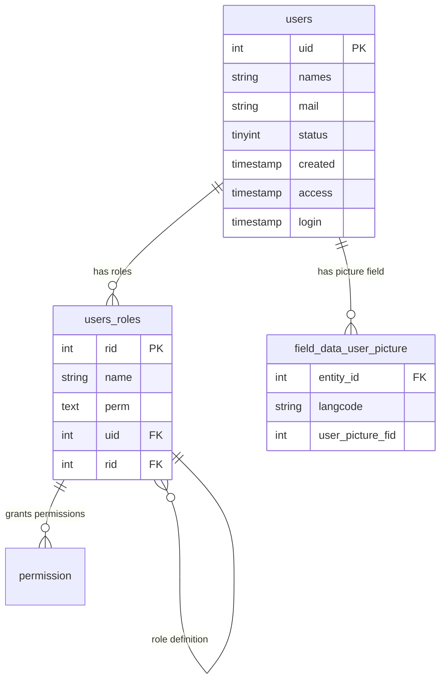

# Drupal User 用户系统完整指南

**版本**: v1.0  
**Drupal 版本**: 11.x  
**状态**: 活跃维护  
**更新时间**: 2026-04-05  

---

## 📖 模块概述

### 简介
**User** 是 Drupal 的核心用户管理系统模块，负责所有用户账户、身份验证、权限控制和用户信息管理。

### 核心功能
- ✅ 用户账户管理 (User Account Management)
- ✅ 角色系统 (Roles)
- ✅ 权限控制 (Permissions)
- ✅ 认证流程 (Authentication)
- ✅ 用户字段自定义 (Custom Fields)
- ✅ 用户订阅管理 (Subscriptions)
- ✅ 第三方登录集成 (OAuth/OpenID)

### 适用范围
- ✅ 所有 Drupal 站点必备
- ✅ 会员网站
- ✅ 电子商务平台
- ✅ 社交网络
- ✅ B2B/B2C 应用

---

## 🚀 安装与启用

### 默认状态
- ✅ **已内建**: User 模块是 Drupal 11 的核心模块
- ⚡ **自动启用**: 新站点创建时自动启用

### 检查状态
```bash
# 查看用户模块状态
drush pm-info user

# 查看用户列表
drush user:list

# 创建测试用户
drush user:create testuser "test@example.com" --password=test123
```

---

## ⚙️ 核心配置

### 1. 用户注册设置

#### 访问设置
```bash
# 用户注册选项
# /admin/people/settings

# 注册选项:
# 1. 所有人皆可注册
# 2. 仅管理员邀请
# 3. 无人可注册
```

#### 注册配置
| 设置项 | 说明 | 推荐 |
|--------|------|------|
| 注册方式 | 自注册/邀请/禁用 | ⚠️ 按需选择 |
| 验证方式 | 邮箱激活/管理员批准 | ✅ 邮箱激活 |
| 默认角色 | 注册用户角色 | ✅ 订阅者 |
| 允许匿名 | 匿名用户访问 | ⚠️ 谨慎启用 |
| 密码强度 | 最小密码长度 | ✅ 8-12 位 |

### 2. 角色系统

#### 默认角色
| 角色 | ID | 说明 |
|------|----|------|
| **Anonymous** | 匿名 | 未登录用户 |
| **Authenticated** | 已认证 | 已登录用户 |
| **Administrator** | 管理员 | 完全权限 |

#### 创建自定义角色
```bash
# 通过 UI 创建
# /admin/people/roles

# 使用 drush
drush role:create editor "Editor" "Content editor role"
drush role:create author "Author" "Content author role"
drush role:create customer "Customer" "Customer role for e-commerce"
```

#### 角色权限分配
```bash
# 分配权限给角色
drush role:add-permission "administer users" editor
drush role:add-permission "create article content" author
drush role:add-permission "purchase products" customer

# 移除权限
drush role:remove-permission "edit any content" editor

# 查看角色权限
drush role:list
```

### 3. 权限系统

#### 权限分类
```
用户权限分类:
├─ 用户管理 (User Management)
│   ├─ 访问用户管理
│   ├─ 创建新用户
│   ├─ 用户管理
│   └─ 用户删除
│
├─ 内容权限 (Content Permissions)
│   ├─ 创建内容
│   ├─ 编辑内容
│   ├─ 删除内容
│   └─ 发布内容
│
├─ 系统权限 (System Permissions)
│   ├─ 站点配置
│   ├─ 模块管理
│   └─ 系统设置
│
└─ 站点特定权限 (Site-specific)
    ├─ 节点权限
    ├─ 评论权限
    └─ 菜单权限
```

#### 权限检查
```php
/**
 * 检查用户权限
 */
function check_user_permission($uid, $permission) {
  $account = \Drupal\user\User::load($uid);
  
  if (!$account) {
    return FALSE;
  }
  
  return $account->hasPermission($permission);
}

/**
 * 批量检查权限
 */
function check_permissions($uid, $permissions) {
  $account = \Drupal\user\User::load($uid);
  
  if (!$account) {
    return [];
  }
  
  $result = [];
  foreach ($permissions as $perm) {
    $result[$perm] = $account->hasPermission($perm);
  }
  
  return $result;
}
```

#### 权限设置示例
```bash
# 管理员权限
drush role:add-permission "administer users" administrator
drush role:add-permission "administer site configuration" administrator
drush role:add-permission "bypass node access" administrator
drush role:add-permission "access administration pages" administrator

# 编辑者权限
drush role:add-permission "create article content" editor
drush role:add-permission "edit any article content" editor
drush role:add-permission "delete any article content" editor
drush role:add-permission "administer content types" editor

# 作者权限
drush role:add-permission "create article content" author
drush role:add-permission "edit own article content" author
drush role:add-permission "delete own article content" author

# 订阅者权限
drush role:add-permission "access comments" authenticated
drush role:add-permission "comment on content" authenticated
drush role:add-permission "reply to comments" authenticated
```

### 4. 用户字段系统

#### 默认用户字段
```yaml
用户默认字段:
  - name: 用户名 (必填)
  - mail: 电子邮件 (必填)
  - picture: 头像 (可选)
  - status: 账户状态 (系统自动)
  - created: 创建时间 (系统自动)
  - timezone: 时区 (可选)
```

#### 添加自定义用户字段
```bash
# 添加用户简介字段
drush field:create user profile_biography "Biography" --type=text_long

# 添加用户职位字段
drush field:create user profile_job "Job" --type=string

# 添加用户部门字段 (列表)
drush field:create user profile_department "Department" --type=list-text

# 添加用户手机字段
drush field:create user profile_phone "Phone" --type=string
```

#### 用户字段配置
```yaml
# 用户字段设置
field_user_fields:
  required_fields:
    - name
    - mail
  
  optional_fields:
    - profile_bio
    - profile_job
    - profile_phone
  
  display_settings:
    teaser:
      label: hidden
    full:
      label: above
```

### 5. 身份验证配置

#### 密码策略
```yaml
# 密码安全设置
password_policy:
  min_length: 8
  require_uppercase: true
  require_lowercase: true
  require_numbers: true
  require_special_chars: false
  history_length: 5  # 保留最近 5 个密码
  max_lifetime: 90   # 90 天过期
```

#### 多因素认证 (MFA)
```bash
# 安装 TOTP 模块 (Google Authenticator)
drush pm:create authenticator

# 启用 MFA
# /admin/config/security/totp

# MFA 策略:
# 1. 强制管理员使用 MFA
# 2. 可选启用 MFA
# 3. 完全禁用 MFA
```

#### OAuth 第三方登录
```bash
# 安装 OAuth 模块
drush pm:install oauth2_client oauth2_server

# 配置 Google 登录
# /admin/oauth2/settings

# 配置 Facebook 登录
# /admin/oauth2/fb/settings

# 配置 Twitter 登录
# /admin/oauth2/twitter/settings
```

### 6. 用户工作流程

#### 用户注册流程
```
新用户注册流程:
1. 填写注册表单
2. 验证邮箱
3. 激活账户
4. 分配默认角色
5. 发送欢迎邮件
6. 登录系统
```

#### 用户审批流程
```yaml
管理员审批流程:
  1. 用户提交注册
  2. 通知管理员审批
  3. 管理员查看申请
  4. 批准或拒绝
  5. 发送审批通知
  6. 用户激活账户
```

#### 密码重置流程
```
密码重置流程:
1. 忘记密码
2. 输入邮箱
3. 发送重置链接
4. 用户点击链接
5. 设置新密码
6. 密码更新成功
```

---

## 💻 开发示例

### 1. 用户管理 API
```php
/**
 * 创建新用户
 */
function create_user($username, $email, $password) {
  $account = \Drupal\user\User::create([
    'name' => $username,
    'mail' => $email,
    'status' => 1,
    'roles' => ['authenticated'],
    'created' => \Drupal::time()->getCurrentTime(),
  ]);
  
  $account->setPassword($password);
  $account->save();
  
  return $account->id();
}

/**
 * 查找用户
 */
function find_user_by_email($email) {
  $uids = \Drupal::entityQuery('user')
    ->condition('mail', $email)
    ->execute();
  
  return $uids ? \Drupal\user\Entity\User::load(reset($uids)) : NULL;
}

/**
 * 更新用户信息
 */
function update_user($uid, $data) {
  $account = \Drupal\user\Entity\User::load($uid);
  
  if (!$account) {
    throw new \Exception("User {$uid} not found");
  }
  
  foreach ($data as $field => $value) {
    if ($account->hasField($field)) {
      $account->set($field, $value);
    }
  }
  
  $account->save();
  
  return TRUE;
}

/**
 * 删除用户
 */
function delete_user($uid) {
  $account = \Drupal\user\Entity\User::load($uid);
  
  if (!$account) {
    return FALSE;
  }
  
  $account->delete();
  
  return TRUE;
}
```

### 2. 角色管理
```php
/**
 * 创建新角色
 */
function create_role($id, $label, $description = '') {
  $role = \Drupal\user\Role::create([
    'id' => $id,
    'label' => $label,
    'description' => $description,
  ]);
  
  try {
    $role->save();
    return $role->id();
  } catch (\Exception $e) {
    // 角色 ID 已存在
    return NULL;
  }
}

/**
 * 删除角色
 */
function delete_role($role_id) {
  $role = \Drupal\user\Entity\Role::load($role_id);
  
  if (!$role) {
    return FALSE;
  }
  
  // 检查是否有用户使用此角色
  $user_count = \Drupal::entityQuery('user')
    ->condition('roles', $role_id)
    ->count()
    ->execute();
  
  if ($user_count > 0) {
    throw new \Exception("Cannot delete role '{$role_id}': {$user_count} users still have this role");
  }
  
  $role->delete();
  return TRUE;
}

/**
 * 获取用户的所有角色
 */
function get_user_roles($uid) {
  $account = \Drupal\user\Entity\User::load($uid);
  
  if (!$account) {
    return [];
  }
  
  $roles = [];
  foreach ($account->getRoles() as $role_id) {
    $role = \Drupal\user\Entity\Role::load($role_id);
    if ($role) {
      $roles[] = [
        'id' => $role->id(),
        'label' => $role->label(),
        'weight' => $role->getWeight(),
      ];
    }
  }
  
  return $roles;
}
```

### 3. 权限管理
```php
/**
 * 获取用户的权限列表
 */
function get_user_permissions($uid) {
  $account = \Drupal\user\Entity\User::load($uid);
  
  if (!$account) {
    return [];
  }
  
  $permissions = [];
  foreach (user_roles() as $role_object) {
    if ($account->hasRole($role_object->id())) {
      $role_permissions = $role_object->getPermissions();
      $permissions = array_merge($permissions, $role_permissions);
    }
  }
  
  // 添加管理员权限
  if ($account->hasRole('administrator')) {
    $permissions = array_merge($permissions, [
      'administer users',
      'administer site configuration',
      'bypass node access',
    ]);
  }
  
  return array_unique($permissions);
}

/**
 * 批量设置用户权限
 */
function bulk_set_user_permissions($uids, $permissions, $role_id) {
  $permission_list = user_permission_list();
  
  foreach ($uids as $uid) {
    $account = \Drupal\user\Entity\User::load($uid);
    
    if ($account) {
      // 移除旧角色
      $account->clearRoles();
      $account->addRole($role_id);
      
      // 设置权限
      $account->setPermission('access content', TRUE);
      
      foreach ($permissions as $permission) {
        if (isset($permission_list[$permission])) {
          $account->assignRole($permission_list[$permission]);
        }
      }
      
      $account->save();
    }
  }
  
  return count($uids);
}
```

### 4. 密码管理
```php
/**
 * 验证密码
 */
function verify_password($uid, $password) {
  $account = \Drupal\user\Entity\User::load($uid);
  
  if (!$account) {
    return FALSE;
  }
  
  return $account->verifyPassword($password);
}

/**
 * 修改密码
 */
function change_password($uid, $old_password, $new_password) {
  $account = \Drupal\user\Entity\User::load($uid);
  
  if (!$account) {
    return FALSE;
  }
  
  // 验证旧密码
  if (!$account->verifyPassword($old_password)) {
    throw new \Exception("Current password is incorrect");
  }
  
  // 设置新密码
  $account->setPassword($new_password);
  $account->save();
  
  return TRUE;
}

/**
 * 发送密码重置邮件
 */
function send_password_reset($uid) {
  $account = \Drupal\user\Entity\User::load($uid);
  
  if (!$account) {
    return FALSE;
  }
  
  // 生成重置令牌
  $token = $account->getResetToken('password');
  
  if (!$token) {
    return FALSE;
  }
  
  // 发送邮件
  $mail_manager = \Drupal::service('plugin.manager.mail');
  $mail_manager->mail('user', 'password_reset', $account->getEmail(), 
    \Drupal::languageManager()->getCurrentLanguage()->getId(),
    [
      'reset_url' => \Drupal::url('user.pass.complete', ['token' => $token], ['absolute' => TRUE]),
      'site_name' => \Drupal::config('system.site')->get('name'),
    ],
    NULL,
    TRUE
  );
  
  return TRUE;
}
```

### 5. 用户搜索
```php
/**
 * 搜索用户
 */
function search_users($keyword, $limit = 20) {
  $email = \Drupal::entityTypeManager()->getStorage('user');
  
  $query = $email->getQuery()
    ->condition('name', $keyword, 'LIKE')
    ->condition('mail', $keyword, 'LIKE')
    ->accessCheck(TRUE)
    ->range(0, $limit);
  
  $uids = $query->execute();
  
  return \Drupal\user\Entity\User::loadMultiple($uids);
}

/**
 * 按角色搜索用户
 */
function search_users_by_role($role_id, $status = 1) {
  $email = \Drupal::entityTypeManager()->getStorage('user');
  
  $query = $email->getQuery()
    ->condition('status', $status)
    ->condition('roles', $role_id, '=')
    ->accessCheck(TRUE);
  
  $uids = $query->execute();
  
  return \Drupal\user\Entity\User::loadMultiple($uids);
}

/**
 * 查找活跃用户
 */
function get_active_users($days = 30, $limit = 100) {
  $time_threshold = \Drupal::time()->getCurrentTime() - ($days * 86400);
  
  $email = \Drupal::entityTypeManager()->getStorage('user');
  
  $query = $email->getQuery()
    ->condition('status', 1)
    ->condition('access', $time_threshold, '>')
    ->sort('access', 'DESC')
    ->range(0, $limit);
  
  $uids = $query->execute();
  
  return \Drupal\user\Entity\User::loadMultiple($uids);
}
```

---

## 📊 数据表结构

### 1. User 核心数据表

#### 用户表 (users)
```sql
CREATE TABLE {users} (
  uid INT NOT NULL AUTO_INCREMENT COMMENT '用户 ID',
  names VARCHAR(255) DEFAULT NULL COMMENT '显示名称',
  mail VARCHAR(255) DEFAULT NULL COMMENT '邮箱地址',
  pass VARCHAR(255) DEFAULT NULL COMMENT '密码哈希',
  status TINYINT(2) NOT NULL DEFAULT 1 COMMENT '账户状态',
  created INT NOT NULL DEFAULT 0 COMMENT '注册时间',
  changed INT NOT NULL DEFAULT 0 COMMENT '修改时间',
  access INT NOT NULL DEFAULT 0 COMMENT '最后登录时间',
  login INT NOT NULL DEFAULT 0 COMMENT '登录时间',
  init VARCHAR(255) DEFAULT NULL COMMENT '初始化邮箱',
  picture VARCHAR(255) DEFAULT NULL COMMENT '头像',
  theme VARCHAR(255) DEFAULT '' COMMENT '主题设置',
  language VARCHAR(128) DEFAULT '' COMMENT '语言',
  data LONGTEXT COMMENT '序列化数据',
  timezone VARCHAR(16) DEFAULT NULL COMMENT '时区',
  PRIMARY KEY (uid),
  KEY status (status),
  KEY created (created),
  KEY changed (changed),
  KEY access (access),
  KEY login (login),
  UNIQUE KEY mail (mail),
  UNIQUE KEY names (names)
) ENGINE=InnoDB DEFAULT CHARSET=utf8mb4 COLLATE=utf8mb4_unicode_ci;
```

**表说明**:
- `uid`: 用户主键，系统唯一标识
- `names`: 显示名称 (可多个)
- `mail`: 邮箱地址，全局唯一
- `pass`: 密码哈希 (不存储明文密码)
- `status`: 账户状态 (0=封禁，1=激活)
- `created`: 注册时间戳
- `changed`: 最后修改时间戳
- `access`: 最后登录时间
- `login`: 本次登录时间

#### 用户角色表 (users_roles)
```sql
CREATE TABLE {users_roles} (
  uid INT NOT NULL DEFAULT 0 COMMENT '用户 ID',
  rid INT NOT NULL DEFAULT 0 COMMENT '角色 ID',
  PRIMARY KEY (uid, rid),
  KEY rid (rid),
  CONSTRAINT fk_users_roles_uid FOREIGN KEY (uid) REFERENCES {users}(uid) ON DELETE CASCADE,
  CONSTRAINT fk_users_roles_rid FOREIGN KEY (rid) REFERENCES {users_roles}(rid) ON DELETE CASCADE
) ENGINE=InnoDB DEFAULT CHARSET=utf8mb4 COLLATE=utf8mb4_unicode_ci;
```

**表说明**:
- 用户与角色的多对多关系表
- (uid, rid) 联合主键
- `rid`: 角色 ID (refer to users_roles 表)

#### 角色表 (users_roles - 角色定义)
```sql
CREATE TABLE {users_roles} (
  rid INT NOT NULL AUTO_INCREMENT COMMENT '角色 ID',
  name VARCHAR(64) NOT NULL COMMENT '角色名称',
  weight INT DEFAULT 0 COMMENT '排序权重',
  perm TEXT COMMENT '权限列表',
  PRIMARY KEY (rid),
  UNIQUE KEY name (name)
) ENGINE=InnoDB DEFAULT CHARSET=utf8mb4 COLLATE=utf8mb4_unicode_ci;
```

**表说明**:
- 存储角色定义
- `rid`: 角色 ID，系统唯一
- `name`: 角色名称 (administrator, editor, user 等)
- `weight`: 排序权重
- `perm`: 序列化存储的权限列表

#### 用户字段表 (field_data_user_picture - 示例)
```sql
CREATE TABLE {field_data_user_picture} (
  bundle VARCHAR(255) NOT NULL DEFAULT 'user' COMMENT '实体类型',
  deleted TINYINT(2) NOT NULL DEFAULT 0 COMMENT '是否删除',
  entity_type VARCHAR(128) NOT NULL DEFAULT 'user' COMMENT '实体类型',
  bundle VARCHAR(255) DEFAULT NULL COMMENT '数据表名称',
  entity_id INT NOT NULL COMMENT '用户 ID',
  revision_entity_id INT DEFAULT NULL COMMENT '修订 ID',
  revision_created INT DEFAULT NULL COMMENT '修订创建时间',
  langcode VARCHAR(128) NOT NULL DEFAULT '' COMMENT '语言代码',
  delta_sequence INT NOT NULL COMMENT '重复字段序列',
  user_picture_fid INT DEFAULT NULL COMMENT '文件 ID',
  user_picture_fid_160 INTEGER DEFAULT 0 COMMENT '头像 160px',
  user_picture_alt VARCHAR(255) DEFAULT NULL COMMENT '头像 alt 文本',
  user_picture_title VARCHAR(255) DEFAULT NULL COMMENT '头像标题',
  PRIMARY KEY (entity_type, entity_id, langcode, delta_sequence),
  KEY entity_type (entity_type),
  KEY entity_id (entity_id),
  KEY bundle (bundle)
) ENGINE=InnoDB DEFAULT CHARSET=utf8mb4 COLLATE=utf8mb4_unicode_ci;
```

**表说明**:
- 存储用户头像字段
- `entity_id`: 关联用户 ID
- `user_picture_fid`: 文件 ID
- `user_picture_alt`: 图片 alt 文本

### 2. 核心表关系图



### 3. 权限与角色关系表

#### 角色权限表 (permission)
```sql
CREATE TABLE {permission} (
  role_id INT NOT NULL DEFAULT 0 COMMENT '角色 ID',
  permission VARCHAR(255) NOT NULL DEFAULT '' COMMENT '权限名',
  UNIQUE KEY role_permission (role_id, permission),
  KEY role_id (role_id)
) ENGINE=InnoDB DEFAULT CHARSET=utf8mb4 COLLATE=utf8mb4_unicode_ci;
```

**表说明**:
- 存储角色与权限的关联
- `role_id`: 角色 ID 引用
- `permission`: 权限名称

---

## 🔐 权限配置

### 1. User 核心权限

| 权限项 | 说明 | 默认角色 | 适用场景 |
|--------|------|---------|---------|
| `administer users` | 管理用户账户 | 管理员 | 用户管理 |
| `administer permissions` | 管理角色权限 | 管理员 | 权限配置 |
| `view user profiles` | 查看用户资料 | 已验证用户 | 用户浏览 |
| `edit own user settings` | 编辑自己的设置 | 已验证用户 | 个人设置 |
| `request new account verification` | 申请新账户验证 | 已验证用户 | 账户找回 |
| `cancel own account` | 删除自己的账户 | 已验证用户 | 账户注销 |
| `administer user fields` | 管理用户字段 | 管理员 | 字段管理 |
| `assign roles` | 分配角色 | 已验证用户 | 权限管理 |
| `access user profiles` | 访问用户资料 | 所有用户 | 资料浏览 |

### 2. 角色权限矩阵

| 角色 | 管理用户 | 分配角色 | 编辑自己 | 查看他人 | 访问个人资料 | 访问管理界面 |
|------|---------|---------|---------|---------|-------------|-------------|
| 管理员 (Administrator) | ✅ | ✅ | ✅ | ✅ | ✅ | ✅ |
| 内容管理员 (Content Editor) | ❌ | ✅ | ✅ | ✅ | ❌ | ✅ |
| 展商 (Exhibitor) | ❌ | ❌ | ✅ | ❌ | ✅ | ❌ |
| 已验证用户 (Authenticated) | ❌ | ❌ | ✅ | ❌ | ✅ | ❌ |
| 访客 (Anonymous) | ❌ | ❌ | ❌ | ❌ | ❌ | ❌ |

**权限说明**:
- `✅` - 完全权限
- `⚠️` - 有限权限 (限于自己)
- `❌` - 无权限

### 3. 权限配置方法

#### 通过 UI 配置
```
访问路径：/admin/people/permissions
找到"User"部分，勾选相应的权限

或者:
访问路径：/admin/people/roles
编辑角色时配置权限
```

#### 通过 drush 配置
```bash
# 创建自定义角色
drush user:role-create exhibitor "展商角色"
drush user:role-create content_editor "内容编辑角色"

# 添加角色权限
drush role-permission-add exhibitor "view user profiles"
drush role-permission-add exhibitor "edit own user settings"
drush role-permission-add exhibitor "access user profiles"

# 为角色分配权限
drush user:role-add exhibitor user:uid

# 查看角色权限
drush role-permission exhibitor

# 删除角色权限
drush role-permission-remove exhibitor "edit own user settings"

# 删除角色
drush user:role-delete exhibitor

# 添加用户到角色
drush user:role-add exhibitor testuser

# 移除用户角色
drush user:role-remove exhibitor testuser
```

#### 批量权限配置示例
```bash
#!/bin/bash
# 为展商角色配置权限
drush role-permission-add exhibitor "view user profiles"
drush role-permission-add exhibitor "edit own user settings"
drush role-permission-add exhibitor "request new account verification"
drush role-permission-add exhibitor "cancel own account"
drush role-permission-add exhibitor "access user profiles"

# 为内容编辑角色配置权限
drush role-permission-add content_editor "administer permissions"
drush role-permission-add content_editor "assign roles"
drush role-permission-add content_editor "view user profiles"
drush role-permission-add content_editor "edit own user settings"

# 确保管理员拥有所有权限
drush role-permission-add administrator "administer users"
drush role-permission-add administrator "administer permissions"
drush role-permission-add administrator "administer user fields"
```

---

## 🎯 最佳实践

### 1. 角色设计

#### 设计原则
- ✅ 最少角色原则 - 避免过多角色
- ✅ 职责分离 - 每个角色职责明确
- ✅ 安全至上 - 最小权限原则
- ✅ 可扩展性 - 预留扩展空间

#### 推荐角色结构
```
用户角色层级:
├─ Anonymous (匿名) - 只读访问
├─ Authenticated (已验证) - 基础权限
│   ├─ Subscriber (订阅者) - 内容消费
│   ├─ Contributor (贡献者) - 提交内容
│   └── Customer (顾客) - 购买权限
├── Editor (编辑) - 内容管理
│   ├── Author (作者) - 内容创建
│   ├── Reviewer (审核员) - 内容审核
│   └── Publisher (发布者) - 内容发布
└─ Administrator (管理员) - 系统管理
```

### 2. 权限控制

#### 最小权限原则
```bash
# ❌ 错误做法：给所有用户管理员权限
drush role:add-permission "administer site configuration" authenticated

# ✅ 正确做法：只给特定角色
drush role:add-permission "administer site configuration" administrator
```

#### 权限审计
```shell
#!/bin/bash
# 定期检查角色权限
drush role:list > /tmp/roles-permissions-$(date +%Y%m%d).txt
```

### 3. 安全配置

#### 密码安全
```yaml
密码安全策略:
  min_length: 12              # 最小长度
  require_uppercase: true     # 需要大写字母
  require_lowercase: true     # 需要小写字母
  require_numbers: true       # 需要数字
  require_special_chars: true # 需要特殊字符
  history_length: 10          # 记忆最近 10 个密码
  max_lifetime: 90           # 90 天过期
  failed_attempts: 5         # 失败 5 次锁定
  lockout_time: 30           # 锁定 30 分钟
```

#### 两因素认证 (MFA)
```bash
# 安装和启用 MFA
drush pm:install mfa_totp

# 配置 MFA 策略
# /admin/config/security/totp

# 强制管理员使用 MFA
drush config-set system.site require_mfa_admin 1
```

### 4. 用户管理

#### 批量操作
```bash
# 批量删除用户
drush user:delete --users="user1,user2,user3"

# 批量分配角色
drush user:role add editor user1 user2 user3

# 批量修改状态
drush user:unblock user1 user2
```

#### 用户数据导出
```bash
# 导出用户数据
echo "user_id,name,email,created" > /tmp/users.csv
drush user:list --format=csv >> /tmp/users.csv

# 查看用户统计
drush user:info

# 查找重复邮箱
drush user:list --format=json | jq '[.[].mail] | group_by(.) | map(select(length > 1))'
```

---

## 📊 常见问题 (FAQ)

### Q1: 如何批量创建用户？
**A**:
```bash
# 使用 drush 批量创建
for i in {1..100}; do
  drush user:create "user$i" "user${i}@example.com" --role=authenticated
done

# 或使用 CSV 导入
# /admin/people/import
```

### Q2: 如何重置用户密码？
**A**:
```bash
# 使用 drush 设置密码
drush user:password-set user1 "newpassword123"

# 通过 UI
# /admin/people/edit/user1/password
```

### Q3: 如何禁用用户账户？
**A**:
```bash
# 禁用用户
drush user:unblock user1

# 通过 UI
# /admin/people/edit/user1
```

### Q4: 如何限制用户登录尝试？
**A**:
```bash
# 配置失败登录限制
# /admin/config/security/login

# 设置失败尝试次数
drush config-set system.security.failed_login_attempts 5

# 设置锁定时间 (分钟)
drush config-set system.security.login_attempts_per_minute 10
```

### Q5: 如何查看用户活动日志？
**A**:
```bash
# 查看用户日志
drush watchlog:show --format=table --limit=50

# 查看特定用户日志
drush watchlog:show --uid=123 --format=table

# UI 查看
# /admin/reports/dblog
```

---

## 🔄 用户与角色权限流程图

```
User (用户)
│
├─ Authentication (认证)
│   ├─ Login (登录)
│   ├─ Registration (注册)
│   └─ Password Reset (密码重置)
│
├─ Authorization (授权)
│   ├─ Roles (角色)
│   │   ├─ Anonymous
│   │   ├─ Authenticated
│   │   └── Custom Roles
│   └─ Permissions (权限)
│       ├─ Content Permissions
│       ├─ System Permissions
│       └─ Module Permissions
│
├─ User Profile (用户档案)
│   ├─ Default Fields (默认字段)
│   └— Custom Fields (自定义字段)
│
└─ User Activity (用户活动)
    ├─ Login Logs (登录日志)
    ├─ Content Activity (内容活动)
    └─ Permission Changes (权限变更)
```

---

## 🔗 相关链接

- [Drupal User API 官方文档](https://api.drupal.org/api/drupal/modules!user!user.api.php)
- [Drupal 用户管理](https://www.drupal.org/docs/8/user-accounts)
- [Drupal 权限系统](https://www.drupal.org/docs/8/permissions)
- [Drupal 角色管理](https://www.drupal.org/docs/8/managing-role-and-permissions)
- [Drupal 安全最佳实践](https://www.drupal.org/documentation/security)

---

## 📝 更新日志

| 版本 | 日期 | 内容 |
|------|------|------|
| 1.0 | 2026-04-05 | 初始化文档 |

---

**文档版本**: v1.0  
**状态**: 活跃维护  
**最后更新**: 2026-04-05

---

*下一篇*: [Field 字段系统](core-modules/03-field.md)  
*返回*: [核心模块索引](core-modules/00-index.md)  
*上一篇*: [Node 内容系统](core-modules/02-node.md)
