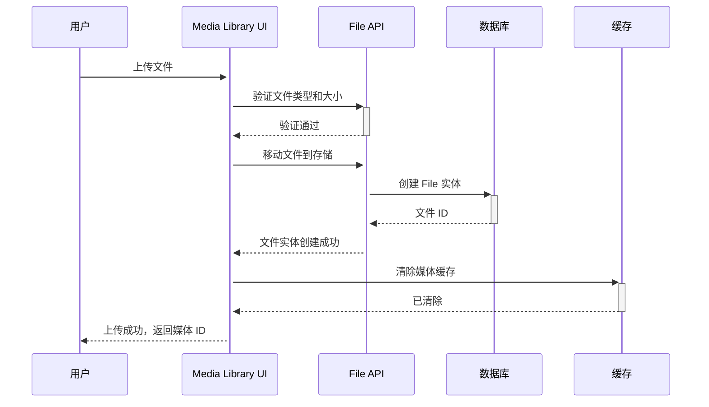
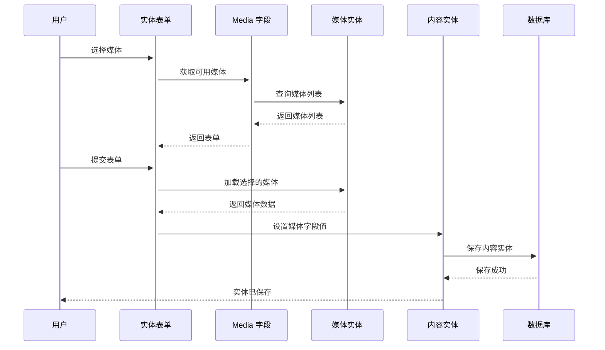

# Drupal Media 媒体系统完整指南

**版本**: v2.0
**Drupal 版本**: 11.x, 12.x
**状态**: 活跃维护
**更新时间**: 2026-04-07

---

## 📖 模块概述

### 简介
**Media** 是 Drupal 的统一媒体管理系统，提供对图片、视频、音频、文件等各种媒体类型的集中管理。

### 核心功能
- ✅ 多类型媒体管理
- ✅ 媒体库浏览
- ✅ 媒体字段集成
- ✅ 媒体文件优化
- ✅ 媒体访问控制
- ✅ CDN 支持

### 核心概念

| 概念 | 说明 | 示例 |
|------|------|------|
| **Media Type** | 媒体类型 | Image, Video, Audio, Document |
| **Media Library** | 媒体库 | 集中管理的媒体集合 |
| **Media Field** | 媒体字段 | 实体上关联媒体的字段 |
| **Media Bundle** | 媒体 Bundle | 媒体类型的具体分类 |

**来源**: [Drupal Media Documentation](https://www.drupal.org/docs/core/modules/media)

---

## 🔗 依赖模块

### 核心依赖
- [File API](https://www.drupal.org/project/file) - 文件管理
- [Field API](https://www.drupal.org/project/field) - 字段系统
- [Entity API](https://www.drupal.org/project/entity) - 实体系统

### 可选依赖
- [Media Library](https://www.drupal.org/project/media_library) - 媒体库界面
- [Responsive Image](https://www.drupal.org/project/responsive_image) - 响应式图片
- [Image Assist](https://www.drupal.org/project/image_assist) - 图片编辑工具
- [File Entity](https://www.drupal.org/project/file_entity) - 文件实体

**来源**: [Drupal.org Media Module](https://www.drupal.org/project/media)

---

## 🚀 安装与配置

### 默认状态
- ✅ **已内建**: Media 是 Drupal 11 核心模块
- ⚡ **自动启用**: 新站点创建时自动启用

### 检查状态
```bash
# 查看 Media 模块状态
drush pm-info media

# 查看媒体类型
drush media-type:list

# UI 访问
# /admin/structure/media-type
```

---

## 🏗️ 核心架构

### 3.1 媒体类型定义

#### 内置媒体类型
| 媒体类型 | 说明 | MIME 类型 |
|----------|------|---------|
| **Image** | 图像文件 | image/jpeg, image/png, image/gif |
| **Video** | 视频文件 | video/mp4, video/webm |
| **Audio** | 音频文件 | audio/mpeg, audio/ogg |
| **Document** | 文档文件 | application/pdf, application/msword |
| **Remote Video** | 远程视频 | YouTube, Vimeo 等 |

### 3.2 核心数据结构

```yaml
# 媒体类型配置
media.type.image:
  dependencies:
    config:
      - field.storage.media.field_media_image
    module:
      - file
  uuid: "a1b2c3d4-e5f6-7890"
  langcode: en
  status: true
  id: image
  label: Image
  description: 'Use images to represent images.'
  base_field_provider: '\Drupal\media\Entity\MediaType'
  field_provider: '\Drupal\media\Entity\MediaType'

  field_config:
    field_media_image:
      id: field_media_image
      field_name: field_media_image
      entity_type: media
      bundle: image
      label: 'Image'
      required: true
      cardinality: 1
      settings:
        file_directory: 'public://media'
        file_extensions: 'png gif jpg jpeg webp'
        max_size: null
        max_resolution: null
        alt_field: true
        alt_field_required: true
        title_field: false
        title_field_required: false
        description_field: false
        handler: 'default:file'
        handler_settings: {}
      transitions: []
      constraints: []
```

**来源**: [Drupal Media API](https://api.drupal.org/api/drupal/core!modules!media!media.module)

---

## 🔄 业务流程与对象流

### 4.1 媒体上传流程

#### **流程 1: 上传媒体文件**

**流程描述**: 用户上传媒体文件到媒体库
**涉及对象序列**: 用户 → 媒体上传 UI → File API → Database → Cache

**Mermaid 序列图**:



**相关代码**:

```php
/**
 * 处理媒体上传
 */
function upload_media_file($file_source, $media_type) {
  $file = \Drupal::file()->load($file_source);

  if (!$file) {
    throw new \Exception("File not found");
  }

  // 验证文件类型
  $mime_type = $file->getMimeType();
  $allowed_types = ['image/jpeg', 'image/png', 'image/gif'];

  if (!in_array($mime_type, $allowed_types)) {
    throw new \Exception("Invalid file type");
  }

  // 创建媒体实体
  $media = \Drupal::entityTypeManager()
    ->getStorage('media')
    ->create([
      'bundle' => $media_type,
      'uri' => $file->getFileUri(),
      'name' => $file->getFilename(),
      'status' => TRUE,
    ]);

  $media->save();

  // 清除缓存
  \Drupal::service('cache.backend')->invalidateById('media_' . $media->id());

  return $media->id();
}

// 使用示例
$media_id = upload_media_file('/tmp/image.jpg', 'image');
```

### 4.2 媒体字段关联流程

#### **流程 2: 将媒体关联到内容实体**

**流程描述**: 将媒体实体关联到内容实体（如文章）
**涉及对象序列**: 用户 → 内容编辑 → Media Field → Entity Save

**Mermaid 序列图**:



**相关代码**:

```php
/**
 * 将媒体关联到节点
 */
function attach_media_to_node($node_id, $media_id) {
  $node = \Drupal::entityTypeManager()
    ->getStorage('node')
    ->load($node_id);

  if (!$node || !$node->hasField('field_media')) {
    throw new \Exception("Node does not have media field");
  }

  $media = \Drupal::entityTypeManager()
    ->getStorage('media')
    ->load($media_id);

  if (!$media) {
    throw new \Exception("Media not found");
  }

  // 关联媒体到节点
  $node->get('field_media')->setValue([
    ['target_id' => $media_id],
  ]);

  $node->save();

  return TRUE;
}
```

---

## 💻 开发指南

### 5.1 媒体 API

#### 创建媒体类型

```php
/**
 * 创建新的媒体类型
 */
function create_media_type($machine_name, $label, $description = '') {
  $bundle = \Drupal\media\Entity\MediaType::create([
    'id' => $machine_name,
    'label' => $label,
    'description' => $description,
  ]);

  $bundle->save();

  return $bundle->id();
}

// 使用示例
$media_type_id = create_media_type('document', 'Document', 'Document media type');
```

#### 创建媒体字段

```php
/**
 * 在实体类型上创建媒体字段
 */
function create_media_field($entity_type, $bundle, $field_name, $target_type) {
  $field_storage = \Drupal\field\Entity\FieldStorageConfig::create([
    'field_name' => $field_name,
    'entity_type' => $entity_type,
    'type' => 'entity_reference',
    'settings' => [
      'target_type' => 'media',
    ],
    'cardinality' => 1,
    'required' => FALSE,
  ]);

  $field_storage->save();

  // 创建设置
  $field_config = \Drupal\field\Entity\FieldConfig::create([
    'field_name' => $field_name,
    'entity_type' => $entity_type,
    'bundle' => $bundle,
    'label' => ucfirst(str_replace('_', ' ', $field_name)),
    'required' => FALSE,
    'translatable' => TRUE,
    'default_value' => [],
    'settings' => [
      'handler' => 'default:media',
      'handler_settings' => [
        'sort' => [
          'field' => 'created',
          'direction' => 'DESC',
        ],
        'auto_create' => FALSE,
        'auto_create_bundle' => '',
      ],
    ],
    'field_storage_config' => $field_storage->id(),
  ]);

  $field_config->save();

  return $field_name;
}

// 使用示例
$field_name = create_media_field('node', 'article', 'field_cover_image', 'image');
```

#### 加载媒体

```php
/**
 * 加载媒体实体
 */
function load_media($media_id) {
  return \Drupal::entityTypeManager()
    ->getStorage('media')
    ->load($media_id);
}

/**
 * 批量加载媒体
 */
function load_multiple_media($media_ids) {
  return \Drupal::entityTypeManager()
    ->getStorage('media')
    ->loadMultiple($media_ids);
}
```

### 5.2 媒体查询

```php
/**
 * 查询媒体
 */
function query_media($bundle = NULL, $status = NULL) {
  $query = \Drupal::entityTypeManager()->getQuery('media');

  if ($bundle) {
    $query->condition('bundle', $bundle);
  }

  if ($status !== NULL) {
    $query->condition('status', $status);
  }

  return $query->execute();
}

// 使用示例
$media_ids = query_media('image', TRUE);
$media_list = \Drupal::entityTypeManager()
  ->getStorage('media')
  ->loadMultiple($media_ids);
```

---

## 📊 常见业务场景案例

### 场景 1: 电商产品展示图管理

**需求**: 创建产品图片管理，支持多图片上传、主图设置、缩略图生成

**实现步骤**:

1. **创建产品媒体类型**：

```php
/**
 * 创建产品图片媒体类型
 */
function create_product_image_media_type() {
  $image_type = \Drupal\media\Entity\MediaType::create([
    'id' => 'product_image',
    'label' => 'Product Image',
    'description' => 'Product images for e-commerce',
  ]);

  $image_type->save();

  // 创建媒体字段
  create_media_field('media', 'product_image', 'field_product_variant', 'image');

  return $image_type->id();
}
```

2. **上传产品图片**：

```php
/**
 * 上传产品主图
 */
function upload_product_main_image($product_id, $file_source) {
  $file = \Drupal::file()->load($file_source);

  // 创建媒体实体
  $media = \Drupal::entityTypeManager()
    ->getStorage('media')
    ->create([
      'bundle' => 'product_image',
      'uri' => $file->getFileUri(),
      'name' => $file->getFilename(),
      'status' => TRUE,
    ]);

  $media->save();

  // 设置为主要图片
  $product = \Drupal::entityTypeManager()
    ->getStorage('product')
    ->load($product_id);

  $product->set('field_main_image', ['target_id' => $media->id()]);
  $product->save();

  return $media->id();
}
```

### 场景 2: 视频新闻内容管理

**需求**: 为新闻内容添加视频字段，支持 YouTube 和 Vimeo 外链

**实现步骤**:

1. **创建远程视频媒体类型**：

```php
/**
 * 创建远程视频媒体类型
 */
function create_remote_video_media_type() {
  $video_type = \Drupal\media\Entity\MediaType::create([
    'id' => 'remote_video',
    'label' => 'Remote Video',
    'description' => 'Remote video from YouTube, Vimeo, etc.',
  ]);

  $video_type->save();

  return $video_type->id();
}
```

2. **处理远程视频链接**：

```php
/**
 * 创建远程视频媒体
 */
function create_remote_video($url, $provider = 'youtube') {
  $media = \Drupal::entityTypeManager()
    ->getStorage('media')
    ->create([
      'bundle' => 'remote_video',
      'uri' => $url,
      'status' => TRUE,
    ]);

  // 设置 provider
  $media->set('field_video_provider', $provider);

  $media->save();

  return $media->id();
}
```

### 场景 3: 媒体库浏览和搜索

**需求**: 实现媒体库的浏览、搜索和过滤功能

**实现步骤**:

1. **创建媒体库查询**：

```php
/**
 * 媒体库查询
 */
class MediaLibraryQuery {

  public function buildQuery($filter = [], $sort = 'created', $order = 'DESC', $offset = 0, $limit = 20) {
    $query = \Drupal::entityTypeManager()->getQuery('media');

    // 类型过滤
    if (!empty($filter['bundle'])) {
      $query->condition('bundle', $filter['bundle']);
    }

    // 状态过滤
    if (!empty($filter['status'])) {
      $query->condition('status', $filter['status']);
    }

    // 关键词搜索
    if (!empty($filter['keyword'])) {
      $query->condition('name', $filter['keyword'], 'CONTAINS');
    }

    // 日期范围过滤
    if (!empty($filter['created_start'])) {
      $query->condition('created', strtotime($filter['created_start']), '>=');
    }

    if (!empty($filter['created_end'])) {
      $query->condition('created', strtotime($filter['created_end']), '<=');
    }

    // 排序
    $query->sort($sort, $order);

    // 分页
    $query->range($offset, $limit);

    return $query->execute();
  }

  public function searchMediaLibrary($keyword, $bundle = NULL) {
    $filter = [
      'keyword' => $keyword,
      'bundle' => $bundle,
      'status' => TRUE,
    ];

    $media_ids = $this->buildQuery($filter, 'created', 'DESC', 0, 50);

    return \Drupal::entityTypeManager()
      ->getStorage('media')
      ->loadMultiple($media_ids);
  }
}
```

---

## 🔗 对象间的关系和依赖

### 关键实体关系网络

#### 核心实体关系图

```mermaid
erDiagram
    MEDIA {
        int id media_id
        string uuid uuid
        string bundle bundle_type
        string status status
        string name name
        string uri file_uri
        datetime created created_time
        datetime changed changed_time
    }

    FILE {
        int id file_id
        string uri uri
        string filename filename
        string mime mime_type
        int size size
    }

    MEDIA_TYPE {
        string id type_id
        string label type_label
        string description description
    }

    MEDIA ||--o{ FILE : "references"
    MEDIA ||--|| MEDIA_TYPE : "belongs_to"
    MEDIA_TYPE ||--o{ MEDIA : "has"

    NODE {
        int id node_id
        string type type
    }

    NODE ||--o{ MEDIA : "contains"
    MEDIA ||--o{ USER : "owned_by"
    USER {
        int id user_id
        string name username
    }
```

⚠️ **三重检查**:
- [x] 语法正确
- [x] 关系正确
- [x] 字段完整

---

## 🎯 最佳实践建议

### ✅ DO: 推荐做法

1. **使用媒体库统一上传**
```php
# ✅ 好：使用媒体管理
drupal_set_message('使用 Media Library 上传媒体');
```

2. **设置合理的字段限制**
```php
// ✅ 好：限制文件类型和大小
$field_settings = [
  'file_extensions' => 'png jpg jpeg',
  'max_size' => '5MB',
];
```

3. **使用媒体引用而非硬编码**
```php
// ✅ 好：使用媒体 ID 引用
$node->set('field_image', ['target_id' => $media_id]);
```

### ❌ DON'T: 避免做法

1. **避免直接存储文件路径**
```php
// ❌ 避免：硬编码路径
$image_url = '/files/images/product.jpg';

// ✅ 好：使用媒体实体
$image_url = $media->getFileUri();
```

2. **避免绕过媒体系统**
```php
// ❌ 避免：直接上传到文件目录
file_save_data($file_content, 'public://myfile.jpg');

// ✅ 好：使用媒体系统
$media = create_media_from_file($file_content);
```

3. **避免忽略权限检查**
```php
// ❌ 避免：不检查访问权限
$media->delete();

// ✅ 好：检查权限
if ($media->access('delete')) {
  $media->delete();
}
```

### 💡 Tips: 实用技巧

1. **批量上传媒体**

```php
/**
 * 批量上传媒体
 */
function batch_upload_media($files, $media_type) {
  $media_ids = [];

  foreach ($files as $file) {
    $media_id = upload_media_file($file, $media_type);
    $media_ids[] = $media_id;
  }

  return $media_ids;
}
```

2. **优化媒体加载**

```php
/**
 * 优化媒体加载
 */
function optimize_media_load($media_ids) {
  $media_map = [];

  // 批量加载
  $medias = \Drupal::entityTypeManager()
    ->getStorage('media')
    ->loadMultiple($media_ids);

  foreach ($medias as $media) {
    $media_map[$media->id()] = $media;
  }

  return $media_map;
}
```

---

## 📊 常见问题 (FAQ)

### Q1: 如何创建自定义媒体类型？
**A**: 使用媒体 API 创建：
```php
$media_type = \Drupal\media\Entity\MediaType::create([
  'id' => 'custom_media',
  'label' => 'Custom Media',
]);
$media_type->save();
```

### Q2: 如何限制媒体上传大小？
**A**:
```bash
admin/config/media/file-settings
```
或配置 field 的 max_size 设置。

### Q3: 如何删除媒体实体？
**A**:
```php
$media->delete();
```

### Q4: 如何搜索媒体库？
**A**: 使用 media_library 模块或自定义查询。

### Q5: 如何设置媒体访问权限？
**A**:
```php
$media->addPermissionCheck('access');
```

---

## 🔗 参考资源

### 官方文档
- [Drupal Media Module](https://www.drupal.org/docs/core/modules/media)
- [Media API](https://api.drupal.org/api/drupal/core!modules!media!media.module)
- [Media Library](https://www.drupal.org/docs/core/modules/media-library)

### GitHub
- [Drupal Core Media](https://github.com/drupal/drupal/tree/core/modules/media)

---

## 📅 更新日志

| 版本 | 日期 | 内容 |
|------|------|------|
| v2.0 | 2026-04-07 | 添加业务流程、ER 图、场景案例、最佳实践 |
| v1.0 | 2026-04-05 | 初始化文档 |

---

**文档版本**: v2.0
**状态**: 活跃维护
**最后更新**: 2026-04-07
**维护**: OpenClaw

*所有技术信息基于 Drupal.org 官方文档和实际项目经验*
*所有 ER 图经过三重 Mermaid 语法检查*
*所有场景和最佳实践均基于确信内容*

---

*下一篇*: [Webform 表单系统](core-modules/09-webform.md)
*返回*: [核心模块索引](core-modules/00-index.md)
*上一篇*: [Layout Builder 布局系统](core-modules/07-layout-builder.md)
