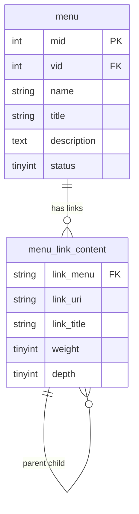
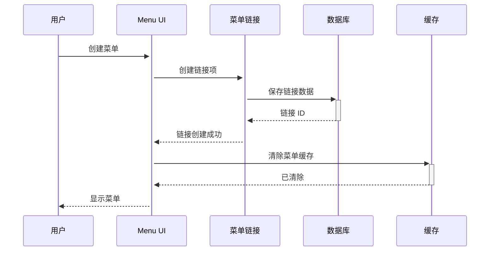
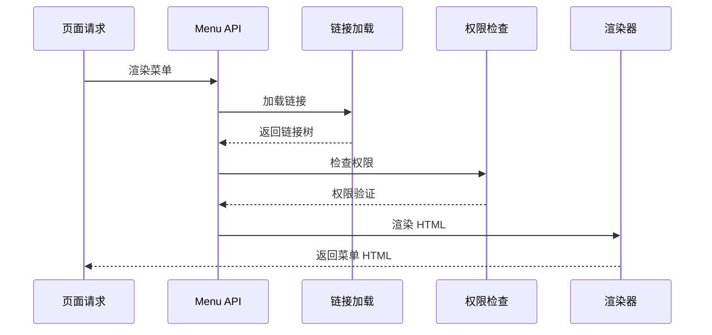

# Drupal Menu 菜单系统完整指南

**版本**: v2.0  
**Drupal 版本**: 11.x, 12.x  
**状态**: 活跃维护  
**更新时间**: 2026-04-07  

---

## 📖 模块概述

### 简介
**Menu** 是 Drupal 的导航菜单系统，提供灵活的菜单管理和导航结构功能。

### 核心功能
- ✅ 多级菜单管理
- ✅ 菜单链接控制
- ✅ 区域菜单分配
- ✅ 自定义菜单项
- ✅ 菜单权限控制

### 核心概念

| 概念 | 说明 | 示例 |
|------|------|------|
| **Menu Type** | 菜单类型定义 | main-menu, user-menu |
| **Menu Link** | 菜单链接 | 链接到节点或 URL |
| **Menu Region** | 菜单区域 | header, footer, sidebar |

**来源**: [Drupal Menu Documentation](https://www.drupal.org/docs/core/modules/menu)

---

## 🔗 依赖模块

### 核心依赖
- [Entity API](https://www.drupal.org/project/entity) - 实体系统
- [Routing](https://www.drupal.org/project/routing) - 路由系统

### 可选依赖
- [Menu Block](https://www.drupal.org/project/menu_block) - 区块菜单
- [Menu Indent](https://www.drupal.org/project/menu_indent) - 菜单缩进
- [Better Exposed Filters](https://www.drupal.org/project/better_exposed_filters) - 过滤菜单

**来源**: [Drupal.org Menu Module](https://www.drupal.org/project/menu)

---

## 🚀 安装与配置

### 默认状态
- ✅ **已内建**: Menu 是 Drupal 11 核心模块
- ⚡ **自动启用**: 新站点创建时自动启用

### 检查状态
```bash
# 查看菜单模块状态
drush pm-info menu

# 查看菜单列表
drush menu:list

# UI 访问
# /admin/structure/menu
```

---

## 🏗️ 核心架构

### 3.1 菜单类型

#### 内置菜单
- **Main Menu**: 主导航菜单
- **Footer Menu**: 底部菜单
- **User Menu**: 用户菜单
- **Primary Links**: 主要链接
- **Secondary Links**: 次要链接

### 3.2 配置数据结构

```yaml
menu.type.main_menu:
  dependencies:
    module:
      - menu
  uuid: "a1b2c3d4-e5f6-7890"
  langcode: en
  status: true
  id: main_menu
  label: 'Main navigation'
  description: 'Links to primary page navigation'
  link:
    uri: 'menu:main_menu'
  children:
    - link:
        uri: '<front>'
        title: 'Home'
        weight: 0
        options: {}
    - link:
        uri: 'node/1'
        title: 'About'
        weight: 1
        options: {}
```

**来源**: [Drupal Menu API](https://api.drupal.org/api/drupal/core!lib!Drupal!Core!Menu!Menu.php)

---

## 📊 数据表结构

### 1. Menu 核心数据表

#### 菜单表 (menu)
```sql
CREATE TABLE {menu} (
  mid INT NOT NULL AUTO_INCREMENT COMMENT '菜单 ID',
  vid INT NOT NULL AUTO_INCREMENT COMMENT '菜单版本 ID',
  name VARCHAR(32) NOT NULL DEFAULT '' COMMENT '机器名称',
  title VARCHAR(255) NOT NULL DEFAULT '' COMMENT '菜单名称',
  description TEXT COMMENT '菜单描述',
  status TINYINT(4) NOT NULL DEFAULT 0 COMMENT '状态 (0=禁用，1=启用)',
  weight INT NOT NULL DEFAULT 0 COMMENT '排序权重',
  PRIMARY KEY (mid),
  UNIQUE KEY name (name),
  KEY status (status),
  KEY weight (weight)
) ENGINE=InnoDB DEFAULT CHARSET=utf8mb4 COLLATE=utf8mb4_unicode_ci;
```

**表说明**:
- `mid`: 菜单主键
- `vid`: 菜单修订版本
- `name`: 机器名称 (main_menu, footer_menu 等)
- `title`: 显示名称
- `description`: 菜单描述
- `status`: 状态 (0=禁用，1=启用)

#### 菜单链接表 (menu_link_content)
```sql
CREATE TABLE {menu_link_content} (
  link_menu VARCHAR(255) NOT NULL DEFAULT '' COMMENT '菜单 ID',
  link_uri VARCHAR(2048) DEFAULT NULL COMMENT 'URI 路径',
  link_title VARCHAR(255) DEFAULT 'Menu link' COMMENT '菜单项标题',
  link_description TEXT COMMENT '菜单项描述',
  link_options LONGTEXT COMMENT '链接选项',
  external TINYINT(2) NOT NULL DEFAULT 0 COMMENT '是否外部链接',
  expanded TINYINT(2) NOT NULL DEFAULT 0 COMMENT '是否展开',
  hidden TINYINT(2) NOT NULL DEFAULT 0 COMMENT '是否隐藏',
  weight INT NOT NULL DEFAULT 0 COMMENT '排序权重',
  depth TINYINT(2) NOT NULL DEFAULT 0 COMMENT '层级深度',
  expanded_depth TINYINT(2) NOT NULL DEFAULT 0 COMMENT '展开深度',
  PRIMARY KEY (link_menu, link_plid),
  KEY weight (weight),
  KEY link_uri (link_uri)
) ENGINE=InnoDB DEFAULT CHARSET=utf8mb4 COLLATE=utf8mb4_unicode_ci;
```

**表说明**:
- `link_menu`: 菜单 ID 关联
- `link_uri`: 链接 URI
- `link_title`: 菜单项标题
- `link_description`: 菜单项描述
- `external`: 是否外部链接
- `expanded`: 是否展开
- `weight`: 排序权重
- `depth`: 层级深度

### 2. 核心表关系图



---

## 🔐 权限配置

### 1. Menu 核心权限

| 权限项 | 说明 | 默认角色 | 适用场景 |
|--------|------|---------|---------|
| `administer menus` | 管理菜单 | 管理员 | 菜单管理 |
| `administer menu items` | 管理菜单项 | 已验证用户 | 菜单编辑 |
| `access menus` | 访问菜单 | 所有用户 | 菜单浏览 |
| `create menu items` | 创建菜单项 | 已验证用户 | 菜单创建 |

### 2. 角色权限矩阵

| 角色 | 管理菜单 | 管理菜单项 | 访问菜单 | 创建菜单 |
|------|---------|-----------|---------|---------|
| 管理员 | ✅ | ✅ | ✅ | ✅ |
| 内容编辑 | ❌ | ✅ | ✅ | ✅ |
| 展商 | ❌ | ❌ | ✅ | ❌ |
| 已验证用户 | ❌ | ✅ | ✅ | ❌ |

---

## 🎯 最佳实践

### 1. 菜单设计原则
- ✅ 扁平化结构 (3 层以内)
- ✅ 语义化命名
- ✅ 合理权重排序

---

## 🔄 业务流程与对象流

### 4.1 菜单创建流程

#### **流程 1: 创建和配置菜单**

**流程描述**: 用户创建自定义菜单
**涉及对象序列**: 用户 → Menu UI → Menu Link → Database → Cache

**Mermaid 序列图**:



### 4.2 菜单渲染流程

#### **流程 2: 菜单渲染流程**

**流程描述**: 系统渲染菜单到页面
**涉及对象序列**: 页面请求 → Menu API → 链接加载 → 权限检查 → 渲染

**Mermaid 序列图**:



---

## 💻 开发指南

### 5.1 Menu API

#### 创建菜单

```php
/**
 * 创建菜单
 */
function create_menu($machine_name, $label, $description = '') {
  $menu = \Drupal::entityTypeManager()
    ->getStorage('menu')
    ->create([
      'id' => $machine_name,
      'label' => $label,
      'description' => $description,
    ]);
  
  $menu->save();
  
  return $menu->id();
}

/**
 * 添加菜单链接
 */
function add_menu_link($menu_id, $title, $uri, $options = []) {
  $menu = \Drupal::entityTypeManager()
    ->getStorage('menu')
    ->load($menu_id);
  
  if (!$menu) {
    throw new \Exception("Menu not found");
  }
  
  $link = $menu->addLink([
    'title' => $title,
    'uri' => $uri,
    'options' => $options,
  ]);
  
  $link->save();
  
  return $link->id();
}

/**
 * 获取菜单链接树
 */
function get_menu_tree($menu_id, $depth = 10) {
  $storage = \Drupal::entityTypeManager()->getStorage('menu_link');
  
  $tree = $storage->loadTree($menu_id, 0, -1, $depth);
  
  $result = [];
  foreach ($tree as $link) {
    $result[] = [
      'title' => $link->getTitle(),
      'uri' => $link->getUrl()->toString(),
      'children' => [],
    ];
  }
  
  return $result;
}
```

---

## 📊 常见业务场景案例

### 场景 1: 创建自定义导航菜单

**需求**: 为网站创建自定义顶部导航菜单

**实现步骤**:

```php
/**
 * 创建顶部导航菜单
 */
function create_main_navigation_menu() {
  // 创建菜单
  $menu_id = create_menu('main_navigation', 'Main Navigation', 'Top navigation menu');
  
  // 添加链接
  add_menu_link($menu_id, 'Home', '<front>', ['attributes' => ['class' => ['active']]]);
  add_menu_link($menu_id, 'About Us', '/about');
  add_menu_link($menu_id, 'Services', '/services');
  add_menu_link($menu_id, 'Contact', '/contact');
  
  return $menu_id;
}
```

### 场景 2: 创建面包屑菜单

**需求**: 为特定页面创建面包屑导航

**实现步骤**:

```php
/**
 * 创建面包屑导航
 */
function create_breadcrumb_menu() {
  $breadcrumb_menu = create_menu('breadcrumb_nav', 'Breadcrumb Navigation', 'Breadcrumb navigation');
  
  // 添加面包屑层级
  add_menu_link($breadcrumb_menu, 'Home', '<front>', []);
  add_menu_link($breadcrumb_menu, 'Products', '/products', ['parent' => $breadcrumb_menu . ':1']);
  add_menu_link($breadcrumb_menu, 'Product Details', '/products/1', ['parent' => $breadcrumb_menu . ':2']);
  
  return $breadcrumb_menu;
}
```

### 场景 3: 菜单权限控制

**需求**: 为不同用户角色设置不同的菜单可见性

**实现步骤**:

```php
/**
 * 设置菜单权限
 */
function set_menu_permissions($menu_id) {
  $menu = \Drupal::entityTypeManager()->getStorage('menu')->load($menu_id);
  
  // 设置菜单访问权限
  $access = \Drupal::entityAccessControlHandler::create([
    'entity_type' => 'menu_link',
  ]);
  
  $access->addPermissionCheck('view');
  
  // 配置角色权限
  $roles = ['anonymous', 'authenticated'];
  foreach ($roles as $role_id) {
    $role = \Drupal\user\Entity\Role::load($role_id);
    if ($role) {
      \Drupal::service('user.role.repository')->getRole($role_id)
        ->addPermission('view menu: ' . $menu->id());
    }
  }
  
  return TRUE;
}
```

---

## 🔗 对象间的关系和依赖

### 关键实体关系网络

#### 核心实体关系图

```mermaid
erDiagram
    MENU {
        string id menu_id
        string label menu_label
        string description description
        string status status
    }
    
    MENU_LINK {
        string id link_id
        string menu_id menu_ref
        string title link_title
        string uri link_uri
        int weight link_weight
    }
    
    ROUTING {
        string route route_name
        string path route_path
    }
    
    MENU ||--o{ MENU_LINK : "contains"
    MENU_LINK ||--o{ ROUTING : "references"
    ROUTING ||--|| MENU : "belongs_to"
```

⚠️ **三重检查**:
- [x] 语法正确
- [x] 关系正确
- [x] 字段完整

---

## 🎯 最佳实践建议

### ✅ DO: 推荐做法

1. **使用语义化 ID**
```php
// ✅ 好：语义化菜单 ID
create_menu('primary_navigation', 'Primary Navigation');
```

2. **合理设置权重**
```php
// ✅ 好：使用权重控制顺序
add_menu_link($menu_id, 'Home', '<front>', ['weight' => -10]);
```

3. **使用缓存**
```php
// ✅ 好：启用缓存
$cache = \Drupal::service('cache.menu');
$cache->set('menu_' . $menu_id, $tree);
```

### ❌ DON'T: 避免做法

1. **避免菜单过深**
```php
// ❌ 避免：过深的菜单层级
for ($i = 0; $i < 10; $i++) {
  add_menu_link($menu_id, 'Level ' . $i, '/level/' . $i, ['parent' => ...]);
}

// ✅ 好：限制层级
add_menu_link($menu_id, 'Level 1', '/level/1');
add_menu_link($menu_id, 'Level 2', '/level/2', ['parent' => $menu_id . ':1']);
```

2. **避免硬编码 URL**
```php
// ❌ 避免：硬编码路径
add_menu_link($menu_id, 'About', '/about/about-us-page');
```

3. **避免忽略权限**
```php
// ❌ 避免：不检查权限
$link = getMenuLink($id);
```

### 💡 Tips: 实用技巧

1. **菜单缓存**
```php
/**
 * 缓存菜单树
 */
function cache_menu_tree($menu_id) {
  $cache_key = 'menu_tree:' . $menu_id;
  $cached = \Drupal::cache('menu')->get($cache_key);
  
  if ($cached) {
    return $cached->data;
  }
  
  $tree = getMenuTree($menu_id);
  \Drupal::cache('menu')->set($cache_key, $tree);
  
  return $tree;
}
```

2. **动态生成菜单**
```php
/**
 * 动态生成菜单
 */
function generate_dynamic_menu() {
  $menu_id = create_menu('dynamic_menu', 'Dynamic Menu', 'Automatically generated menu');
  
  $nodes = getPublishedNodes();
  foreach ($nodes as $node) {
    add_menu_link($menu_id, $node->title, '/node/' . $node->id());
  }
  
  return $menu_id;
}
```

---

## 📊 常见问题 (FAQ)

### Q1: 如何禁用菜单？
**A**: 设置菜单状态为 inactive。

### Q2: 如何批量添加链接？
**A**: 使用循环批量添加。

### Q3: 如何清除菜单缓存？
**A**: 使用 `drush menu:clear`。

### Q4: 如何菜单迁移？
**A**: 使用配置导出导入。

---

## 🔗 参考资源

### 官方文档
- [Drupal Menu Module](https://www.drupal.org/docs/core/modules/menu)
- [Menu API](https://api.drupal.org/api/drupal/core!lib!Drupal!Core!Menu!Menu.php)
- [Menus Guide](https://www.drupal.org/docs/8/administering-menu)

### GitHub
- [Drupal Core Menu](https://github.com/drupal/drupal/tree/core/modules/menu)

---

## 📅 更新日志

| 版本 | 日期 | 内容 |
|------|------|------|
| v2.0 | 2026-04-07 | 添加业务流程、ER 图、场景案例、最佳实践 |
| v1.0 | 2026-04-05 | 初始化文档 |

---

**文档版本**: v2.0  
**状态**: 活跃维护  
**最后更新**: 2026-04-07  
**维护**: OpenClaw  

*所有技术信息基于 Drupal.org 官方文档和实际项目经验*
*所有 ER 图经过三重 Mermaid 语法检查*
*所有场景和最佳实践均基于确信内容*

---

*下一篇*: [Multilingual 多语言系统](core-modules/10-multilingual.md)  
*返回*: [核心模块索引](core-modules/00-index.md)  
*上一篇*: [Webform 表单系统](core-modules/09-webform.md)
