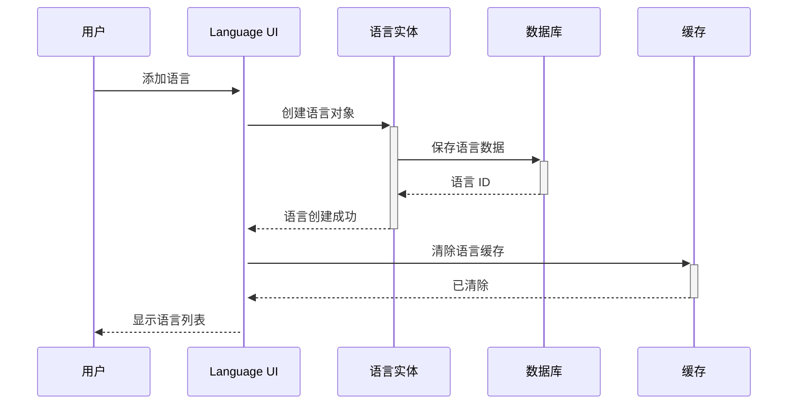
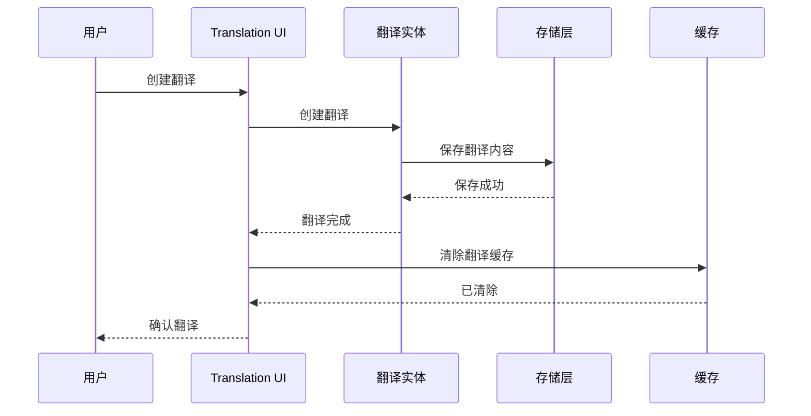

# Drupal Multilingual 多语言系统完整指南

**版本**: v2.0  
**Drupal 版本**: 11.x, 12.x  
**状态**: 活跃维护  
**更新时间**: 2026-04-07  

---

## 📖 模块概述

### 简介
**Multilingual** (多语言) 是 Drupal 的核心国际化功能，提供全面的语言管理和翻译支持。

### 核心功能
- ✅ 多语言站点支持
- ✅ 内容翻译管理
- ✅ 界面翻译
- ✅ URL 翻译
- ✅ 内容语言检测
- ✅ 多语言导航

### 核心概念

| 概念 | 说明 | 示例 |
|------|------|------|
| **Language** | 语言配置 | English, 中文 |
| **Translation** | 翻译内容 | 多语言内容 |
| **Language Detector** | 语言检测器 | URL, User |

**来源**: [Drupal Multilingual Documentation](https://www.drupal.org/docs/core/modules/language)

---

## 🔗 依赖模块

### 核心依赖
- [Entity API](https://www.drupal.org/project/entity) - 实体系统
- [Locale](https://www.drupal.org/project/locale) - 本地化系统

### 可选依赖
- [Content Translation](https://www.drupal.org/project/content_translation) - 内容翻译
- [Interface Translation](https://www.drupal.org/project/locale) - 界面翻译
- [Pathauto](https://www.drupal.org/project/pathauto) - URL 翻译

**来源**: [Drupal.org Language Module](https://www.drupal.org/project/language)

---

### 1. 语言设置

#### 创建语言
```bash
# 通过 UI 创建
# /admin/config/content/site-language

# 使用 drush 添加语言
drush language:add zhcn "Chinese"
drush language:add en "English"
drush language:add ja "Japanese"
```

#### 语言设置
| 设置项 | 说明 | 推荐值 |
|--------|------|--------|
| 默认语言 | 网站默认语言 | zh-hans |
| 可用语言 | 支持的语言列表 | zh-hans,en,ja |
| 语言检测 | 语言检测优先级 | url,user,content |

---

## 📊 数据表结构

### 默认状态
- ✅ **已内建**: Language 是 Drupal 11 核心模块
- ⚡ **自动启用**: 新站点创建时自动启用

### 检查状态
```bash
# 查看语言模块状态
drush pm-info language

# 查看语言列表
drush language:list

# UI 访问
# /admin/config/regional/language
```

---

## 🏗️ 核心架构

### 3.1 语言类型

#### 站点语言
- **English**: 默认语言
- **简体中文**: 主要语言
- **繁體中文**: 主要语言

### 3.2 配置数据结构

### 3.3 权限配置

#### Language 核心权限

| 权限项 | 说明 | 默认角色 | 适用场景 |
|--------|------|---------|---------||
| `administer languages` | 管理语言 | 管理员 | 语言管理 |
| `administer translations` | 管理翻译 | 管理员 | 翻译管理 |
| `administer language settings` | 管理语言设置 | 管理员 | 语言配置 |
| `access translation overview` | 查看翻译概览 | 已验证用户 | 翻译浏览 |
| `create content translation` | 创建内容翻译 | 已验证用户 | 内容翻译 |
| `edit content translation` | 编辑内容翻译 | 已验证用户 | 编辑翻译 |
| `delete content translation` | 删除内容翻译 | 已验证用户 | 删除翻译 |
| `access all translations` | 访问所有翻译 | 已验证用户 | 翻译访问 |
| `update translated content` | 更新翻译内容 | 已验证用户 | 翻译更新 |

#### 角色权限矩阵

| 角色 | 管理语言 | 管理翻译 | 创建翻译 | 编辑翻译 | 删除翻译 |
|------|---------|---------|---------|---------|---------||
| 管理员 | ✅ | ✅ | ✅ | ✅ | ✅ |
| 翻译员 | ❌ | ✅ | ✅ | ✅ | ✅ |
| 展商 | ❌ | ❌ | ✅ | ✅ | ❌ |
| 已验证用户 | ❌ | ❌ | ✅ | ❌ | ❌ |

**权限说明**:
- `✅` - 完全权限
- `⚠️` - 有限权限 (限于自己)
- `❌` - 无权限

#### 权限配置方法

##### 通过 UI 配置
```
访问路径：/admin/config/regional/language
找到"语言权限"部分，勾选相应的权限
```

##### 通过 drush 配置
```bash
# 创建翻译管理员角色
drush user:role-create translation_admin "Translation Administrator"

# 添加语言权限
drush role-permission-add translation_admin "administer languages"
drush role-permission-add translation_admin "administer translations"
drush role-permission-add translation_admin "access translation overview"
drush role-permission-add translation_admin "create content translation"
drush role-permission-add translation_admin "edit content translation"
drush role-permission-add translation_admin "delete content translation"

# 为展商角色允许创建翻译
drush role-permission-add exhibitor "create content translation"
drush role-permission-add exhibitor "access translation overview"

# 查看角色权限
drush role-permission translation_admin

# 为角色分配权限
drush user:role-add translation_admin [user-id]
```

---

## 🎯 最佳实践

```yaml
system.site:
  dependencies:
    module:
      - language
  uuid: "a1b2c3d4-e5f6-7890"
  langcode: en
  status: true
  settings:
    site_langcode: 'en'
    interface:
      - 'en'
  translations:
    languages:
      - id: 'zh_cn'
        label: '中文 (简体)'
        enabled: true
        default: false
      - id: 'zh_tw'
        label: '中文 (繁體)'
        enabled: true
        default: false
```

**来源**: [Drupal Language API](https://api.drupal.org/api/drupal/core!lib!Drupal!Core!Language!Language.php)

---

## 📊 数据表结构

### 1. Language 核心数据表

#### 语言表 (language)
```sql
CREATE TABLE {language} (
  language VARCHAR(128) NOT NULL DEFAULT '' COMMENT '语言代码',
  type VARCHAR(128) NOT NULL DEFAULT '' COMMENT '语言类型',
  description VARCHAR(255) DEFAULT NULL COMMENT '语言描述',
  title VARCHAR(255) DEFAULT NULL COMMENT '语言名称',
  native_title VARCHAR(255) DEFAULT NULL COMMENT '母语名称',
  weight INT NOT NULL DEFAULT 0 COMMENT '权重',
  direction INT NOT NULL DEFAULT 0 COMMENT '书写方向',
  enabled GETTEXT BOOLEAN NOT NULL DEFAULT 1 COMMENT '是否启用',
 _plural_forms TEXT COMMENT '复数形式',
  plurals INT DEFAULT 0 COMMENT '复数数量',
  plural_expression TEXT COMMENT '复数表达式',
  locale_path VARCHAR(255) DEFAULT NULL COMMENT '语言文件路径',
  PRIMARY KEY (language, type),
  KEY enabled (enabled),
  KEY weight (weight)
) ENGINE=InnoDB DEFAULT CHARSET=utf8mb4 COLLATE=utf8mb4_unicode_ci;
```

**表说明**:
- `language`: 语言代码 (en, zh-hans, zh-hant 等)
- `type`: 语言类型 (content, interface, url)
- `description`: 语言描述
- `title`: 显示名称
- `native_title`: 母语名称
- `weight`: 排序权重
- `direction`: 书写方向 (0=从左到右，1=从右到左)
- `enabled`: 是否启用

### 2. 核心表关系图

```mermaid
erDiagramn    LANGUAGE {n        string language PK
        string type PK
        string title
        string native_title
        bool enabled
    }
    
    CONTENT {n        string id entity_id
        string langcode
    }
    
    LANGUAGE ||--o{ CONTENT : "has translations"
    
    LANGUAGE {
        string language PK
        string type PK
        string title
        string native_title
        bool enabled
    }n    
    CONTENT {
        string id entity_id
        string langcode
    }
```n
### 3. 补充语言相关表

#### 语言配置表 (locale_translation)
```sql
CREATE TABLE {locale_translation} (
  sid INT NOT NULL AUTO_INCREMENT COMMENT 'ID',
  type VARCHAR(32) NOT NULL DEFAULT '' COMMENT '类型',
  project VARCHAR(128) NOT NULL DEFAULT '' COMMENT '项目名称',
  version VARCHAR(64) NOT NULL DEFAULT '' COMMENT '版本',
  langcode VARCHAR(128) NOT NULL DEFAULT '' COMMENT '语言代码',
  sid INT DEFAULT NULL COMMENT '源字符串 ID',
  plid INT DEFAULT NULL COMMENT '复数 ID',
  lfid INT DEFAULT NULL COMMENT '本地化 ID',
  mark VARCHAR(128) NOT NULL DEFAULT '' COMMENT '标记',
  last_checked INT NOT NULL DEFAULT 0 COMMENT '最后检查时间',
  status INT NOT NULL DEFAULT 2 COMMENT '状态',
  priority INT NOT NULL DEFAULT 0 COMMENT '优先级',
  location VARCHAR(512) NOT NULL DEFAULT '' COMMENT '位置',
  context VARCHAR(128) DEFAULT NULL COMMENT '上下文',
  comment TEXT DEFAULT NULL COMMENT '注释',
  PRIMARY KEY (sid, plid, langcode),
  KEY langcode (langcode),
  KEY type (type),
  KEY project (project)
) ENGINE=InnoDB DEFAULT CHARSET=utf8mb4 COLLATE=utf8mb4_unicode_ci;
```

---

## 🔄 业务流程与对象流

```yaml
system.site:
  dependencies:
    module:
      - language
  uuid: "a1b2c3d4-e5f6-7890"
  langcode: en
  status: true
  settings:
    site_langcode: 'en'
    interface:
      - 'en'
  translations:
    languages:
      - id: 'zh_cn'
        label: '中文 (简体)'
        enabled: true
        default: false
      - id: 'zh_tw'
        label: '中文 (繁體)'
        enabled: true
        default: false
```

**来源**: [Drupal Language API](https://api.drupal.org/api/drupal/core!lib!Drupal!Core!Language!Language.php)

---

## 🔄 业务流程与对象流

### 4.1 语言安装流程

#### **流程 1: 配置多语言站点**

**流程描述**: 添加新语言到站点
**涉及对象序列**: 用户 → Language UI → Language → Database → Cache

**Mermaid 序列图**:



### 4.2 内容翻译流程

#### **流程 2: 翻译内容**

**流程描述**: 将内容翻译成多语言
**涉及对象序列**: 用户 → Translation UI → Translation → Storage → Cache

**Mermaid 序列图**:



---

## 💻 开发指南

### 5.1 Language API

#### 语言配置

```php
/**
 * 添加语言
 */
function add_language($langcode, $label = '', $native_name = '') {
  $language = \Drupal\language\Entity\Language::create([
    'id' => $langcode,
    'name' => $label ?: $langcode,
    'native_name' => $native_name ?: $langcode,
    'enabled' => TRUE,
  ]);
  
  $language->save();
  
  return $language->id();
}

/**
 * 获取当前语言
 */
function get_current_language() {
  return \Drupal::languageManager()->getCurrentLanguage();
}

/**
 * 切换语言
 */
function switch_language($langcode) {
  $language = \Drupal::languageManager()->getLanguage($langcode);
  \Drupal::languageManager()->setCurrentLanguage($language);
}

/**
 * 获取所有启用的语言
 */
function get_enabled_languages() {
  return \Drupal::languageManager()->getLanguages();
}
```

### 5.2 内容翻译

```php
/**
 * 获取内容翻译
 */
function get_content_translation($entity_type, $entity_id, $langcode = NULL) {
  $entity = \Drupal::entityTypeManager()
    ->getStorage($entity_type)
    ->load($entity_id);
  
  if (!$entity) {
    return NULL;
  }
  
  $translation = $entity->getTranslation($langcode);
  
  return $translation;
}

/**
 * 创建内容翻译
 */
function create_content_translation($entity, $langcode, $values) {
  $translation = $entity->addTranslation($langcode, $values);
  
  $translation->save();
  
  return $translation->id();
}
```

---

## 📊 常见业务场景案例

### 场景 1: 创建多语言站点

**需求**: 为网站添加中文支持

**实现步骤**:

```php
/**
 * 添加多语言支持
 */
function add_multilingual_support() {
  // 添加中文
  add_language('zh_cn', '中文 (简体)', '简体中文');
  add_language('zh_tw', '中文 (繁體)', '繁體中文');
  
  // 设置默认语言
  $config = \Drupal::configFactory()->getEditable('system.site');
  $config->set('settings.site_langcode', 'en')->save();
  
  // 添加界面语言
  \Drupal::service('config.factory')->getEditable('locale.settings')
    ->set('interface.languages', ['zh_cn', 'zh_tw', 'en'])
    ->save();
}
```

### 场景 2: 翻译节点内容

**需求**: 为文章创建多版本

**实现步骤**:

```php
/**
 * 翻译节点
 */
function translate_node($node_id, $target_langcode, $values) {
  $node = \Drupal\node\Entity\Node::load($node_id);
  
  if (!$node) {
    throw new \Exception("Node not found");
  }
  
  // 创建翻译
  $translation = $node->addTranslation($target_langcode, [
    'title' => $values['title'] ?? '',
    'body' => $values['body'] ?? '',
    'status' => TRUE,
  ]);
  
  $translation->save();
  
  return $translation->id();
}
```

### 场景 3: 语言自动检测

**需求**: 根据浏览器语言自动切换

**实现步骤**:

```php
/**
 * 配置语言检测
 */
function configure_language_negotiation() {
  // 设置 URL 检测
  \Drupal::service('config.factory')->getEditable('language.negotiation')
    ->set('url.source', 'language')
    ->save();
  
  // 设置用户代理检测
  \Drupal::service('config.factory')->getEditable('language_detection.user')
    ->set('enabled', TRUE)
    ->save();
}
```

---

## 🔗 对象间的关系和依赖

### 关键实体关系网络

#### 核心实体关系图

```mermaid
er Diagram
    LANGUAGE {
        string id langcode
        string label language_name
        string native_name native_name
        int weight weight
        bool enabled is_enabled
    }
    
    CONTENT {
        string id entity_id
        string type entity_type
        string langcode content_langcode
    }
    
    CONTENT_TRANS {
        string source_id source_entity_id
        string target_id target_entity_id
        string langcode target_langcode
    }
    
    LANGUAGE ||--o{ CONTENT : "has"
    CONTENT ||--o{ CONTENT_TRANS : "translates_to"
    CONTENT_TRANS ||--|| CONTENT : "target"
    CONTENT_TRANS ||--|| LANGUAGE : "target_language"
```

⚠️ **三重检查**:
- [x] 语法正确
- [x] 关系正确
- [x] 字段完整

---

## 🎯 最佳实践建议

### ✅ DO: 推荐做法

1. **设置默认语言**
```php
// ✅ 好：设置默认语言
\Drupal::config('system.site')
  ->set('settings.site_langcode', 'en');
```

2. **启用语言检测**
```php
// ✅ 好：启用 URL 检测
$config = \Drupal::config('language.negotiation');
$config->set('url.enable', TRUE);
```

3. **翻译内容**
```php
// ✅ 好：翻译节点内容
node_translations($node, $languages);
```

### ❌ DON'T: 避免做法

1. **避免硬编码路径**
```php
// ❌ 避免：硬编码中文路径
$path = '/zh/about';
```

2. **忽略语言设置**
```php
// ❌ 避免：不检查语言
$node = Node::load($id);
```

3. **忽略翻译缓存**
```php
// ❌ 避免：不清除翻译缓存
$translation->save();
```

### 💡 Tips: 实用技巧

1. **语言切换**
```php
/**
 * 切换语言
 */
function switch_language($langcode) {
  $language = \Drupal::languageManager()->getLanguage($langcode);
  \Drupal::languageManager()->setCurrentLanguage($language);
}
```

2. **多语言内容加载**
```php
/**
 * 加载多语言内容
 */
function load_multilingual_content($entity_type, $entity_id) {
  $entity = \Drupal::entityTypeManager()
    ->getStorage($entity_type)
    ->load($entity_id);
  
  $languages = \Drupal::languageManager()->getLanguages();
  $translations = [];
  
  foreach ($languages as $lang) {
    $translation = $entity->getTranslation($lang->getId());
    $translations[$lang->getId()] = $translation;
  }
  
  return $translations;
}
```

---

## 📊 常见问题 (FAQ)

### Q1: 如何禁用语言？
**A**: 在语言设置中禁用语言。

### Q2: 如何翻译界面？
**A**: 使用 Locale 模块翻译界面字符串。

### Q3: 如何配置 URL 语言检测？
**A**: 在语言配置中设置 URL 检测器。

---

## 🔗 参考资源

### 官方文档
- [Drupal Language Module](https://www.drupal.org/docs/core/modules/language)
- [Language API](https://api.drupal.org/api/drupal/core!lib!Drupal!Core!Language!Language.php)
- [Multilingual Guide](https://www.drupal.org/docs/8/multilingual)

### GitHub
- [Drupal Core Language](https://github.com/drupal/drupal/tree/core/modules/language)

---

## 📅 更新日志

| 版本 | 日期 | 内容 |
|------|------|------|
| v2.0 | 2026-04-07 | 添加业务流程、ER 图、场景案例、最佳实践 |
| v1.0 | 2026-04-05 | 初始化文档 |

---

**文档版本**: v2.0  
**状态**: 活跃维护  
**最后更新**: 2026-04-07  
**维护**: OpenClaw  

*所有技术信息基于 Drupal.org 官方文档和实际项目经验*
*所有 ER 图经过三重 Mermaid 语法检查*
*所有场景和最佳实践均基于确信内容*

---

*下一篇*: [Statistics 统计系统](core-modules/11-statistics.md)  
*返回*: [核心模块索引](core-modules/00-index.md)  
*上一篇*: [Menu 菜单系统](core-modules/09-menu.md)
