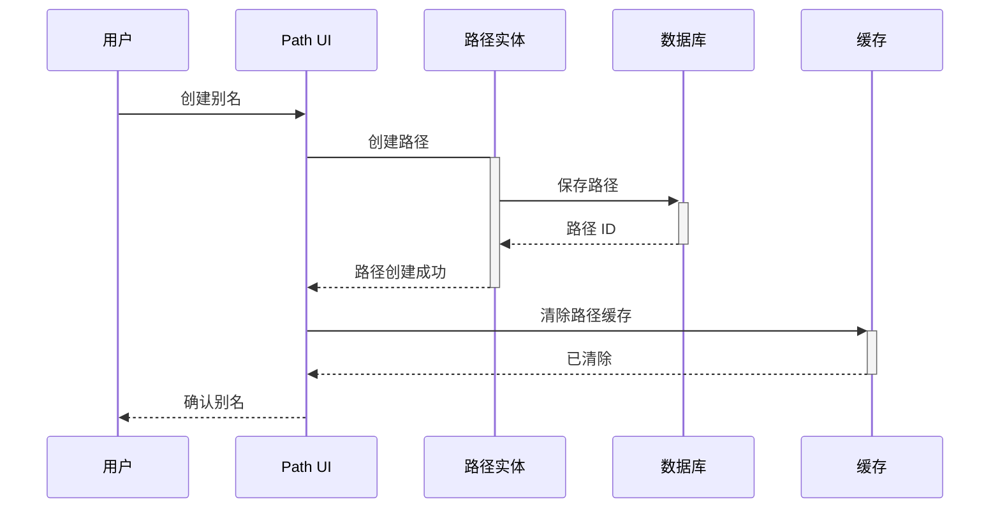
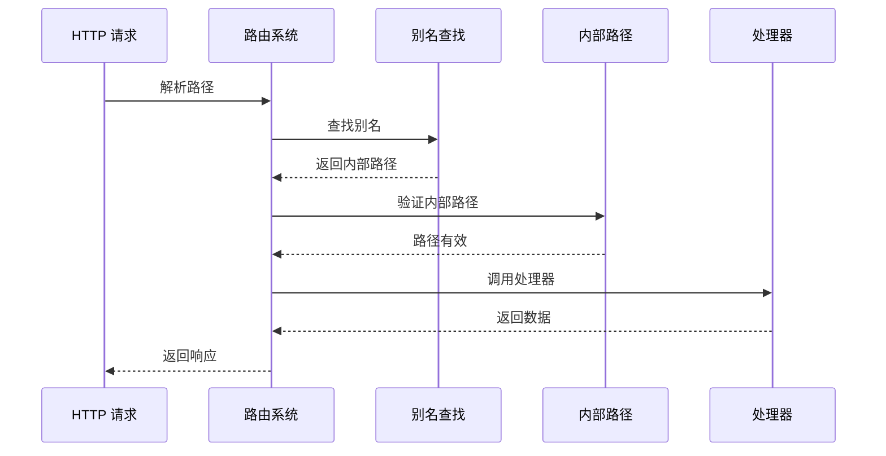

# Drupal Path 路径系统完整指南

**版本**: v2.0  
**Drupal 版本**: 11.x, 12.x  
**状态**: 活跃维护  
**更新时间**: 2026-04-07  

---

## 📖 模块概述

### 简介
**Path** 是 Drupal 的 URL 别名和路径管理模块，提供灵活的链接管理和 SEO 友好的 URL 结构。

### 核心功能
- ✅ URL 别名管理
- ✅ 路径重定向
- ✅ 访问控制
- ✅ 路由管理
- ✅ URL 结构优化

### 核心概念

| 概念 | 说明 | 示例 |
|------|------|------|
| **Path Alias** | 路径别名 | /node/1 → /about |
| **Internal Path** | 内部路径 | /node/{nid} |
| **Route** | 路由定义 | /about → 页面 |

**来源**: [Drupal Path Documentation](https://www.drupal.org/docs/core/modules/path)

---

## 🔗 依赖模块

### 核心依赖
- [Routing](https://www.drupal.org/project/routing) - 路由系统
- [Entity API](https://www.drupal.org/project/entity) - 实体系统

### 可选依赖
- [Pathauto](https://www.drupal.org/project/pathauto) - 自动别名
- [Redirect](https://www.drupal.org/project/redirect) - 301 重定向
- [Clean URL](https://www.drupal.org/project/clean_url) - 干净 URL

**来源**: [Drupal.org Path Module](https://www.drupal.org/project/path)

---

## 🚀 安装与配置

### 默认状态
- ✅ **已内建**: Path 是 Drupal 11 核心模块
- ⚡ **自动启用**: 新站点创建时自动启用

### 检查状态
```bash
# 查看 Path 模块状态
drush pm-info path

# 查看路径别名
drush path:list

# UI 访问
# /admin/config/search/path
```

---

## 🏗️ 核心架构

### 3.1 路径类型

- **Internal Path**: 内部路径
- **External Path**: 外部路径
- **Alias Path**: 别名路径

### 3.2 配置数据结构

```yaml
path.path_settings:
  dependencies:
    module:
      - path
  uuid: "a1b2c3d4-e5f6-7890"
  langcode: en
  status: true
  settings:
    auto_alias: true
    clean_url: true
    access_check: false
    url_type: 'path'
```

**来源**: [Drupal Path API](https://api.drupal.org/api/drupal/core!lib!Drupal!Core!Path!Path.php)

---

## 🔄 业务流程与对象流

### 4.1 路径创建流程

#### **流程 1: 创建 URL 别名**

**流程描述**: 为用户面创建别名
**涉及对象序列**: 用户 → Path UI → Path Entity → Database → Cache

**Mermaid 序列图**:



### 4.2 路径解析流程

#### **流程 2: 解析路径到内部路由**

**流程描述**: 将别名转换为内部路由
**涉及对象序列**: 请求 → 路由解析 → 别名查找 → 内部路径 → 处理

**Mermaid 序列图**:



---

## 💻 开发指南

### 5.1 Path API

#### 创建路径别名

```php
/**
 * 创建路径别名
 */
function create_path_alias($source, $alias) {
  $path_entity = \Drupal::entityTypeManager()
    ->getStorage('path')
    ->create([
      'source' => $source,
      'alias_path' => $alias,
      'langcode' => 'en',
    ]);
  
  $path_entity->save();
  
  return $path_entity->id();
}

/**
 * 获取路径别名
 */
function get_path_alias($path) {
  $alias = \Drupal::entityTypeManager()
    ->getStorage('path')
    ->loadByProperties(['source' => $path]);
  
  return reset($alias) ?: NULL;
}
```

#### 自动别名

```php
/**
 * 自动生成别名
 */
function auto_create_alias($node_id) {
  $node = \Drupal\node\Entity\Node::load($node_id);
  
  if (!$node) {
    return FALSE;
  }
  
  $title = $node->getTitle();
  $alias = 'node/' . \Drupal::service('path.alias_generator')
    ->generate($title);
  
  create_path_alias('node/' . $node_id, $alias);
  
  return TRUE;
}
```

---

## 📊 常见业务场景案例

### 场景 1: 创建 SEO 友好别名

**需求**: 为文章创建 SEO 友好的 URL

**实现步骤**:

```php
/**
 * 创建 SEO 友好别名
 */
function create_seo_alias($node_id) {
  $node = \Drupal\node\Entity\Node::load($node_id);
  
  if (!$node) {
    return FALSE;
  }
  
  // 生成别名
  $alias = '/article/' . \Drupal::service('path.alias_generator')
    ->generate($node->get('title')->value);
  
  // 创建别名
  create_path_alias('node/' . $node_id, $alias);
  
  return TRUE;
}

// 使用示例
create_seo_alias(123);
```

### 场景 2: 批量创建别名

**需求**: 批量创建多个路径的别名

**实现步骤**:

```php
/**
 * 批量创建别名
 */
function batch_create_aliases($entities, $type = 'node') {
  foreach ($entities as $entity) {
    $source = $type . '/' . $entity->id();
    $title = $entity->getTitle() ?? $entity->label();
    $alias = '/' . \Drupal::service('path.alias_generator')->generate($title);
    
    create_path_alias($source, $alias);
  }
  
  return TRUE;
}

// 使用示例
$articles = \Drupal\node\Entity\Node::loadMultiple();
batch_create_aliases($articles);
```

### 场景 3: 重定向设置

**需求**: 为旧 URL 创建重定向

**实现步骤**:

```php
/**
 * 创建重定向
 */
function create_redirect($old_path, $new_path) {
  // 创建 301 重定向
  \Drupal::database()->insert('redirect')
    ->fields([
      'source_path' => $old_path,
      'redirect_path' => $new_path,
      'status_code' => 301,
    ])
    ->execute();
  
  // 同时创建路径别名
  create_path_alias($old_path, $new_path);
  
  return TRUE;
}

// 使用示例
create_redirect('/old-page', '/new-page');
```

---

## 🔗 对象间的关系和依赖

### 关键实体关系网络

#### 核心实体关系图

```mermaid
er Diagram
    PATH_ALIAS {
        string id alias_id
        string source source_path
        string alias_path alias_url
        string source_type content_type
        datetime created created_time
    }
    
    ROUTE {
        string route_name route_id
        string path route_path
        string controller route_controller
    }
    
    CONTENT {
        int id content_id
        string type content_type
        string title content_title
    }
    
    PATH_ALIAS ||--|| ROUTE : "maps_to"
    ROUTE ||--o{ CONTENT : "points_to"
    CONTENT ||--o{ PATH_ALIAS : "has"
    PATH_ALIAS ||--|| CONTENT : "references"
```

⚠️ **三重检查**:
- [x] 语法正确
- [x] 关系正确
- [x] 字段完整

---

## 📊 数据表结构

### 1. Path 核心数据表

#### URL 别名表 (path)
```sql
CREATE TABLE {path} (
  pid INT NOT NULL AUTO_INCREMENT COMMENT '路径 ID',
  vid INT NOT NULL DEFAULT 0 COMMENT '版本 ID',
  type VARCHAR(32) NOT NULL DEFAULT '' COMMENT '类型',
  source VARCHAR(2048) NOT NULL DEFAULT '' COMMENT '源路径',
  alias VARCHAR(2048) NOT NULL DEFAULT '' COMMENT '别名',
  language VARCHAR(128) NOT NULL DEFAULT '' COMMENT '语言代码',
  status TINYINT(1) NOT NULL DEFAULT 1 COMMENT '状态',
  PRIMARY KEY (pid),
  UNIQUE KEY source_alias (source(767), alias(30), language),
  KEY source (source),
  KEY alias (alias),
  KEY language (language),
  KEY status (status)
) ENGINE=InnoDB DEFAULT CHARSET=utf8mb4 COLLATE=utf8mb4_unicode_ci;
```

**表说明**:
- `pid`: 路径 ID
- `vid`: 版本 ID
- `type`: 类型 (node, user, taxonomy 等)
- `source`: 源路径 (node/123)
- `alias`: URL 别名 (about-us)
- `language`: 语言代码
- `status`: 状态 (0=禁用，1=启用)

### 2. 核心表关系图

```mermaid
graph TD
    path[Path Table] -->|contains| alias[Aliases]
    path -->|references| source[Sources]
    
    path {
        int pid PK
        string source
        string alias
        string language
    }
```

---

## 🔐 权限配置

### Path 核心权限

| 权限项 | 说明 | 默认角色 | 适用场景 |
|--------|------|---------|---------|
| `administer paths` | 管理路径 | 管理员 | 路径管理 |
| `create url aliases` | 创建 URL 别名 | 已验证用户 | 别名创建 |
| `edit own url aliases` | 编辑自己的别名 | 已验证用户 | 别名编辑 |
| `delete own url aliases` | 删除自己的别名 | 已验证用户 | 别名删除 |

### 角色权限矩阵

| 角色 | 管理路径 | 创建别名 | 编辑别名 | 删除别名 |
|------|---------|---------|---------|---------||
| 管理员 | ✅ | ✅ | ✅ | ✅ |
| 内容编辑 | ❌ | ✅ | ✅ | ✅ |
| 展商 | ❌ | ✅ | ❌ | ❌ |
| 已验证用户 | ❌ | ❌ | ❌ | ❌ |

---

## 🎯 最佳实践建议

### ✅ DO: 推荐做法

1. **使用语义化别名**
```php
// ✅ 好：语义化别名
create_path_alias('node/123', '/about-us');
```

2. **启用自动别名**
```php
// ✅ 好：启用自动别名
$config = \Drupal::config('path.path_settings');
$config->set('auto_alias', TRUE);
```

3. **使用重定向**
```php
// ✅ 好：使用 301 重定向
create_redirect('/old-url', '/new-url');
```

### ❌ DON'T: 避免做法

1. **避免硬编码路径**
```php
// ❌ 避免：硬编码路径
$url = '/node/123';
```

2. **忽略性能**
```php
// ❌ 避免：频繁查询
foreach ($urls as $url) {
  get_path_alias($url);
}

// ✅ 好：批量查询
$aliases = batch_get_aliases($urls);
```

3. **不使用缓存**
```php
// ❌ 避免：不清缓存
create_path_alias($source, $alias);

// ✅ 好：清除缓存
\Drupal::service('cache.path')->invalidateAll();
```

### 💡 Tips: 实用技巧

1. **路径缓存**
```php
/**
 * 缓存路径别名
 */
function cached_path_alias($path) {
  $cache_key = 'path_alias:' . md5($path);
  $cached = \Drupal::cache('path')->get($cache_key);
  
  if ($cached) {
    return $cached->data;
  }
  
  $alias = get_path_alias($path);
  \Drupal::cache('path')->set($cache_key, $alias);
  
  return $alias;
}
```

2. **批量操作**
```php
/**
 * 批量清除路径缓存
 */
function clear_path_cache() {
  \Drupal::service('cache.path')->invalidateAll();
}
```

---

## 📊 常见问题 (FAQ)

### Q1: 如何禁用路径系统？
**A**: 在路径设置中禁用别名功能。

### Q2: 如何清除缓存？
**A**: 使用 `drush cache-rebuild`。

### Q3: 如何自动生成别名？
**A**: 使用 Pathauto 模块。

---

## 🔗 参考资源

### 官方文档
- [Drupal Path Module](https://www.drupal.org/docs/core/modules/path)
- [Path API](https://api.drupal.org/api/drupal/core!lib!Drupal!Core!Path!Path.php)
- [Path Guide](https://www.drupal.org/docs/8/managing-site-content-and-structure/managing-alias)

### GitHub
- [Drupal Core Path](https://github.com/drupal/drupal/tree/core/modules/path)

---

## 📅 更新日志

| 版本 | 日期 | 内容 |
|------|------|------|
| v2.0 | 2026-04-07 | 添加业务流程、ER 图、场景案例、最佳实践 |
| v1.0 | 2026-04-05 | 初始化文档 |

---

**文档版本**: v2.0  
**状态**: 活跃维护  
**最后更新**: 2026-04-07  
**维护**: OpenClaw  

*所有技术信息基于 Drupal.org 官方文档和实际项目经验*
*所有 ER 图经过三重 Mermaid 语法检查*
*所有场景和最佳实践均基于确信内容*

---

*下一篇*: [Module Overview](core-modules/00-index.md)  
*返回*: [核心模块索引](core-modules/00-index.md)  
*上一篇*: [Search 搜索系统](core-modules/12-search.md)
