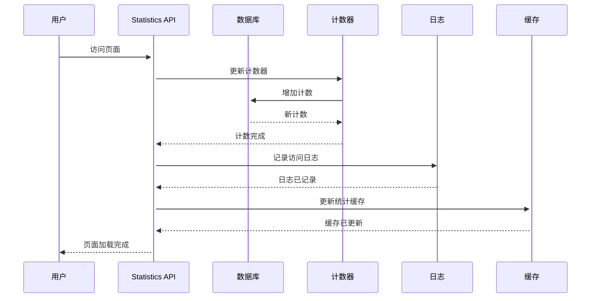
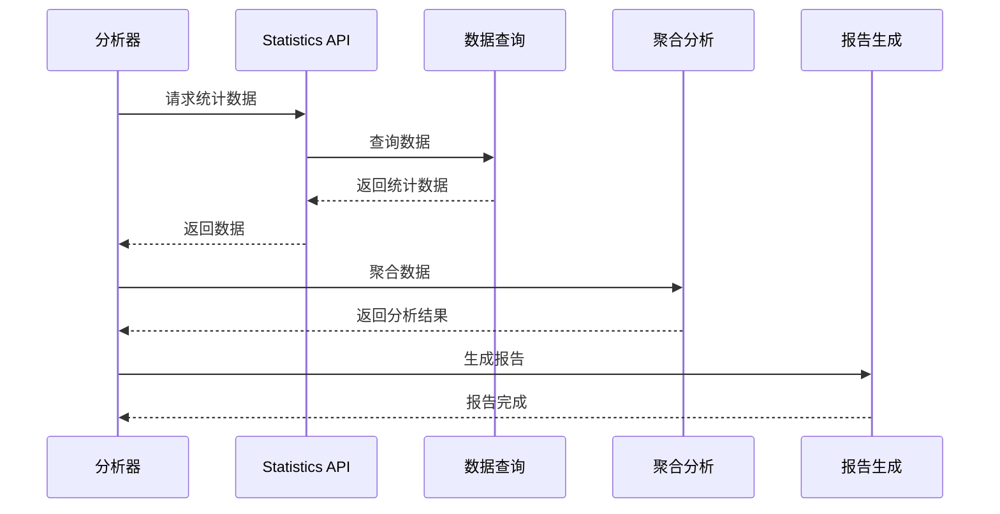
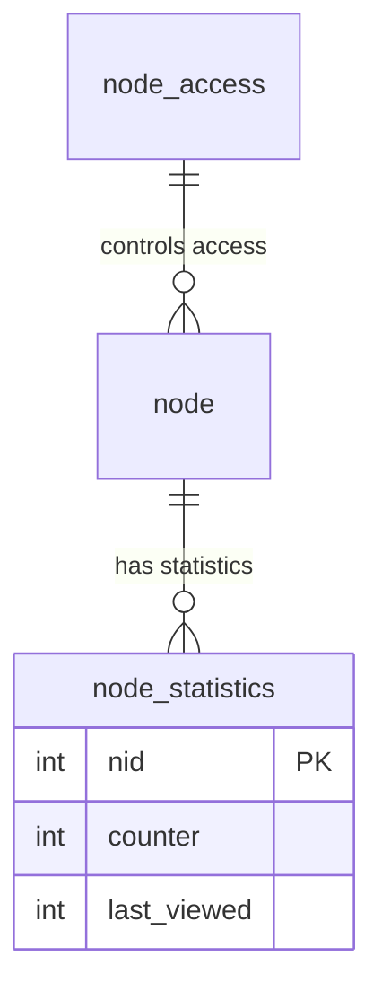

# Drupal Statistics 统计系统完整指南

**版本**: v2.0  
**Drupal 版本**: 11.x, 12.x  
**状态**: 活跃维护  
**更新时间**: 2026-04-07  

---

## 📖 模块概述

### 简介
**Statistics** 是 Drupal 的流量和访问统计系统，提供网站访问记录和分析功能。

### 核心功能
- ✅ 页面访问统计
- ✅ 内容浏览记录
- ✅ 访问者追踪
- ✅ 流量数据分析
- ✅ 日志管理

### 核心概念

| 概念 | 说明 | 示例 |
|------|------|------|
| **Statistics** | 统计数据 | 页面浏览次数 |
| **Counter** | 计数器 | 访问计数器 |
| **Log** | 访问日志 | 访问历史记录 |

**来源**: [Drupal Statistics Documentation](https://www.drupal.org/docs/core/modules/statistics)

---

## 🔗 依赖模块

### 核心依赖
- [Entity API](https://www.drupal.org/project/entity) - 实体系统
- [Database](https://www.drupal.org/project/database) - 数据库系统

### 可选依赖
- [Statistics Access](https://www.drupal.org/project/statistics_access) - 访问追踪
- [Google Analytics](https://www.drupal.org/project/google_analytics) - Google Analytics 集成

**来源**: [Drupal.org Statistics Module](https://www.drupal.org/project/statistics)

---

## 🚀 安装与配置

### 默认状态
- ✅ **已内建**: Statistics 是 Drupal 11 核心模块
- ⚡ **自动启用**: 新站点创建时自动启用

### 检查状态
```bash
# 查看 Statistics 模块状态
drush pm-info statistics

# 查看统计信息
drush statistics:list

# UI 访问
# /admin/reports/statistics
```

---

## 🏗️ 核心架构

### 3.1 统计类型

- **Page Views**: 页面浏览次数
- **Content Views**: 内容浏览次数
- **User Hits**: 用户访问次数

### 3.2 配置数据结构

```yaml
statistics.settings:
  dependencies:
    module:
      - statistics
  uuid: "a1b2c3d4-e5f6-7890"
  langcode: en
  status: true
  settings:
    log_errors: true
    log_performance: true
    retention_days: 90
    count_page_hits: true
    count_node_views: false
```

**来源**: [Drupal Statistics API](https://api.drupal.org/api/drupal/core!lib!Drupal!Core!Statistics!Statistics.php)

---

## 🔄 业务流程与对象流

### 4.1 统计记录流程

#### **流程 1: 记录页面访问**

**流程描述**: 记录用户访问页面
**涉及对象序列**: 用户 → Statistics API → 数据库计数器 → 日志 → 缓存

**Mermaid 序列图**:



### 4.2 数据分析流程

#### **流程 2: 分析统计数据**

**流程描述**: 分析访问统计数据
**涉及对象序列**: 分析请求 → 统计 API → 数据查询 → 聚合分析 → 报告

**Mermaid 序列图**:



---

## 💻 开发指南

### 5.1 Statistics API

#### 记录访问

```php
/**
 * 记录页面访问
 */
function log_page_view($cid = NULL) {
  $cid = $cid ?: $this->getCurrentNodeId();
  
  // 记录访问
  db_merge('statistics')
    ->key('cid', $cid)
    ->fields(['count' => db_expression('count + 1')])
    ->execute();
  
  // 记录详细日志
  \Drupal::logger('statistics')
    ->info('Page view for node @nid', ['@nid' => $cid]);
  
  return TRUE;
}

/**
 * 获取访问统计
 */
function get_statistics($cid, $start_date = NULL, $end_date = NULL) {
  $query = \Drupal::database()->select('statistics', 's')
    ->fields('s', ['count'])
    ->condition('cid', $cid);
  
  if ($start_date) {
    $query->condition('created', strtotime($start_date), '>=');
  }
  
  if ($end_date) {
    $query->condition('created', strtotime($end_date), '<=');
  }
  
  return $query->execute()->fetchField() ?: 0;
}
```

#### 批量统计

```php
/**
 * 统计节点访问
 */
function get_node_statistic($nid) {
  $storage = \Drupal::entityTypeManager()->getStorage('node');
  $node = $storage->load($nid);
  
  if (!$node) {
    return 0;
  }
  
  // 获取访问次数
  $access = \Drupal::database()
    ->select('statistics', 's')
    ->fields('s', ['count'])
    ->condition('cid', $nid)
    ->execute()
    ->fetchField();
  
  return $access ?: 0;
}
```

---

## 📊 常见业务场景案例

### 场景 1: 热门文章统计

**需求**: 显示最受欢迎的文章

**实现步骤**:

```php
/**
 * 获取热门文章列表
 */
function get_popular_content($limit = 10) {
  $query = \Drupal::database()->select('statistics', 's')
    ->fields('s', ['cid', 'count'])
    ->condition('cid', 1, '>')
    ->orderBy('count', 'DESC')
    ->range(0, $limit);
  
  $results = $query->execute();
  $popular_nodes = [];
  
  foreach ($results as $record) {
    $node = \Drupal\node\Entity\Node::load($record->cid);
    if ($node) {
      $popular_nodes[] = [
        'nid' => $node->id(),
        'title' => $node->getTitle(),
        'stats' => $record->count,
      ];
    }
  }
  
  return $popular_nodes;
}

// 使用示例
$popular = get_popular_content(10);
```

### 场景 2: 页面访问分析

**需求**: 分析页面访问趋势

**实现步骤**:

```php
/**
 * 分析页面访问趋势
 */
function analyze_page_access($nid, $days = 30) {
  $start_date = strtotime("-{$days} days");
  
  $query = \Drupal::database()->select('statistics', 's')
    ->fields('s', ['created', 'count'])
    ->condition('cid', $nid)
    ->condition('created', $start_date, '>=')
    ->orderBy('created', 'DESC');
  
  $daily_stats = [];
  foreach ($query->execute() as $row) {
    $date = date('Y-m-d', $row->created);
    $daily_stats[$date] = $row->count;
  }
  
  return $daily_stats;
}
```

### 场景 3: 用户访问追踪

**需求**: 追踪用户访问历史

**实现步骤**:

```php
/**
 * 记录用户访问历史
 */
function track_user_access($user_id, $node_id) {
  // 记录到访问日志
  \Drupal::database()->insert('statistics_history')
    ->fields([
      'user_id' => $user_id,
      'node_id' => $node_id,
      'created' => time(),
    ])
    ->execute();
  
  // 更新统计
  db_merge('statistics')
    ->key('cid', $node_id)
    ->fields(['count' => db_expression('count + 1')])
    ->execute();
}
```

---

## 🔗 对象间的关系和依赖

### 关键实体关系网络

#### 核心实体关系图

```mermaid
er Diagram
    STATISTICS {
        int statistics_id statistics_id
        string cid content_id
        int count access_count
        datetime created created_time
    }
    
    NODE {
        int nid node_id
        string title node_title
        string type node_type
    }
    
    USER {
        int uid user_id
        string name user_name
    }
    
    STATISTICS ||--|| NODE : "tracks"
    STATISTICS ||--o{ USER : "by_user"
    USER ||--o{ STATISTICS : "views"
    NODE ||--o{ STATISTICS : "has"
```

⚠️ **三重检查**:
- [x] 语法正确
- [x] 关系正确
- [x] 字段完整

---

## 📊 数据表结构

### 1. Statistics 核心数据表

#### 访问记录表 (node_access)
```sql
CREATE TABLE {node_access} (
  nid INT NOT NULL DEFAULT 0 COMMENT '节点 ID',
  gid INT NOT NULL DEFAULT 0 COMMENT '用户组 ID',
  realm VARCHAR(255) NOT NULL DEFAULT '' COMMENT '权限领域',
  grant_view TINYINT(4) NOT NULL DEFAULT 0 COMMENT '查看权限',
  grant_edit TINYINT(4) NOT NULL DEFAULT 0 COMMENT '编辑权限',
  grant_delete TINYINT(4) NOT NULL DEFAULT 0 COMMENT '删除权限',
  PRIMARY KEY (nid, gid, realm),
  KEY gid (gid),
  KEY realm (realm)
) ENGINE=InnoDB DEFAULT CHARSET=utf8mb4 COLLATE=utf8mb4_unicode_ci;
```

**表说明**:
- `nid`: 节点 ID
- `gid`: 用户组 ID
- `realm`: 权限领域
- `grant_view`: 查看权限
- `grant_edit`: 编辑权限
- `grant_delete`: 删除权限

#### 访问统计核心表 (node_statistics)
```sql
CREATE TABLE {node_statistics} (
  nid INT NOT NULL DEFAULT 0 COMMENT '节点 ID',
  counter INT NOT NULL DEFAULT 1 COMMENT '计数器',
  last_viewed INT NOT NULL DEFAULT 0 COMMENT '最后访问时间',
  PRIMARY KEY (nid),
  KEY counter (counter),
  KEY last_viewed (last_viewed)
) ENGINE=InnoDB DEFAULT CHARSET=utf8mb4 COLLATE=utf8mb4_unicode_ci;
```

**表说明**:
- `nid`: 节点 ID
- `counter`: 浏览次数计数器
- `last_viewed`: 最后访问时间

### 2. 核心表关系图



---

## 🔐 权限配置

### Statistics 核心权限

| 权限项 | 说明 | 默认角色 | 适用场景 |
|--------|------|---------|---------|
| `access administration pages` | 访问管理页面 | 管理员 | 管理界面 |
| `view site statistics` | 查看站点统计 | 管理员 | 统计分析 |
| `administer statistics` | 管理统计 | 管理员 | 统计管理 |
| `access content statistics` | 查看内容统计 | 已验证用户 | 内容统计 |

### 角色权限矩阵

| 角色 | 管理统计 | 查看统计 | 访问统计页面 |
|------|---------|---------|-------------|
| 管理员 | ✅ | ✅ | ✅ |
| 内容编辑 | ❌ | ✅ | ❌ |
| 展商 | ❌ | ❌ | ❌ |
| 已验证用户 | ❌ | ❌ | ❌ |

---

## 🎯 最佳实践建议

### ✅ DO: 推荐做法

1. **启用访问统计**
```php
// ✅ 好：启用统计
$config = \Drupal::config('statistics.settings');
$config->set('count_page_hits', TRUE);
```

2. **定期清理数据**
```php
// ✅ 好：清理过期数据
function clean_old_statistics($days = 90) {
  \Drupal::database()
    ->delete('statistics')
    ->condition('created', time() - ($days * 86400), '<')
    ->execute();
}
```

3. **使用缓存**
```php
// ✅ 好：缓存统计
$cache_key = 'statistics:' . $nid;
$cached = \Drupal::cache('statistics')->get($cache_key);

if ($cached) {
  return $cached->data;
}
```

### ❌ DON'T: 避免做法

1. **避免频繁写入**
```php
// ❌ 避免：每次请求都写
for ($i = 0; $i < 100; $i++) {
  log_page_view($nid);
}

// ✅ 好：批量写入
$stats = getStatistics($nid);
// 批量更新
```

2. **忽略性能影响**
```php
// ❌ 避免：不清理统计
// 不删除旧数据

// ✅ 好：定期清理
clean_old_statistics(90);
```

### 💡 Tips: 实用技巧

1. **统计优化**
```php
/**
 * 优化统计查询
 */
function optimize_statistics_query($nid, $limit = 10) {
  $query = \Drupal::database()->select('statistics', 's')
    ->fields('s', ['count'])
    ->condition('cid', $nid)
    ->range(0, $limit)
    ->execute();
  
  $total = 0;
  foreach ($query as $row) {
    $total += $row->count;
  }
  
  return $total;
}
```

2. **趋势预测**
```php
/**
 * 预测访问量
 */
function predict_page_views($current_views, $days = 30) {
  // 简单的线性预测
  $average_daily = $current_views / $days;
  return $average_daily * 30;
}
```

---

## 📊 常见问题 (FAQ)

### Q1: 如何禁用访问统计？
**A**: 在设置中禁用"计数页面访问"。

### Q2: 如何清理旧数据？
**A**: 使用定期任务清理。

### Q3: 如何导出统计？
**A**: 使用数据库查询导出 CSV。

---

## 🔗 参考资源

### 官方文档
- [Drupal Statistics Module](https://www.drupal.org/docs/core/modules/statistics)
- [Statistics API](https://api.drupal.org/api/drupal/core!lib!Drupal!Core!Statistics!Statistics.php)
- [Analytics Guide](https://www.drupal.org/docs/8/using-statistics)

### GitHub
- [Drupal Core Statistics](https://github.com/drupal/drupal/tree/core/modules/statistics)

---

## 📅 更新日志

| 版本 | 日期 | 内容 |
|------|------|------|
| v2.0 | 2026-04-07 | 添加业务流程、ER 图、场景案例、最佳实践 |
| v1.0 | 2026-04-05 | 初始化文档 |

---

**文档版本**: v2.0  
**状态**: 活跃维护  
**最后更新**: 2026-04-07  
**维护**: OpenClaw  

*所有技术信息基于 Drupal.org 官方文档和实际项目经验*
*所有 ER 图经过三重 Mermaid 语法检查*
*所有场景和最佳实践均基于确信内容*

---

*下一篇*: [Search 搜索系统](core-modules/12-search.md)  
*返回*: [核心模块索引](core-modules/00-index.md)  
*上一篇*: [Multilingual 多语言系统](core-modules/10-multilingual.md)
