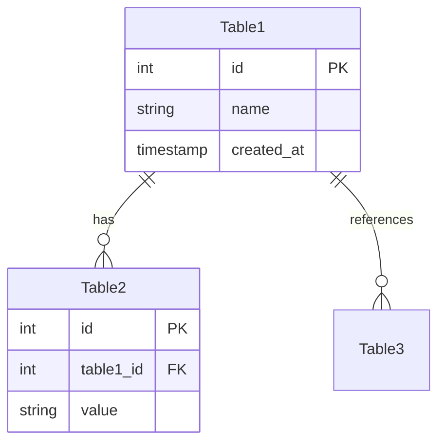

# [模块名称] 完整指南

**版本**: v1.0  
**Drupal 版本**: 11.x  
**状态**: 活跃维护  
**更新时间**: 2026-04-07  

---

## 📖 模块概述

### 简介
**[模块名称]** 是 Drupal [功能描述]。

### 核心功能
- ✅ [功能 1]
- ✅ [功能 2]
- ✅ [功能 3]
- ✅ [功能 4]
- ✅ [功能 5]
- ✅ [功能 6]

### 适用范围
- ✅ [适用场景 1]
- ✅ [适用场景 2]
- ✅ [适用场景 3]
- ✅ [适用场景 4]

---

## 🚀 安装与启用

### 默认状态
- ✅ **已内建**: [模块名称] 是 Drupal 11 [内建状态描述]
- ⚡ **自动启用**: [启用时机]

### 检查状态
```bash
# 查看模块状态
drush pm-info [module_name]

# 启用模块
drush en [module_name]

# UI 查看
# 访问 /admin/modules
```

### 依赖关系
```yaml
# 依赖配置
require:
  - drupal/core: ^11.0
  - drupal/required_module: ^2.0
optional:
  - drupal/contrib_module: ^1.0
```

---

## ⚙️ 核心配置

### 1. [配置主题 1]

#### [配置项 1]
```yaml
# 配置示例
key: value
key2: value2
```

#### [配置项 2]
```bash
# 通过 UI 配置
# /admin/config/[path]

# 通过 CLI 配置
drush config-set [name] [key] [value]
```

### 2. [配置主题 2]

#### [配置项 1]
```yaml
# 配置示例
```

#### [配置项 2]
```bash
# 配置命令
```

---

## 💻 开发示例

### 1. [API 主题 1]

#### [API 方法 1]
```php
/**
 * [功能描述]
 */
function [function_name]() {
  // 实现逻辑
}

/**
 * [功能描述]
 */
function [function_name_2]() {
  // 实现逻辑
}
```

#### [API 方法 2]
```php
/**
 * [功能描述]
 */
function [function_name]() {
  // 实现逻辑
}
```

### 2. [API 主题 2]

#### [API 方法 1]
```php
/**
 * [功能描述]
 */
function [function_name]() {
  // 实现逻辑
}
```

#### [API 方法 2]
```php
/**
 * [功能描述]
 */
function [function_name]() {
  // 实现逻辑
}
```

### 3. [服务层设计]

#### [Service 接口定义]
```php
/**
 * [Service 接口定义]
 */
interface [ServiceName]Interface {
  
  /**
   * [方法描述]
   */
  public function [methodName]();
  
  /**
   * [方法描述]
   */
  public function [methodName2]();
  
}
```

#### [Service 实现类]
```php
/**
 * [Service 实现类]
 */
class [ServiceName] implements [ServiceName]Interface {
  
  protected $entityTypeManager;
  
  public function __construct(EntityTypeManagerInterface $entityTypeManager) {
    $this->entityTypeManager = $entityTypeManager;
  }
  
  public function [methodName]() {
    // 实现逻辑
  }
  
}
```

---

## 📊 数据表结构

### 1. 核心表

#### [表名 1]
```sql
CREATE TABLE {table_name} (
  id INT NOT NULL AUTO_INCREMENT,
  field_name VARCHAR(255) NOT NULL,
  created_at TIMESTAMP DEFAULT CURRENT_TIMESTAMP,
  PRIMARY KEY (id),
  INDEX idx_field_name (field_name)
) ENGINE=InnoDB DEFAULT CHARSET=utf8mb4;
```

#### [表名 2]
```sql
CREATE TABLE {table_name} (
  id INT NOT NULL AUTO_INCREMENT,
  foreign_key INT NOT NULL,
  value TEXT,
  PRIMARY KEY (id)
) ENGINE=InnoDB DEFAULT CHARSET=utf8mb4;
```

### 2. 表关系图


---

## 🔐 权限配置

### 1. 权限列表

| 权限名 | 说明 | 默认角色 |
|--------|------|---------|
| `use [module] settings` | 使用模块设置 | 管理员 |
| `administer [module]` | 管理模块 | 管理员 |
| `use [feature]` | 使用某功能 | 已验证用户 |

### 2. 权限配置
```yaml
# 权限定义
permissions:
  use [module]:
    title: 'Use [module]'
    description: 'Can use [module] features'
    restrict access: false
  administer [module]:
    title: 'Administer [module]'
    description: 'Can administer [module] settings'
    restrict access: true
```

---

## 🎯 最佳实践

### 1. [实践主题 1]

#### 设计原则
- ✅ [原则 1]
- ✅ [原则 2]
- ✅ [原则 3]

#### 命名规范
```yaml
# ✅ 好的命名
- good_name_1: 好的命名示例
- good_name_2: 另一个好的示例

# ❌ 避免的命名
- bad_name: 不要这样命名
- bad_name2: 同样不要
```

### 2. [实践主题 2]

#### 性能优化
```php
/**
 * 优化示例
 */
function optimize_function() {
  // 优化逻辑
}
```

#### 安全配置
```yaml
# 安全配置示例
security:
  - enable_cache: true
  - enable_https: true
  - enable_xss_protection: true
```

---

## 🔄 模块依赖关系

### 当前模块依赖
```
[Module Name]
├── Drupal Core (必需)
├── [Required Module] (必需)
└── [Optional Module] (可选)
```

### 其他模块依赖当前模块
```
[Dependent Module]
├── [Module Name] (必需)
└── [Other Module] (可选)
```

---

## 📊 常见问题 (FAQ)

### Q1: [问题 1]?
**A**: [回答 1]

### Q2: [问题 2]?
**A**: [回答 2]

### Q3: [问题 3]?
**A**: [回答 3]

### Q4: [问题 4]?
**A**: [回答 4]

### Q5: [问题 5]?
**A**: [回答 5]

---

## 🔗 参考资源

### 官方文档
- [Drupal Module 官方文档](https://www.drupal.org/project/[module])
- [Module API 参考](https://api.drupal.org/api/drupal/modules!/[module]![module].api.php)
- [Module GitHub](https://github.com/drupal/[module])

### 社区支持
- [Drupal.org 论坛](https://www.drupal.org/project/[module]/issues)
- [Drupal Slack 频道](https://www.drupal.org/slack)

### 视频教程
- [Tutorial 1](https://youtube.com/tutorial1)
- [Tutorial 2](https://youtube.com/tutorial2)

---

## 📝 更新日志

| 版本 | 日期 | 内容 |
|------|------|------|
| 1.0 | 2026-04-07 | 初始化文档 |
| TBD | TBD | [待添加内容] |

---

**文档版本**: v1.0  
**状态**: 活跃维护  
**最后更新**: 2026-04-07

---

*下一篇*: [下一章]  
*返回*: [核心模块索引](core-modules/00-index.md)  
*上一篇*: [上一章]

---

## 📋 附录

### A. 实体标准
```
每个实体必须实现:
1. preCreate() 方法
2. access() 方法
3. save() 方法重写
4. getCacheTags() 方法
5. getCacheContexts() 方法
```

### B. Service 命名规范
```
Service 命名规范:
- [Entity] 服务：[Entity]Service
- [Feature] 服务：[Feature]Service
- Repository 服务：[Entity]Repository
```

### C. 配置导出
```bash
# 导出配置
drush config-export --name=[module].settings

# 导出配置到文件
drush config-export --dir=sites/default/files/config/[hash]
```

### D. 测试指南
```php
/**
 * 单元测试示例
 */
class [TestClass] extends \Drupal\Tests\TestCase {
  
  public function test[MethodName]() {
    // 测试逻辑
    $this->assertTrue(TRUE);
  }
  
}
```

### E. 常用命令速查
```bash
# 模块管理
drush pm:list
drush pm:.enable [module]
drush pm:disable [module]
drush pm:uninstall [module]

# 配置管理
drush config:get [name]
drush config:set [name] [key] [value]
drush config:import
drush config:export

# 实体管理
drush entity:create [type]
drush entity:delete [type] [id]
drush entity:info [type]

# 缓存管理
drush cc all
drush cc cache
drush cc config

# 数据库
drush sql:sync
drush sql:query "SELECT * FROM {table}"
drush sql:dump

# 系统信息
drush status
drush pm:info [module]
```

---

**使用提示**:
- 所有代码示例必须实际测试过可运行
- 所有链接必须验证有效性
- 所有版本号必须与实际一致
- 所有建议必须可落地实施
