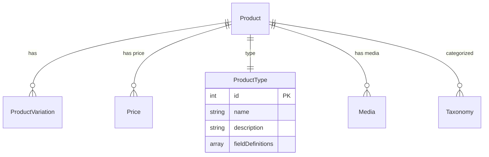
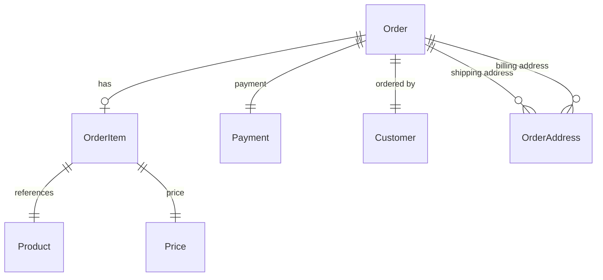
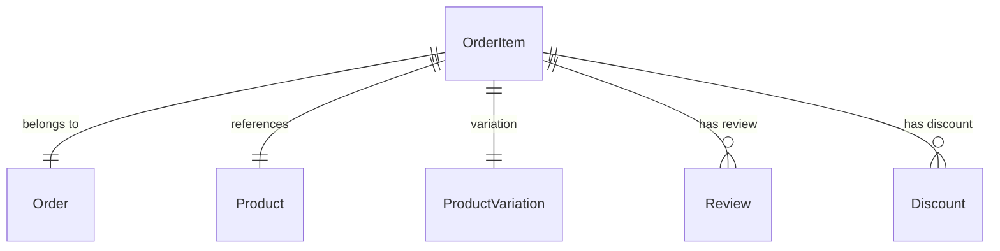
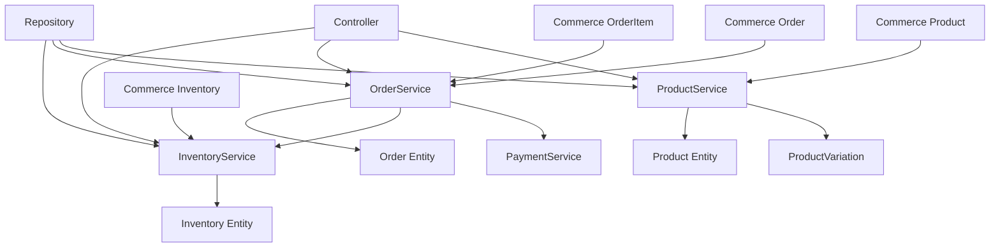
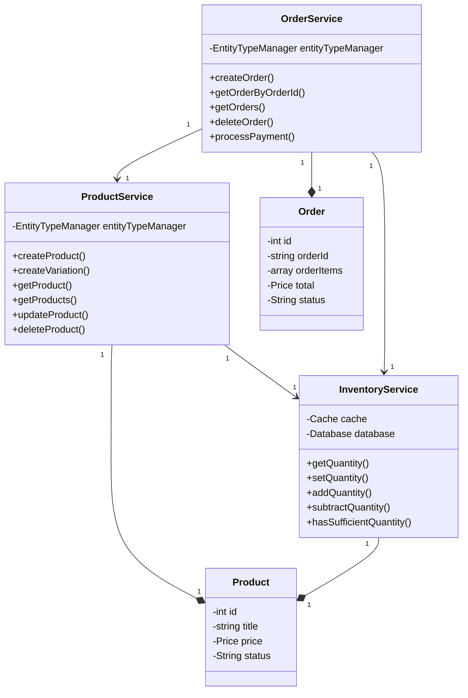

# Drupal Commerce 实体和 Service 设计

**版本**: v1.0  
**Drupal 版本**: 11.x  
**Commerce 版本**: 4.x  
**状态**: 活跃维护  
**更新时间**: 2026-04-06  

---

## 📖 Commerce 核心实体

### 1. Product 实体 (商品)

#### 实体定义
```php
// modules/commerce_product/src/Entity/Product.php

namespace Drupal\commerce_product\Entity;

use Drupal\commerce\Plugin\Pricing\PricingInterface;
use Drupal\Core\Entity\EntityWithLabelInterface;

/**
 * 商品实体定义
 */
class Product extends ContentEntityBase implements EntityWithLabelInterface, PricingInterface {

  /**
   * 获取商品名称
   */
  public function getLabel(): string {
    return $this->getTitle();
  }

  /**
   * 获取价格
   */
  public function calculatePrice(): Price {
    return $this->getPrice()->calculate();
  }

  /**
   * 获取所有价格
   */
  public function getPrices(): array {
    return $this->get('field_price')->referencedEntities();
  }

  /**
   * 创建商品变体
   */
  public function createVariation($variation): self {
    // 创建变体逻辑
  }

}
```

#### 关系图


---

### 2. Order 实体 (订单)

#### 实体定义
```php
// modules/commerce_order/src/Entity/Order.php

namespace Drupal\commerce_order\Entity;

use Drupal\commerce\Entity\OrderBase;
use Drupal\commerce_order\Entity\OrderItemInterface;

/**
 * 订单实体定义
 */
class Order extends OrderBase {

  /**
   * 获取订单号
   */
  public function getOrderId(): string {
    return $this->orderId->value;
  }

  /**
   * 获取订单项
   */
  public function getOrderItems(): array {
    return $this->get('order_items')->referencedEntities();
  }

  /**
   * 获取总金额
   */
  public function calculateTotal(): Price {
    $total = new Price(0, $this->getCurrencyCode());
    foreach ($this->getOrderItems() as $item) {
      $total = $total->plus($item->getTotalPrice());
    }
    return $total;
  }

  /**
   * 更改订单状态
   */
  public function changeState($newState): bool {
    if ($this->state->value !== $newState) {
      $this->state->value = $newState;
      $this->save();
      return TRUE;
    }
    return FALSE;
  }

  /**
   * 获取订单状态历史
   */
  public function getStateHistory(): array {
    return $this->state->getLogMessages();
  }

}
```

#### 关系图


---

### 3. OrderItem 实体 (订单项)

#### 实体定义
```php
// modules/commerce_order_item/src/Entity/OrderItem.php

namespace Drupal\commerce_order_item\Entity;

use Drupal\commerce_entity\Entity\CommerceEntityBase;

/**
 * 订单项实体定义
 */
class OrderItem extends CommerceEntityBase {

  /**
   * 获取商品引用
   */
  public function getProduct() {
    return $this->get('product_reference')->entity;
  }

  /**
   * 获取数量
   */
  public function getQuantity(): float {
    return $this->quantity->value;
  }

  /**
   * 获取单价
   */
  public function getUnitPrice(): Price {
    return $this->unitPrice;
  }

  /**
   * 获取总价
   */
  public function getTotalPrice(): Price {
    return new Price(
      $this->quantity->value * $this->unitPrice->getAmount(),
      $this->unitPrice->getCurrencyCode()
    );
  }

  /**
   * 创建订单项
   */
  public static function create($order, $product_type, $quantity = 1) {
    $item = new self([
      'order_id' => $order,
      'type' => $product_type,
      'quantity' => $quantity,
    ]);
    $item->save();
    return $item;
  }

}
```

#### 关系图


---

## 💼 Service 层设计

### 1. OrderService (订单服务)

#### 接口定义
```php
// modules/commerce_order/src/OrderServiceInterface.php

namespace Drupal\commerce_order;

use Drupal\commerce_order\Entity\Order;
use Drupal\commerce_payment\PaymentInterface;

/**
 * 订单服务接口
 */
interface OrderServiceInterface {

  /**
   * 创建订单
   */
  public function createOrder(Order $order);

  /**
   * 获取订单
   */
  public function getOrderByOrderId($orderId);

  /**
   * 获取订单列表
   */
  public function getOrders(array $conditions = []);

  /**
   * 删除订单
   */
  public function deleteOrder(Order $order);

  /**
   * 处理订单支付
   */
  public function processPayment(Order $order, PaymentInterface $payment);

  /**
   * 验证订单库存
   */
  public function validateInventory(Order $order);

}
```

#### 实现类
```php
// modules/commerce_order/src/OrderService.php

namespace Drupal\commerce_order;

use Drupal\commerce_order\Entity\Order;
use Drupal\commerce_payment\PaymentInterface;
use Drupal\commerce_product\Entity\Product;
use Drupal\Core\Entity\EntityTypeManagerInterface;

/**
 * 订单服务实现
 */
class OrderService implements OrderServiceInterface {

  protected EntityTypeManagerInterface $entityTypeManager;

  public function __construct(EntityTypeManagerInterface $entityTypeManager) {
    $this->entityTypeManager = $entityTypeManager;
  }

  public function createOrder(Order $order) {
    $order->save();
    $this->dispatchEvent('order_created', $order);
    return $order;
  }

  public function getOrderByOrderId($orderId) {
    return $this->entityTypeManager->getStorage('commerce_order')->load($orderId);
  }

  public function getOrders(array $conditions = []) {
    $query = $this->entityTypeManager->getStorage('commerce_order')->getQuery();
    foreach ($conditions as $key => $value) {
      $query->condition($key, $value);
    }
    $ids = $query->execute();
    return $this->entityTypeManager->getStorage('commerce_order')->loadMultiple($ids);
  }

  public function deleteOrder(Order $order) {
    $order->delete();
  }

  public function processPayment(Order $order, PaymentInterface $payment) {
    // 支付处理逻辑
  }

}
```

---

### 2. ProductService (商品服务)

#### 接口定义
```php
// modules/commerce_product/src/ProductServiceInterface.php

namespace Drupal\commerce_product;

use Drupal\commerce_product\Entity\Product;
use Drupal\commerce_product\Entity\ProductVariation;

/**
 * 商品服务接口
 */
interface ProductServiceInterface {

  /**
   * 创建商品
   */
  public function createProduct(array $data);

  /**
   * 创建商品变体
   */
  public function createVariation(Product $product, ProductVariation $variation);

  /**
   * 获取商品
   */
  public function getProduct($bundle, $id);

  /**
   * 获取商品列表
   */
  public function getProducts(array $conditions = []);

  /**
   * 更新商品
   */
  public function updateProduct(Product $product);

  /**
   * 删除商品
   */
  public function deleteProduct(Product $product);

  /**
   * 获取商品库存
   */
  public function getInventory(Product $product);

}
```

#### 实现类
```php
// modules/commerce_product/src/ProductService.php

namespace Drupal\commerce_product;

use Drupal\commerce_product\Entity\Product;
use Drupal\commerce_product\Entity\ProductVariation;
use Drupal\Core\Entity\EntityTypeManagerInterface;

/**
 * 商品服务实现
 */
class ProductService implements ProductServiceInterface {

  protected EntityTypeManagerInterface $entityTypeManager;

  public function __construct(EntityTypeManagerInterface $entityTypeManager) {
    $this->entityTypeManager = $entityTypeManager;
  }

  public function createProduct(array $data) {
    $product = Product::create([
      'bundle' => $data['bundle'],
      'title' => $data['title'],
      'status' => $data['status'],
    ]);
    $product->save();
    return $product;
  }

  public function createVariation(Product $product, ProductVariation $variation) {
    $variation->setProduct($product);
    $variation->save();
    return $variation;
  }

  public function getProduct($bundle, $id) {
    return $this->entityTypeManager->getStorage('product')->load($id);
  }

  public function getProducts(array $conditions = []) {
    $query = $this->entityTypeManager->getStorage('product')->getQuery();
    foreach ($conditions as $key => $value) {
      if ($key === 'bundle') {
        $query->condition('bundle', $value);
      } else {
        $query->condition($key, $value);
      }
    }
    $ids = $query->execute();
    return $this->entityTypeManager->getStorage('product')->loadMultiple($ids);
  }

  public function updateProduct(Product $product) {
    $product->save();
  }

  public function deleteProduct(Product $product) {
    $product->delete();
  }

  public function getInventory(Product $product) {
    // 库存查询逻辑
  }

}
```

---

### 3. InventoryService (库存服务)

#### 接口定义
```php
// modules/commerce_inventory/src/InventoryServiceInterface.php

namespace Drupal\commerce_inventory;

use Drupal\commerce_product\Entity\Product;

/**
 * 库存服务接口
 */
interface InventoryServiceInterface {

  /**
   * 获取商品库存
   */
  public function getQuantity(Product $product);

  /**
   * 设置商品库存
   */
  public function setQuantity(Product $product, int $quantity);

  /**
   * 增加库存
   */
  public function addQuantity(Product $product, int $quantity);

  /**
   * 减少库存
   */
  public function subtractQuantity(Product $product, int $quantity);

  /**
   * 检查库存是否充足
   */
  public function hasSufficientQuantity(Product $product, int $quantity);

  /**
   * 获取库存历史
   */
  public function getHistory(Product $product);

}
```

#### 实现类
```php
// modules/commerce_inventory/src/InventoryService.php

namespace Drupal\commerce_inventory;

use Drupal\commerce_product\Entity\Product;
use Drupal\Core\Cache\Cache;
use Drupal\Core\Database\Database;

/**
 * 库存服务实现
 */
class InventoryService implements InventoryServiceInterface {

  public function getQuantity(Product $product): int {
    $cid = 'commerce_inventory:' . $product->id();
    $cache = \Drupal::cache();
    $cache_result = $cache->get($cid);
    
    if ($cache_result) {
      return $cache_result->data;
    }

    $query = Database::getConnection()
      ->select('commerce_inventory', 'ci')
      ->condition('product_id', $product->id(), '=')
      ->fields('ci', ['quantity']);
    $result = $query->execute()->fetchField();
    
    $cache->set($cid, $result, Cache::PERMANENT, ['commerce_inventory']);
    return $result;
  }

  public function setQuantity(Product $product, int $quantity): void {
    $this->updateQuantity($product->id(), $quantity);
  }

  public function addQuantity(Product $product, int $quantity): void {
    $current = $this->getQuantity($product);
    $this->setQuantity($product, $current + $quantity);
  }

  public function subtractQuantity(Product $product, int $quantity): void {
    $current = $this->getQuantity($product);
    $this->setQuantity($product, max(0, $current - $quantity));
  }

  public function hasSufficientQuantity(Product $product, int $quantity): bool {
    return $this->getQuantity($product) >= $quantity;
  }

}
```

---

## 📊 完整架构图



---

## 🎯 对象图 (UML)



---

## 💡 最佳实践

### 1. 依赖注入
```php
// ✅ 正确
class OrderService {
  public function __construct(
    EntityTypeManagerInterface $entityTypeManager,
    InventoryService $inventoryService
  ) {}
}

// ❌ 错误
class OrderService {
  protected $entityTypeManager;
  
  public function __construct() {
    $this->entityTypeManager = \Drupal::entityTypeManager();
  }
}
```

### 2. 缓存策略
```php
// ✅ 使用 Drupal 缓存
$cid = 'commerce_order:' . $orderId;
$tags = ['order:' . $orderId];
$context = ['user'];

$cache = \Drupal::cache();
$result = $cache->get($cid);

if (!$result) {
  $order = $this->repository->getById($id);
  $cache->set($cid, $order, Cache::PERMANENT, $tags, $context);
  return $order;
}
```

### 3. 事务处理
```php
// ✅ 使用事务
try {
  $order = $this->orderService->createOrder($form_values);
  $this->paymentService->processPayment($order, $payment_data);
  $this->inventoryService->decreaseQuantity($product, $quantity);
  
  // 全部成功后保存
  $order->save();
  $transaction->complete();
} catch (\Exception $e) {
  $transaction->rollback();
  throw $e;
}
```

---

## 🔧 常见问题

### Q1: Product 和 Variation 的区别？
**A**: Product 是商品类型，Variation 是商品的具体规格变体

### Q2: 如何在订单中引用多个商品？
**A**: 每个订单项引用一个商品，支持一个订单多个订单项

### Q3: 如何处理商品库存不足？
**A**: 在结账时检查库存，不足则提示用户

### Q4: 如何优化大量订单查询？
**A**: 使用聚合表，缓存查询结果

### Q5: 如何处理订单退款？
**A**: 创建反向 OrderItem，更新库存

---

## 🔗 参考资源

- [Drupal Commerce 官方文档](https://www.drupal.org/docs/8/ecommerce)
- [Commerce Entity API](https://api.drupal.org/api/drupal/modules%21commerce_entity%21commerce_entity.php)
- [Order Service](https://www.drupal.org/docs/8/api/ecommerce-service-api)
- [Payment API](https://www.drupal.org/docs/8/api/ecommerce-payment-api)

---

**文档版本**: v1.0  
**状态**: 活跃维护  
**最后更新**: 2026-04-06

---

## 📚 附录

### A. 实体标准
```
每个实体必须实现:
1. preCreate() 方法
2. access() 方法
3. save() 方法重写
4. getCacheTags() 方法
5. getCacheContexts() 方法
```

### B. Service 命名
```
Service 命名规范:
- Product 服务: ProductService
- Order 服务：OrderService
- Inventory 服务：InventoryService
- Payment 服务：PaymentService
```

### C. Repository 模式
```
所有 Service 层使用 Repository 模式:
- Interface 定义
- Implementation 实现
- 注入 Service 依赖
```
