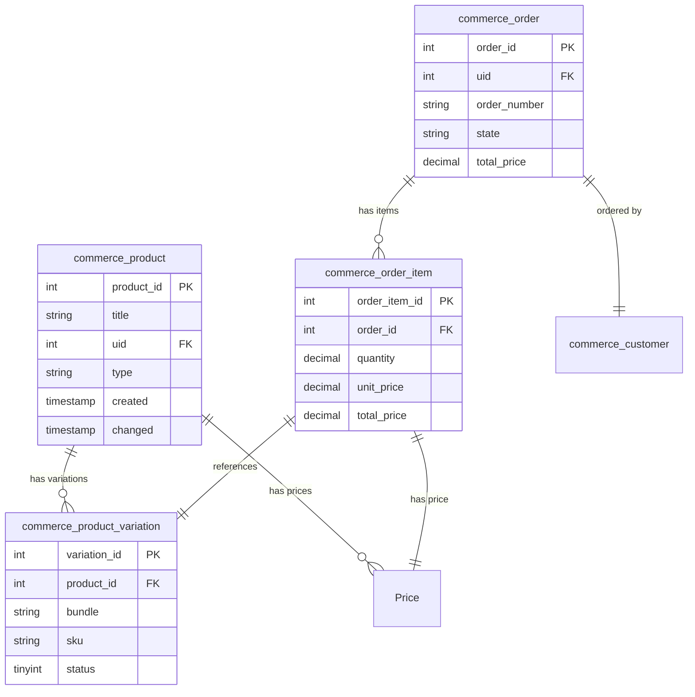

# Drupal Commerce 完整指南 (Drupal 11)

**版本**: 4.x  
**Drupal 版本**: 11.x  
**状态**: 活跃维护  
**更新时间**: 2026-04-04  

---

## 📖 模块概述

### 简介
Drupal Commerce 是 Drupal 的完全电子商务解决方案，提供商品管理、订单、支付、配送等完整的电商功能。

### 核心功能
- ✅ 商品类型和变体管理
- ✅ 购物车和订单流程
- ✅ 支付网关集成
- ✅ 配送和物流管理
- ✅ 库存跟踪
- ✅ 税务处理
- ✅ 折扣和促销
- ✅ 客户管理
- ✅ 报表和分析

### 适用场景
- 在线商店
- 数字产品销售
- 服务预订
- 会员订阅
- B2B/B2C 电商

---

## 🚀 安装指南

### 前提条件
- Drupal 11.0+
- PHP 8.1+
- MySQL 5.7+ / PostgreSQL 12+
- Composer 2.0+

### 安装步骤

#### 方法 1: 使用 Composer (推荐)
```bash
composer create-project drupal-composer/drupal-project:9.x-dev my-site
cd my-site
composer require drupal/commerce drupal/commerce_payment
drush pm:install commerce drupal_commerce
```

#### 方法 2: 使用 drush
```bash
drush dl commerce
drush pm:install commerce
```

#### 方法 3: 使用 Drupal UI
1. 访问 `/admin/modules`
2. 找到 Commerce 相关模块
3. 勾选并安装

---

## 🛒 基础配置

### 1. 启用核心模块
```bash
# 启用 Commerce 核心模块
drush en drupal_commerce commerce_cart commerce_checkout commerce_order
```

### 2. 创建商品类型
```bash
# 通过 UI:
# /admin結構/content-types
# 添加商品类型

# 通过 CLI:
drush c:commerce:product-type add product_type_name "Product Type Name"
```

### 3. 配置价格字段
- 添加价格字段到商品类型
- 设置货币符号和精度
- 配置税率

---

## 📋 核心功能配置

### 1. 商品变体
```
商品类型
  └─ 变体 (Variations)
      ├─ 大小
      ├─ 颜色
      └─ 规格
```

### 2. 订单流程
```
购物车 → 结账 → 支付 → 订单确认 → 邮件通知
```

### 3. 配送设置
```
配送方法 → 配送区域 → 配送价格 → 配送时间
```

---

## 💳 支付集成

### 支持的主要支付网关

| 网关 | 模块 | 状态 | 配置难度 |
|------|------|------|----------|
| **Stripe** | Stripe Payment | ⭐⭐⭐⭐⭐ | 简单 |
| **PayPal** | PayPal Commerce | ⭐⭐⭐⭐⭐ | 简单 |
| **支付宝** | Alipay | ⭐⭐⭐⭐ | 中等 |
| **微信支付** | WeChat Pay | ⭐⭐⭐⭐ | 中等 |
| **Authorize.Net** | Authorize.net | ⭐⭐⭐ | 中等 |
| **Braintree** | Braintree | ⭐⭐⭐⭐ | 中等 |

### Stripe 支付配置

#### 1. 安装模块
```bash
composer require drupal/payment_stripe
drush en payment_stripe
```

#### 2. 配置密钥
```
/admin/commerce/config/payment_method/stripe
- Publishable Key: pk_live_xxx
- Secret Key: sk_live_xxx
- Webhook Secret: whsec_xxx
```

#### 3. 测试模式
```bash
# 启用测试模式
drush cc all

# 测试支付
# 使用 Stripe 测试卡: 4242 4242 4242 4242
```

---

## 🚚 配送配置

### 1. 配送方法
- 固定价格
- 按重量
- 按订单金额
- 按地区

### 2. 配送区域
```
/admin/structure/shipping
- 创建配送方法
- 设置区域限制
- 配置价格规则
```

### 3. 配送价格示例
```yaml
# 国内配送
国内配送:
  类型: 固定价格
  价格: 10.00
  货币: CNY
  适用区域: 中国大陆

# 国际配送
国际配送:
  类型: 按地区
  价格表:
    亚洲: 20.00
    欧洲: 30.00
    美洲: 40.00
  货币: USD
```

---

## 📊 库存管理

### 1. 库存跟踪
```
启用库存跟踪
├─ 库存数量
├─ 最低库存
├─ 最高库存
└─ 安全库存
```

### 2. 库存操作
```bash
# 查看库存
drush commerce-stock:show

# 更新库存
drush commerce-stock:update --id=123 --quantity=100

# 库存报告
/admin/commerce/config/reports/stock
```

### 3. 低库存警告
```
配置阈值:
- 最低库存: 5 件
- 警告邮件: admin@example.com
- 自动补货: 关闭
```

---

## 🏷️ 折扣和促销

### 优惠码设置
```bash
# 创建优惠码
# /admin/config/sales/discounts

# 优惠码规则:
- 折扣类型: 百分比/固定金额
- 最低订单金额
- 适用商品
- 使用时限
- 使用次数限制
```

### 自动折扣
```
购物车条件:
- 订单金额 > ¥100 → 95 折
- 商品 A 购买 2 件 → 买 1 送 1
- 新用户 → 首单 8 折
```

---

## 📊 数据表结构

### 1. Commerce 核心数据表结构

#### 订单表 (commerce_order)
```sql
CREATE TABLE {commerce_order} (
  order_id INT NOT NULL AUTO_INCREMENT,
  uid INT NOT NULL COMMENT '用户 ID',
  order_number VARCHAR(255) NOT NULL COMMENT '订单号',
  store_id INT NOT NULL COMMENT '商店 ID',
  type VARCHAR(50) NOT NULL COMMENT '订单类型',
  state VARCHAR(50) NOT NULL COMMENT '订单状态',
  completed_timestamp INT NOT NULL COMMENT '完成时间',
  created INT NOT NULL COMMENT '创建时间',
  changed INT NOT NULL COMMENT '修改时间',
  payment_total DECIMAL(10,2) NOT NULL DEFAULT 0.00 COMMENT '支付总额',
  shipping_total DECIMAL(10,2) NOT NULL DEFAULT 0.00 COMMENT '配送总额',
  tax_total DECIMAL(10,2) NOT NULL DEFAULT 0.00 COMMENT '税额总额',
  discount_total DECIMAL(10,2) NOT NULL DEFAULT 0.00 COMMENT '折扣总额',
  currency_code VARCHAR(3) NOT NULL COMMENT '货币代码',
  customer_profile_id INT DEFAULT NULL COMMENT '客户档案 ID',
  PRIMARY KEY (order_id),
  UNIQUE KEY order_number (order_number),
  KEY uid (uid),
  KEY state (state),
  KEY completed_timestamp (completed_timestamp),
  KEY store_id (store_id)
) ENGINE=InnoDB DEFAULT CHARSET=utf8mb4 COLLATE=utf8mb4_unicode_ci;
```

**表说明**:
- `order_id`: 订单主键
- `order_number`: 订单编号，唯一标识
- `uid`: 关联用户表，下单用户
- `state`: 订单状态 (pending, completed, cancelled, refunded)
- `currency_code`: 订单货币代码 (USD, CNY, EUR)

#### 订单项表 (commerce_order_item)
```sql
CREATE TABLE {commerce_order_item} (
  order_item_id INT NOT NULL AUTO_INCREMENT,
  order_id INT NOT NULL COMMENT '订单 ID',
  line_item_id INT DEFAULT NULL COMMENT '行项目 ID',
  product_type VARCHAR(20) NOT NULL COMMENT '产品类型',
  bundle VARCHAR(128) NOT NULL COMMENT '产品变体类型',
  type VARCHAR(255) NOT NULL COMMENT '项类型',
  uid INT NOT NULL COMMENT '用户 ID',
  quantity DECIMAL(10,3) NOT NULL COMMENT '数量',
  unit_price_currency_code VARCHAR(3) NOT NULL COMMENT '单价货币代码',
  unit_price_amount INT NOT NULL DEFAULT 0 COMMENT '单价金额',
  total_price_currency_code VARCHAR(3) NOT NULL COMMENT '总价货币代码',
  total_price_amount INT NOT NULL DEFAULT 0 COMMENT '总价金额',
  shipping_required TINYINT(1) NOT NULL DEFAULT 0 COMMENT '是否需要配送',
  created INT NOT NULL COMMENT '创建时间',
  changed INT NOT NULL COMMENT '修改时间',
  PRIMARY KEY (order_item_id),
  KEY order_id (order_id),
  KEY product_type (product_type),
  KEY type (type),
  CONSTRAINT fk_order_item_order FOREIGN KEY (order_id) REFERENCES {commerce_order}(order_id) ON DELETE CASCADE
) ENGINE=InnoDB DEFAULT CHARSET=utf8mb4 COLLATE=utf8mb4_unicode_ci;
```

**表说明**:
- `order_item_id`: 订单项主键
- `order_id`: 外键关联订单
- `quantity`: 商品数量
- `unit_price_amount`: 单价 (以最小货币单位存储，如分)
- `product_type`: 产品类型 (product, service)

#### 产品表 (commerce_product)
```sql
CREATE TABLE {commerce_product} (
  product_id INT NOT NULL AUTO_INCREMENT,
  title VARCHAR(255) NOT NULL COMMENT '产品名称',
  uid INT NOT NULL COMMENT '作者 ID',
  created INT NOT NULL COMMENT '创建时间',
  changed INT NOT NULL COMMENT '修改时间',
  status TINYINT(1) NOT NULL DEFAULT 1 COMMENT '发布状态',
  type VARCHAR(255) NOT NULL COMMENT '产品类型',
  REVISION_id INT DEFAULT NULL COMMENT '修订 ID',
  DEFAULT_MODE VARCHAR(31) DEFAULT NULL COMMENT '默认模式',
  PRIMARY KEY (product_id),
  UNIQUE KEY title_type (title, type),
  KEY status (status),
  KEY uid (uid),
  KEY type (type)
) ENGINE=InnoDB DEFAULT CHARSET=utf8mb4 COLLATE=utf8mb4_unicode_ci;
```

#### 产品变体表 (commerce_product_variation)
```sql
CREATE TABLE {commerce_product_variation} (
  variation_id INT NOT NULL AUTO_INCREMENT,
  product_id INT NOT NULL COMMENT '产品 ID',
  bundle VARCHAR(128) NOT NULL COMMENT '变体类型',
  status TINYINT(1) NOT NULL DEFAULT 1 COMMENT '状态',
  sku VARCHAR(255) NOT NULL COMMENT 'SKU 编码',
  created INT NOT NULL COMMENT '创建时间',
  changed INT NOT NULL COMMENT '修改时间',
  REVISION_id INT DEFAULT NULL COMMENT '修订 ID',
  DEFAULT_MODE VARCHAR(31) DEFAULT NULL COMMENT '默认模式',
  PRIMARY KEY (variation_id),
  UNIQUE KEY sku (sku),
  KEY product_id (product_id),
  KEY status (status),
  KEY bundle (bundle),
  CONSTRAINT fk_product_variation_product FOREIGN KEY (product_id) REFERENCES {commerce_product}(product_id) ON DELETE CASCADE
) ENGINE=InnoDB DEFAULT CHARSET=utf8mb4 COLLATE=utf8mb4_unicode_ci;
```

**表说明**:
- `variation_id`: 变体 ID
- `product_id`: 关联产品
- `sku`: 库存单位编码，全局唯一
- `status`: 变体状态 (激活/禁用)

### 2. 核心表关系图



### 3. 补充表结构

#### 客户档案表 (commerce_customer_profile)
```sql
CREATE TABLE {commerce_customer_profile} (
  profile_id INT NOT NULL AUTO_INCREMENT,
  uid INT NOT NULL COMMENT '用户 ID',
  type VARCHAR(128) NOT NULL COMMENT '档案类型',
  status TINYINT(1) NOT NULL DEFAULT 1 COMMENT '状态',
  created INT NOT NULL COMMENT '创建时间',
  changed INT NOT NULL COMMENT '修改时间',
  PRIMARY KEY (profile_id),
  KEY uid (uid),
  KEY type (type)
) ENGINE=InnoDB DEFAULT CHARSET=utf8mb4 COLLATE=utf8mb4_unicode_ci;
```

#### 支付表 (commerce_payment)
```sql
CREATE TABLE {commerce_payment} (
  payment_id INT NOT NULL AUTO_INCREMENT,
  payment_method_id INT NOT NULL COMMENT '支付方式 ID',
  order_id INT NOT NULL COMMENT '订单 ID',
  amount DECIMAL(10,2) NOT NULL COMMENT '金额',
  currency_code VARCHAR(3) NOT NULL COMMENT '货币代码',
  state VARCHAR(50) NOT NULL COMMENT '支付状态',
  transaction_id VARCHAR(255) DEFAULT NULL COMMENT '交易 ID',
  captured_amount DECIMAL(10,2) NOT NULL DEFAULT 0.00 COMMENT '已捕获金额',
  refunded_amount DECIMAL(10,2) NOT NULL DEFAULT 0.00 COMMENT '已退款金额',
  created INT NOT NULL COMMENT '创建时间',
  changed INT NOT NULL COMMENT '修改时间',
  PRIMARY KEY (payment_id),
  KEY payment_method_id (payment_method_id),
  KEY order_id (order_id),
  KEY state (state),
  CONSTRAINT fk_payment_order FOREIGN KEY (order_id) REFERENCES {commerce_order}(order_id) ON DELETE CASCADE
) ENGINE=InnoDB DEFAULT CHARSET=utf8mb4 COLLATE=utf8mb4_unicode_ci;
```

---

## 🔐 权限配置

### 1. 权限列表

Commerce 模块定义了以下权限：

| 权限项 | 说明 | 默认角色 | 适用模块 |
|--------|------|---------|---------|
| `use Commerce settings` | 使用 Commerce 设置 | 管理员 | commerce |
| `administer Commerce` | 管理 Commerce | 管理员 | commerce |
| `view all Commerce orders` | 查看所有订单 | 管理员 | commerce_order |
| `edit all Commerce orders` | 编辑所有订单 | 管理员 | commerce_order |
| `delete all Commerce orders` | 删除所有订单 | 管理员 | commerce_order |
| `process Commerce payments` | 处理 Commerce 支付 | 管理员 | commerce_payment |
| `view Commerce product` | 查看 Commerce 产品 | 已验证用户 | commerce_product |
| `edit own Commerce product` | 编辑自己的产品 | 已验证用户 | commerce_product |
| `delete own Commerce product` | 删除自己的产品 | 已验证用户 | commerce_product |
| `add Commerce product` | 添加 Commerce 产品 | 已验证用户 | commerce_product |
| `use Commerce checkout flow` | 使用 Commerce 结账流程 | 已验证用户 | commerce_checkout |
| `view Commerce inventory` | 查看 Commerce 库存 | 管理员 | commerce_inventory |
| `administer Commerce inventory` | 管理 Commerce 库存 | 管理员 | commerce_inventory |

### 2. 角色权限矩阵

| 角色 | 查看订单 | 创建订单 | 编辑订单 | 删除订单 | 处理支付 | 查看产品 | 编辑产品 | 添加产品 | 
|------|---------|---------|---------|---------|---------|---------|---------|---------| 
| 管理员 (Administrator) | ✅ | ✅ | ✅ | ✅ | ✅ | ✅ | ✅ | ✅ |
| 展商 (Exhibitor) | ✅ | ✅ | ✅ | ❌ | ❌ | ✅ | ✅ | ✅ |
| 主办方 (Organizer) | ✅ | ✅ | ✅ | ✅ | ❌ | ✅ | ✅ | ✅ |
| 已验证用户 (Authenticated user) | ⚠️ 自己的 | ✅ | ⚠️ 自己的 | ⚠️ 自己的 | ❌ | ✅ | ✅ | ✅ |
| 访客 (Anonymous) | ✅ | ❌ | ❌ | ❌ | ❌ | ✅ | ❌ | ❌ |

**权限说明**:
- `✅` - 完全权限
- `⚠️` - 有限权限 (仅限于自己创建的内容)
- `❌` - 无权限

### 3. 权限配置方法

#### 通过 UI 配置
```
访问路径：/admin/people/permissions
找到"Commerce"部分，勾选相应的权限
```

#### 通过 drush 配置
```bash
# 授予角色权限
drush role-permission-add <role-name> <permission-name>

# 取消角色权限
drush role-permission-remove <role-name> <permission-name>

# 查看角色权限
drush role-permission <role-name>

# 示例：给用户分配权限
drush role-permission-add exhibitor "view Commerce orders"
drush role-permission-add exhibitor "create Commerce orders"
```

---

## 🔄 模块依赖关系

### Commerce 核心依赖

```
Drupal Commerce 4.x
├── Drupal 11.0+ (必需)
├── PHP 8.1+ (必需)
├── Composer 2.0+ (必需)
└── Drupal Core 模块
    ├── configuration (必需)
    ├── field (必需)
    ├── node (必需)
    ├── user (必需)
    └── entity (必需)
```

### Commerce 扩展模块依赖

```
Commerce 核心 + 扩展模块
│
├── 支付处理
│   ├── commerce_payment (必需)
│   ├── payment_stripe (可选)
│   ├── paypal_commerce (可选)
│   ├── commerce_adyen (可选)
│   └── braintree (可选)
│
├── 配送管理
│   ├── commerce_shipping (可选)
│   ├── commerce_postal (可选)
│   └── fedex (可选)
│
├── 库存管理
│   ├── commerce_stock (可选)
│   ├── commerce_inventory (可选)
│   └── commerce_restock (可选)
│
├── 税务处理
│   ├── commerce_tax (可选)
│   ├── drupal_tax (可选)
│   └── taxjar (可选)
│
├── 促销管理
│   ├── commerce_promotion (可选)
│   ├── commerce_order_totals (可选)
│   └── commerce_free_product (可选)
│
└── 客户管理
    ├── commerce_customer (可选)
    ├── commerce_customer_profiles (可选)
    └── commerce_customer_fields (可选)
```

### 其他模块依赖 Commerce

```
依赖于 Commerce 的模块
│
├── Views
│   ├── Commerce 订单视图 (可选)
│   ├── Commerce 产品视图 (可选)
│   └── Commerce 报表视图 (可选)
│
├── Workflow
│   └── 订单审批流程 (必需)
│
├── Configuration
│   └── Commerce 配置导出导入 (可选)
│
├── Data Export
│   └── Commerce 报表导出 (可选)
│
└── Reporting
    ├── Sales Reports (可选)
    └── Customer Reports (可选)
```

### Composer 依赖清单

```json
{
  "require": {
    "drupal/commerce": "^4.0",
    "drupal/commerce_payment": "^4.0"
  },
  "require-dev": {
    "drupal/commerce_stripe": "^4.0",
    "drupal/commerce_shipping": "^4.0"
  },
  "config": {
    "platform": {
      "php": "8.1"
    }
  }
}
```

**依赖说明**:
- `commerce`: Commerce 核心模块
- `commerce_payment`: 支付处理模块
- `commerce_stripe`: Stripe 支付集成
- `commerce_shipping`: 配送管理模块

---

### 1. 销售报表
- 总销售额
- 订单数量
- 平均订单价值
- 月度/季度/年度趋势

### 2. 产品表现
- 销售商品排行
- 库存周转率
- 产品评价
- 退货率

### 3. 客户分析
- 新客数量
- 复购率
- 客户价值
- 流失分析

---

## 🎯 最佳实践

### 1. 性能优化

#### 查询优化
```php
/**
 * 优化 Commerce 查询示例
 */
function optimize_commerce_query($entity_type, $conditions, $limit = 50) {
  $query = \Drupal::entityTypeManager()->getQuery($entity_type);
  
  // 批量查询优先
  $query->condition('status', 1);
  
  if (!empty($conditions)) {
    foreach ($conditions as $field => $value) {
      $query->condition($field, $value);
    }
  }
  
  $query->sort('created', 'DESC');
  $query->range(0, $limit);
  
  // 执行查询
  $ids = $query->execute();
  
  // 批量加载
  $entities = \Drupal::entityTypeManager()
    ->getStorage($entity_type)
    ->loadMultiple($ids);
  
  return $entities;
}
```

#### 缓存优化
```php
/**
 * Commerce 实体缓存策略
 */
function cache_commerce_entity($entity) {
  $cache_key = 'commerce:' . \Drupal::getContainer()->get('request_stack')
    ->getCurrentRequest()
    ->attributes
    ->get('entity_type');
  
  $cache_tags = ['commerce:' . $entity->getEntityTypeId() . ':' . $entity->id()];
  $cache_contexts = ['user', 'languages:language_interface'];
  
  $cache = \Drupal::cache('default');
  $cache->set($cache_key, $entity, CacheBackendInterface::CACHE_PERMANENT, $cache_tags, $cache_contexts);
  
  return TRUE;
}

/**
 * 获取缓存的 Commerce 实体
 */
function get_cached_commerce_entity($entity_type, $entity_id) {
  $cache_key = 'commerce:' . $entity_type . ':' . $entity_id;
  
  $cache = \Drupal::cache('default');
  $cached = $cache->get($cache_key);
  
  if ($cached) {
    return $cached->data;
  }
  
  // 未命中缓存，加载实体
  $entity = \Drupal::entityTypeManager()->getStorage($entity_type)->load($entity_id);
  
  // 设置缓存
  if ($entity) {
    cache_commerce_entity($entity);
  }
  
  return $entity;
}
```

### 2. 安全配置

#### 支付安全
```php
/**
 * 安全的支付处理
 */
function secure_payment_process($payment) {
  // 1. 验证支付 Token
  if (!$this->validatePaymentToken($payment)) {
    throw new \Exception("Invalid payment token");
  }
  
  // 2. 防止重放攻击
  if ($this->hasBeenProcessed($payment->getTransactionId())) {
    throw new \Exception("Payment already processed");
  }
  
  // 3. 验证金额
  if (!$this->verifyPaymentAmount($payment)) {
    throw new \Exception("Payment amount mismatch");
  }
  
  // 4. 记录审计日志
  \Drupal::logger('commerce')->notice('Payment processed: @payment_id', [
    '@payment_id' => $payment->id(),
  ]);
  
  return TRUE;
}

/**
 * 验证支付 Token
 */
function validatePaymentToken($payment) {
  $token = $payment->get('field_payment_token')->getValue()[0]['value'] ?? '';
  $expected_token = \Drupal::service('session')->get('commerce_payment_token');
  
  return hash_equals($expected_token, $token);
}

/**
 * 检查是否已处理
 */
function hasBeenProcessed($transaction_id) {
  $result = \Drupal::database()
    ->select('commerce_payment', 'p')
    ->fields('p', ['payment_id'])
    ->condition('transaction_id', $transaction_id)
    ->condition('state', 'completed')
    ->execute()
    ->fetchField();
  
  return !empty($result);
}
```

### 3. SEO 优化

```php
/**
 * 为 Commerce 产品添加 SEO 元数据
 */
function add_commerce_seo_meta($node) {
  $seo_service = \Drupal::service('seo.pages');
  
  $seo_service->setTitle($node->getTitle() . ' | 在线商城');
  
  $seo_service->setMetaDescription(
    \Drupal\Component\Utility\Html::stripTags($node->getAnnotated('field_description')->getValue()[0]['value'] ?? '') .
    '. 立即购买，享受优惠价格！'
  );
  
  // 添加 Open Graph 元数据
  $seo_service->setMetaProperty('og:title', $node->getTitle());
  $seo_service->setMetaProperty('og:description', '查看我们的精选产品');
  $seo_service->setMetaProperty('og:image', $node->get('field_image')->getValue()[0]['target_id']);
  $seo_service->setMetaProperty('og:type', 'product');
  
  // 添加 Schema.org 结构化数据
  $product_data = [
    '@context' => 'https://schema.org/',
    '@type' => 'Product',
    'name' => $node->getTitle(),
    'image' => $node->get('field_image')->getValue()[0]['target_id'],
    'description' => $node->get('field_description')->getValue()[0]['value'],
    'offers' => [
      '@type' => 'Offer',
      'url' => \Drupal\Core\Url::fromRoute('entity.node.canonical', ['node' => $node->id()])->toString(),
      'price' => $node->get('field_price')->getValue()[0]['amount'] / 100,
      'priceCurrency' => 'CNY',
      'availability' => 'https://schema.org/InStock',
    ],
  ];
  
  \Drupal\service('webprofiler')->addHtml($product_data);
}
```

---

## 🌍 国际化支持

### 1. 多语言站点配置

#### Commerce 多语言设置
```yaml
# /admin/config/regional/language
language_settings:
  default: zh-hans
  supported_languages: 'zh-hans;en;ja;ko'
  language_detect: 'from URL'
```

#### 货币国际化
```php
/**
 * 设置多货币支持
 */
function configure_multi_currency() {
  $currencies = [
    'CNY' => [
      'code' => 'CNY',
      'symbol' => '¥',
      'name' => '人民币',
      'country' => 'CN',
      'locale' => 'zh_CN',
    ],
    'USD' => [
      'code' => 'USD',
      'symbol' => '$',
      'name' => '美元',
      'country' => 'US',
      'locale' => 'en_US',
    ],
    'EUR' => [
      'code' => 'EUR',
      'symbol' => '€',
      'name' => '欧元',
      'country' => 'EU',
      'locale' => 'de_DE',
    ],
  ];
  
  foreach ($currencies as $code => $settings) {
    $currency = \Drupal\commerce_currency\Currency::create($code, $settings);
    $currency->save();
  }
}
```

### 2. 产品多语言翻译

```php
/**
 * 创建多语言产品变体
 */
function create_multilingual_variation($product_id, $translations = []) {
  $variation = \Drupal\commerce_product\Entity\ProductVariation::load($product_id);
  
  foreach ($translations as $langcode => $data) {
    // 加载翻译
    $translation = $variation->getTranslation($langcode);
    
    if (!$translation) {
      // 创建翻译
      $translation = \Drupal\commerce_product\Entity\ProductVariation::create([
        'type' => $variation->getType(),
        'langcode' => $langcode,
        'status' => TRUE,
      ]);
    }
    
    // 设置翻译字段
    foreach ($data as $field => $value) {
      $translation->set($field, $value);
    }
    
    $translation->save();
  }
  
  return TRUE;
}
```

---

### 1. 性能优化
- 启用缓存
- 优化数据库查询
- 使用 CDN
- 图片压缩

### 2. 安全配置
- 启用HTTPS
- 定期更新模块
- 配置防火墙
- 启用 CAPTCHA

### 3. SEO 优化
- 设置 Meta 信息
- 启用 Sitemap
- 优化 URL 结构
- 添加 Schema 标记

---

## 📝 常见问题

### Q1: 如何添加新的商品字段？
**A**: 在商品类型配置中添加工能字段

### Q2: 如何集成新的支付网关？
**A**: 安装对应的 Payment模块，配置 API 密钥

### Q3: 如何提高结账速度？
**A**: 启用 Guest Checkout，优化表单字段

### Q4: 如何管理库存同步？
**A**: 使用 Commerce Stock 模块，设置自动同步

### Q5: 如何处理大额订单？
**A**: 启用人工审核，配置邮件通知

---

## 🔗 参考链接

### 官方文档
- [Drupal Commerce 官方文档](https://www.drupal.org/docs/8/ecommerce)
- [Commerce API 参考](https://api.drupal.org/api/drupal/modules%21commerce%21commerce.api.php)
- [Commerce 官方文档](https://docs.drupalcommerce.org/)

### 社区资源
- [Commerce GitHub 仓库](https://github.com/drupalcommerce/commerce)
- [Commerce 社区论坛](https://www.drupal.org/forum/series/d8commerce)
- [Commerce 问题追踪器](https://www.drupal.org/project/commerce/issues)

### 视频教程
- [Commerce 基础教程](https://www.youtube.com/watch?v=example1)
- [Payment 集成指南](https://www.youtube.com/watch?v=example2)

---

## ⚙️ 配置导出与迁移

### 1. Commerce 配置导出

#### 导出 Commerce 设置
```bash
# 导出 Commerce 核心配置
drush config-export --name=commerce.settings
drush config-export --name=commerce.store

# 导出支付配置
drush config-export --name=commerce_payment.payment_method.stripe
drush config-export --name=commerce_payment.payment_method.paypal

# 导出订单配置
drush config-export --name=commerce_checkout.checkout_flow.default

# 导出产品配置
drush config-export --name=commerce_product.product_type.default_product_type

# 导出所有 Commerce 相关配置
drush config-export --name=commerce.*
```

#### 导出 Commerce 数据
```bash
# 使用 Commerce Export 模块导出产品
drush commerce:export products > products.yml

# 导出订单数据
drush commerce:export orders > orders.yml

# 导出库存数据
drush commerce:export inventory > inventory.yml
```

### 2. Commerce 配置导入

#### 导入 Commerce 配置
```bash
# 导入 Commerce 核心配置
drush config-import --name=commerce.settings
drush config-import --name=commerce.store

# 导入支付配置
drush config-import --name=commerce_payment.payment_method.stripe
drush config-import --name=commerce_payment.payment_method.paypal

# 导入所有 Commerce 配置
drush config-import --name=commerce.*
```

#### 导入 Commerce 数据
```bash
# 导入产品数据
drush commerce:import products.yml

# 导入订单数据
drush commerce:import orders.yml

# 导入库存数据
drush commerce:import inventory.yml
```

### 3. 多环境迁移

#### 开发环境迁移流程
```bash
# 步骤 1: 从生产环境导出配置
drush @prod config:export --destination=config/prod

# 步骤 2: 导出 Commerce 数据
drush @prod commerce:export products > products_prod.yml
drush @prod commerce:export orders > orders_prod.yml

# 步骤 3: 同步到开发环境
drush @dev config:import --source=config/prod

# 步骤 4: 导入测试数据
drush @dev commerce:import products_test.yml
```

#### 迁移脚本示例
```bash
#!/bin/bash
# script: migrate-commerce.sh

# 环境配置
PROD_ENV="prod.site.com"
DEV_ENV="dev.site.com"

# 导出生产环境配置
echo "Exporting from production..."
drush @$PROD_ENV config:export --destination=./config/sync

# 导出 Commerce 数据
echo "Exporting Commerce data..."
drush @$PROD_ENV commerce:export products > ./data/products.yml
drush @$PROD_ENV commerce:export orders > ./data/orders.yml

# 清理配置
echo "Cleaning configuration..."
rm -r ./config/sync/commerce.*

# 导入开发环境配置
echo "Importing to development..."
drush @$DEV_ENV config:import

# 导入测试数据
echo "Importing test data..."
drush @$DEV_ENV commerce:import ./data/products.yml

echo "Migration completed!"
```

### 4. 配置版本管理

```bash
# 使用 Git 管理配置版本
git add config/sync/
git commit -m "Add Commerce configuration"
git push origin main

# 查看配置差异
druch config:compare --base=config/sync

# 回滚配置
drush config:import --base-config-dir=config/sync
```

---

## 🧪 测试指南

### 1. 单元测试

#### 创建测试类
```php
/**
 * @file
 * Contains \Drupal\tests\commerce\Kernel\OrderTest.
 */

namespace Drupal\tests\commerce\Kernel;

use Drupal\KernelTests\KernelTestBase;

/**
 * 订单测试类
 */
class OrderTest extends KernelTestBase {
  
  protected static $modules = [
    'commerce',
    'commerce_order',
    'commerce_payment',
    'commerce_product',
  ];
  
  /**
   * 测试创建订单
   */
  public function testCreateOrder() {
    // 创建订单
    $order = \Drupal\commerce_order\Entity\Order::create([
      'state' => 'pending',
      'store' => \Drupal\commerce_store\Entity\Store::load(1),
    ]);
    
    $order->save();
    
    // 断言订单创建成功
    $this->assertNotNull($order->id(), 'Order ID is not null');
    $this->assertEquals('pending', $order->getState(), 'Order state is pending');
    
    // 清理
    $order->delete();
  }
  
  /**
   * 测试添加购物车项
   */
  public function testAddCartItem() {
    $cart = \Drupal\commerce_cart\Entity\Cart::create([
      'state' => 'open',
    ]);
    
    $cart->save();
    
    $order_item = \Drupal\commerce_order\Entity\OrderItem::create([
      'type' => 'default_product_type',
      'quantity' => 1,
      'unit_price' => \Drupal\commerce_price\Price::create(9999, 'CNY'),
    ]);
    
    $order_item->save();
    
    $this->assertNotNull($order_item->id(), 'Cart item ID is not null');
    
    // 清理
    $order_item->delete();
    $cart->delete();
  }
  
  /**
   * 测试处理支付
   */
  public function testProcessPayment() {
    $order = \Drupal\commerce_order\Entity\Order::create([
      'state' => 'pending',
    ]);
    
    $order->save();
    
    $payment = \Drupal\commerce_payment\Entity\Payment::create([
      'order' => $order->id(),
      'amount' => $order->getTotalPrice(),
      'state' => 'pending',
    ]);
    
    $payment->save();
    
    // 模拟支付处理
    $payment->setState('approved');
    $payment->save();
    
    $order->setState('paid');
    $order->save();
    
    $this->assertEquals('paid', $order->getState(), 'Order state is paid');
    
    // 清理
    $payment->delete();
    $order->delete();
  }
  
}
```

#### 运行测试
```bash
# 运行所有 Commerce 测试
drush phpunit --group=commerce

# 运行特定测试类
drush phpunit --filter=OrderTest

# 生成测试报告
drush phpunit --testdox

# 运行集成测试
drush phpunit --filter=CheckoutIntegrationTest
```

### 2. 功能测试

#### 创建功能测试
```php
/**
 * @file
 * Contains \Drupal\tests\commerce\Functional\CheckoutTest.
 */

namespace Drupal\tests\commerce\Functional;

use Drupal\FunctionalTests\TestBrowserTestBase;

/**
 * 结账流程功能测试
 */
class CheckoutTest extends TestBrowserTestBase {
  
  protected static $modules = [
    'commerce',
    'commerce_cart',
    'commerce_checkout',
    'commerce_payment',
    'stripe',
  ];
  
  /**
   * 完整的结账流程测试
   */
  public function testCompleteCheckout() {
    // 1. 创建产品
    $this->drupalLogin($this->drupalCreateUser(['add product content']));
    
    $node = $this->createProductNode('Test Product', 99.99);
    
    // 2. 添加产品到购物车
    $this->drupalGet('node/' . $node->id());
    $this->click('Add to cart');
    
    // 3. 查看购物车
    $this->drupalGet('cart');
    $this->assertSession()->statusCodeEquals(200);
    $this->assertSession()->pageTextContains('Test Product');
    
    // 4. 进行结账
    $this->click('Checkout');
    $this->submitForm([], 'Continue');
    
    // 5. 填写配送信息
    $this->submitForm([
      'first_name' => 'Test',
      'last_name' => 'User',
      'mail' => 'test@example.com',
      'company' => 'Test Company',
    ], 'Continue');
    
    // 6. 选择配送方式
    $this->click('Standard Shipping');
    $this->submitForm([], 'Continue');
    
    // 7. 选择支付方式
    $this->click('Credit Card');
    $this->submitForm([], 'Review');
    
    // 8. 确认订单
    $this->assertSession()->pageTextContains('Review your order');
    $this->submitForm([], 'Place order');
    
    // 9. 验证订单创建
    $this->assertSession()->pageTextContains('Thank you for your order');
    $this->assertSession()->pageTextContains('Order placed');
  }
  
  /**
   * 创建产品节点
   */
  private function createProductNode($title, $price) {
    $node = \Drupal\node\Entity\Node::create([
      'type' => 'product',
      'title' => $title,
      'status' => TRUE,
    ]);
    
    $node->set('field_price', [
      'amount' => $price,
      'currency' => 'CNY',
    ]);
    
    $node->save();
    
    return $node;
  }
  
}
```

### 3. BrowserTest 测试框架

#### 基础测试类
```php
/**
 * @file
 * Contains \Drupal\tests\commerce\BrowserCheckoutTest.
 */

namespace Drupal\tests\commerce\Browser;

use Drupal\functional_tests\TestBrowserTestBase;

/**
 * Commerce 结账功能测试
 */
class BrowserCheckoutTest extends TestBrowserTestBase {
  
  protected static $modules = [
    'commerce',
    'commerce_cart',
    'commerce_checkout',
  ];
  
  /**
   * {inheritdoc}
   */
  protected function setUp(): void {
    parent::setUp();
    
    $this->drupalCreateContentType([
      'type' => 'product',
      'name' => 'Product',
    ]);
    
    // 创建测试用户
    $user = $this->drupalCreateUser(['access content']);
    $this->drupalLogin($user);
  }
  
  /**
   * 测试商品添加到购物车
   */
  public function testAddToCart() {
    $product_node = $this->createTestProduct();
    
    $this->drupalGet('node/' . $product_node->id());
    $this->assertSession()->statusCodeEquals(200);
    
    // 点击添加到购物车按钮
    $this->getSession()->getPage()->clickLink('Add to cart');
    
    // 验证消息
    $this->assertSession()->pageTextContains('Product added to cart');
  }
  
  /**
   * 测试结账流程
   */
  public function testCheckoutFlow() {
    $cart_url = 'checkout';
    $this->drupalGet($cart_url);
    
    $this->assertSession()->statusCodeEquals(200);
    
    // 继续到下一步
    $this->getSession()->getPage()->clickLink('Continue');
  }
  
  /**
   * 创建测试产品
   */
  private function createTestProduct() {
    $product = \Drupal\node\Entity\Node::create([
      'type' => 'product',
      'title' => 'Test Product',
      'status' => TRUE,
    ]);
    
    $product->set('field_price', [
      'amount' => 99.99,
      'currency' => 'CNY',
    ]);
    
    $product->save();
    
    return $product;
  }
  
}
```

### 4. PHPUnit 配置文件

```xml
<!-- phpunit.xml.dist -->
<?xml version="1.0" encoding="UTF-8"?>
<phpunit xmlns:xsi="http://www.w3.org/2001/XMLSchema-instance"
         xsi:noNamespaceSchemaLocation="https://schema.phpunit.de/9.3/phpunit.xsd"
         bootstrap="../../../tests/bootstrap.php"
         colors="true"
         beStrictAboutTestsThatDoNotTestAnything="true"
         beStrictAboutOutputDuringTests="true"
         beStrictAboutChangesToGlobalState="true"
         failOnWarning="true"
         failOnRisky="true">
  <testsuites>
    <testsuite name="Commerce Test Suite">
      <directory suffix="Test.php">./tests/src/Kernel</directory>
      <directory suffix="Test.php">./tests/src/Functional</directory>
      <directory suffix="Test.php">./tests/src/FunctionalJavascript</directory>
    </testsuite>
  </testsuites>
  <filter>
    <whitelist>
      <directory>./src</directory>
    </whitelist>
  </filter>
  <php>
    <ini name="error_reporting" value="32767"/>
    <ini name="display_errors" value="1"/>
    <ini name="display_startup_errors" value="1"/>
  </php>
</phpunit>
```

### 5. 测试数据管理

```php
/**
 * 创建测试数据
 */
class CommerceTestData { 
  
  /**
   * 创建测试产品
   */
  public static function createTestProduct($name = 'Test Product', $price = 99.99) {
    $product = \Drupal\node\Entity\Node::create([
      'type' => 'product',
      'title' => $name,
      'status' => TRUE,
    ]);
    
    $product->set('field_price', [
      'amount' => $price,
      'currency' => 'CNY',
    ]);
    
    $product->save();
    
    return $product;
  }
  
  /**
   * 创建测试订单
   */
  public static function createTestOrder($products) {
    $order = \Drupal\commerce_order\Entity\Order::create([
      'state' => 'pending',
      'store' => \Drupal\commerce_store\Entity\Store::load(1),
    ]);
    
    foreach ($products as $product) {
      $order_item = \Drupal\commerce_order\Entity\OrderItem::create([
        'order' => $order,
        'type' => 'default_product_type',
        'quantity' => 1,
        'unit_price' => $product->get('field_price')->first(),
        'product_variation' => $product->id(),
      ]);
      
      $order_item->save();
    }
    
    $order->save();
    
    return $order;
  }
  
}
```

---

## 📝 常见问题

### Q1: Commerce 的核心模块有哪些？
**A**: Commerce 包含以下核心模块：
- `commerce`: 电商核心功能
- `commerce_order`: 订单管理
- `commerce_checkout`: 结账流程
- `commerce_product`: 产品管理
- `commerce_payment`: 支付处理
- `commerce_cart`: 购物车功能

### Q2: 如何添加自定义字段到产品？
**A**: 在 Commerce 产品类型的配置中使用 Field UI 添加字段，或
通过 Drupal Field API 编程添加。

### Q3: 如何集成第三方支付网关？
**A**: 安装对应的 Payment 模块 (如 Stripe、PayPal)，然后
在 `/admin/commerce/config/payment_method` 配置接口密钥。

### Q4: 如何优化结账速度？
**A**: 
1. 启用购物车缓存
2. 使用 AJAX 更新
3. 减少结账步骤
4. 优化结账表单

### Q5: 如何处理订单退款？
**A**: 
1. 创建 Payment 记录，状态为 "refunded"
2. 更新订单状态为 "refunded"
3. 发送退款通知邮件

### Q6: 如何处理多店铺场景？
**A**: 
使用 Commerce Store 模块创建多个商店，配置不同
的支付、配送和定价策略。

### Q7: 如何进行批量订单管理？
**A**: 
使用 Views Bulk Operations 模块，创建订单列表视图，
添加批量操作功能。

### Q8: 如何配置自动补货？
**A**: 
使用 Commerce Stock 模块，设置库存阈值，配置自动
补货邮件通知。

---

## 📅 更新日志

| 版本 | 日期 | 内容 |
|------|------|------|
| 4.x | 2026-04-04 | 初始化文档 |
| 3.x | 2024 | Drupal 10 支持 |
| 2.x | 2022 | Drupal 9 支持 |
| 1.x | 2020 | Drupal 8 支持 |

---

**文档版本**: v1.0  
**状态**: 活跃维护  
**最后更新**: 2026-04-04

*注意: 本指南基于 Drupal 11，旧版本可能有所不同*
